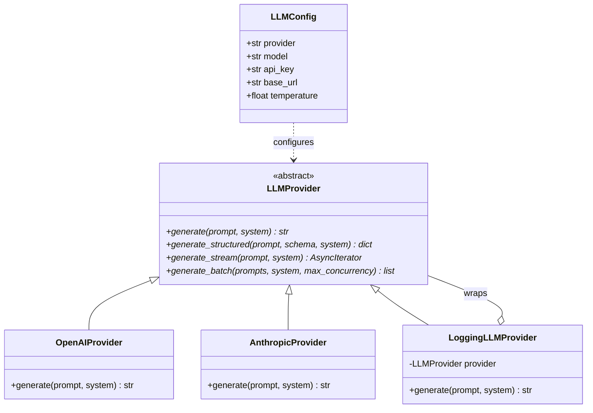
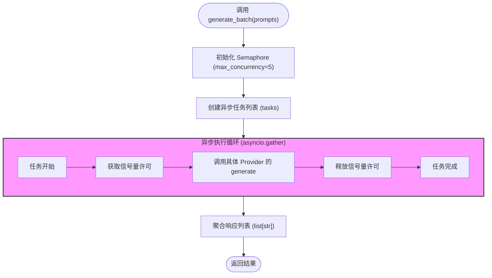

# AI 抽象层

AutoWiki 的 AI 抽象层旨在通过标准化的接口屏蔽不同大语言模型（LLM）和向量嵌入（Embedding）提供商之间的 API 差异。这种设计确保了系统核心逻辑（如维基规划、事实核查和页面生成）与底层模型实现解耦，使开发者能够根据成本、性能或隐私需求，在 Anthropic、OpenAI、Google Gemini 以及本地运行的 Ollama 模型之间无缝切换。

有关具体 Provider 的实现细节和使用指南，请参阅子页面：
- **大语言模型驱动**：涵盖 LLM 接口的具体实现、流式输出处理及 `LoggingLLMProvider` 装饰器。
- **向量嵌入驱动**：涵盖 Embedding 接口定义及其在语义搜索中的应用。
- **提示词段落化管理**：涵盖如何通过 `PromptSegment` 优化上下文缓存和动态提示词构建。

## AI 抽象层架构概览

在 AutoWiki 中，AI 功能的接入由 `worker/llm/base.py` 中定义的抽象基类 `LLMProvider` 驱动。业务组件不直接依赖于特定的 SDK（如 `openai` 或 `anthropic`），而是通过依赖注入的方式持有 `LLMProvider` 实例。这种架构允许系统在运行时通过 `LLMConfig` 动态实例化正确的 Provider。

此外，系统引入了装饰器模式，通过 `LoggingLLMProvider` 包装基础 Provider，实现透明的输入输出记录，而无需在每个业务点手动编写日志逻辑。

**Diagram: LLMProvider 类结构与配置关联**



*Source: worker/llm/base.py:49-155, shared/config.py:11-32*

## 核心接口与功能定义

`LLMProvider` 定义了四种核心交互模式，以满足 AutoWiki 不同场景下的生成需求。从简单的文本补全到高度复杂的并发任务，所有子类都必须遵循这套契约。

| 方法名 | 返回值类型 | 应用场景 | 关键逻辑 |
| :--- | :--- | :--- | :--- |
| `generate` | `str` | 基础文本生成，如生成维基页面的段落描述。 | 直接返回模型生成的原始文本。 |
| `generate_structured` | `dict[str, Any]` | 结构化数据提取，如解析任务规划 JSON 或事实核查结果。 | 调用 `_parse_json_response` 处理 Markdown 代码块并验证 Schema。 |
| `generate_stream` | `AsyncIterator[str]` | 实时交互，如在 WebSocket 或 CLI 中流式展示生成内容。 | 异步产生文本碎片（chunks）。 |
| `generate_batch` | `list[str]` | 批量文件分析，如对数百个源代码文件进行摘要。 | 使用 `asyncio.Semaphore` 限制并发，防止触发 API 速率限制（Rate Limit）。 |

为了增强容错性，基类提供了 `_parse_json_response` 工具函数。由于 Gemini 等模型有时会将 JSON 包裹在 Markdown 代码块（如 ` ```json `）中，该函数会自动剥离这些装饰符，确保 `json.loads` 的稳定性。

*Source: worker/llm/base.py:15-85*

## 配置与环境管理

AutoWiki 使用 Pydantic 模型 `LLMConfig` 和 `EmbeddingConfig` 集中管理 AI 相关的配置参数。为了简化 Docker 部署和 CLI 使用，系统实现了自动强制转换逻辑，确保环境变量在缺失或为空字符串时能够正确回退到默认值。

*   **环境一致性**：通过 `_coerce_empty_to_default` 等验证器，系统将空字符串（通常由未设置的环境变量产生）视为 `None` 或默认值。例如，如果 `LLM_BASE_URL` 环境变量未定义，系统会自动应用对应 Provider 的官方 API 地址。
*   **配置嵌套**：主配置类 `Config` 将 `LLMConfig` 和 `EmbeddingConfig` 作为子对象。这意味着所有 AI 相关的行为都可以通过前缀化的环境变量（如 `AUTOWIKI_LLM__MODEL`）进行覆盖。
*   **默认供应商逻辑**：
    *   `LLMConfig.provider` 默认为 `"openai"`。
    *   `EmbeddingConfig.provider` 默认为 `"openai"`。
    *   `ChatConfig` 控制历史对话窗口大小，默认为 10 条消息。

*Source: shared/config.py:11-103*

## 执行流程与并发控制

在处理大规模任务（如为整个代码仓库生成初步索引）时，传统的串行调用会导致不可接受的延迟。`LLMProvider` 在基类级别实现了 `generate_batch` 方法，通过异步并发机制显著提升吞吐量。

该方法不仅负责并发执行，还通过 `asyncio.Semaphore` 实现了内置的限流保护。默认情况下，最大并发数设置为 5，以兼顾处理速度与下游服务商的并发限制。

**Diagram: generate_batch 并发执行流**



在执行过程中，系统还会利用 `_truncate` 函数对输入提示词进行截断处理后记入调试日志。这既保证了日志的可读性（避免数万字的提示词刷屏），又在一定程度上通过 `LoggingLLMProvider` 提供了对模型输出质量的可追溯性。

*Source: worker/llm/base.py:42-46, 66-85*

## Source Files

| File |
|------|
| `worker/llm/base.py` |
| `shared/config.py` |
| `worker/embedding/base.py` |
| `worker/llm/prompt_segment.py` |
| `tests/worker/test_llm.py` |