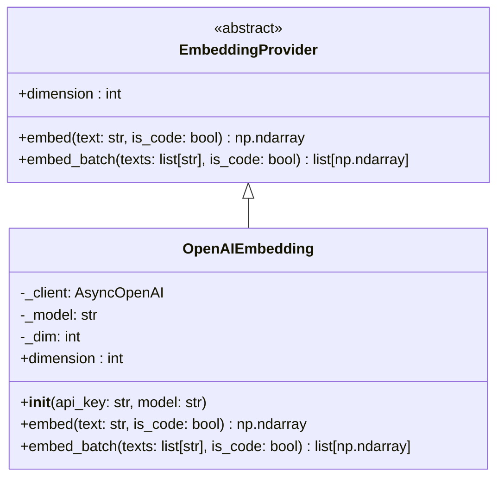
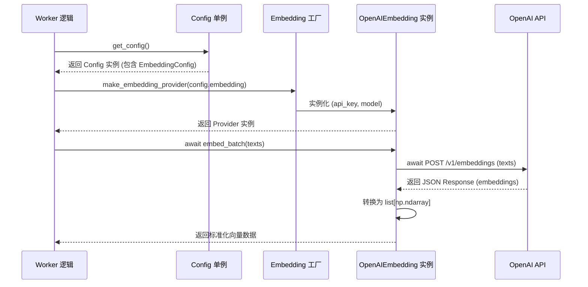

# 向量嵌入驱动

AutoWiki 系统依赖于高质量的向量嵌入（Embedding）来支持语义搜索、文档检索和知识库构建。为了兼容不同的 Embedding 模型供应商（如 OpenAI、Google Gemini、Ollama 等），系统构建了一套基于 Pydantic 的配置管理体系和标准化的 Provider 接口协议。

### 配置管理概览

向量嵌入的配置由 `shared/config.py` 中的 `EmbeddingConfig` 类统一管理。该系统利用 Pydantic 的 `BaseSettings` 功能，通过环境变量实现灵活的参数注入。

*   **环境变量前缀**：所有 Embedding 相关的配置项均需带有 `AUTOWIKI_EMBEDDING_` 前缀。例如，设置 API Key 的环境变量名为 `AUTOWIKI_EMBEDDING_API_KEY`。
*   **配置字段**：
    *   `provider`: 指定嵌入服务提供商，目前支持 `openai`（默认）、`google` 和 `ollama`。
    *   `model`: 指定具体的模型名称，默认为 `text-embedding-3-small`。
    *   `api_key`: 访问 Provider API 所需的身份验证密钥。
*   **空值强制转换机制**：系统通过 `_coerce_empty_provider` 验证器确保配置的健壮性。当环境变量被设置为空字符串时，系统会自动将其回滚为默认值（如 `openai`），防止因配置缺失导致的运行时崩溃。
*   **全局单例访问**：通过 `get_config()` 函数获取全局唯一的 `Config` 实例。在测试环境中，可以使用 `reset_config()` 重置配置缓存，强制系统重新读取环境变量。

*Source: [shared/config.py:35-45](https://github.com/lazyxiang/AutoWiki/blob/main/shared/config.py#L35-L45), [shared/config.py:109-119*](https://github.com/lazyxiang/AutoWiki/blob/main/shared/config.py#L109-L119*)

### 向量嵌入接口定义

为了屏蔽不同模型服务商在 API 调用细节以及底层协议（如 REST API 或 gRPC）上的差异，AutoWiki 定义了统一的 `EmbeddingProvider` 抽象基类。该基类通过 Python 的 `abc` 模块定义了标准契约，确保所有下游任务（如页面生成、知识库检索）能够以多态的方式调用不同的嵌入引擎。任何新的 Provider 实现都必须遵循该接口约定的**异步 (async)** 方法签名，并严格返回 `dtype=np.float32` 的 NumPy 数组。

**Diagram: EmbeddingProvider 类结构与继承关系**

*Source: [worker/embedding/base.py:6-20](https://github.com/lazyxiang/AutoWiki/blob/main/worker/embedding/base.py#L6-L20), [worker/embedding/openai_embed.py:9-29*](https://github.com/lazyxiang/AutoWiki/blob/main/worker/embedding/openai_embed.py#L9-L29*)

`EmbeddingProvider` 定义了以下三个核心能力，要求基类与具体 Provider（如 `OpenAIEmbedding`）在异步特性与参数签名上保持严格对齐：

1.  **异步单文本嵌入 (`embed`)**：采用 `async def` 定义的异步方法，旨在避免在向量生成过程中阻塞 Worker 的主事件循环。该方法将输入的单条字符串转换为 `float32` 类型的 NumPy 数组。`is_code` 参数用于指示文本内容是否为源代码，这对于支持针对代码优化的嵌入模型至关重要，能有效提升代码片段的语义检索准确度。
2.  **异步批量嵌入 (`embed_batch`)**：专为高吞吐量场景设计的异步批量处理接口。它接受一个字符串列表并返回对应的 NumPy 数组列表。在实现层面，所有具体 Provider 均需确保 `is_code` 参数在批量处理时同样生效，并对空列表输入进行短路处理（直接返回空列表）。通过并发处理，该接口能显著降低处理大规模文档片段时的网络往返延迟。
3.  **维度查询 (`dimension`)**：返回当前模型生成的向量空间维度（例如 OpenAI 的 `text-embedding-3-small` 为 1536 维，而 `text-embedding-3-large` 默认可达 3072 维）。该值通常在对象初始化时根据模型名称自动计算或查询，是初始化向量索引（如 FAISS）的必要参数。

*Source: [worker/embedding/base.py:8-20](https://github.com/lazyxiang/AutoWiki/blob/main/worker/embedding/base.py#L8-L20), [worker/embedding/openai_embed.py:16-29*](https://github.com/lazyxiang/AutoWiki/blob/main/worker/embedding/openai_embed.py#L16-L29*)

### Provider 实现对比与调用流程

不同 Provider 在模型能力和部署方式上存在差异。系统在 `worker/embedding` 包中通过工厂模式（通常在 `__init__.py` 中实现）根据 `EmbeddingConfig.provider` 的值实例化具体的实现类。

| Provider | 默认模型 | 向量维度 (Dimension) | 特点 |
| :--- | :--- | :--- | :--- |
| **OpenAI** | `text-embedding-3-small` | 1536 / 3072 | 高精度，动态维度支持，需外部 API 访问 |
| **Google** | (依赖配置) | 768 (通常) | 适用于 Google Cloud 生态系统 |
| **Ollama** | (本地模型) | 取决于模型 | 本地化部署，无需 API Key，适合私有化场景 |

在执行任务时，Worker 节点会经历从配置读取到向量生成的完整生命周期。

**Diagram: 向量嵌入生成调用时序图**

*Source: [shared/config.py:72-103](https://github.com/lazyxiang/AutoWiki/blob/main/shared/config.py#L72-L103), [worker/embedding/openai_embed.py:19-29*](https://github.com/lazyxiang/AutoWiki/blob/main/worker/embedding/openai_embed.py#L19-L29*)

在该流程中，`OpenAIEmbedding` 负责管理内部的异步客户端（如 `AsyncOpenAI`），并处理原始 API 响应到 NumPy 数组的类型转换。这种封装确保了上层业务逻辑（如 `worker/pipeline/page_generator.py`）无需关心底层的 HTTP 通信或特定的响应格式。

*Source: [worker/embedding/openai_embed.py:10-29*](https://github.com/lazyxiang/AutoWiki/blob/main/worker/embedding/openai_embed.py#L10-L29*)

## Source Files

| File |
|------|
| `shared/config.py` |
| `worker/embedding/base.py` |
| `worker/embedding/openai_embed.py` |