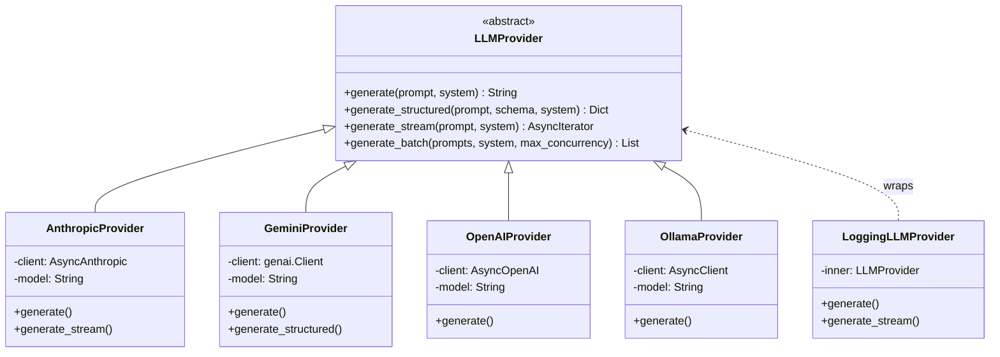
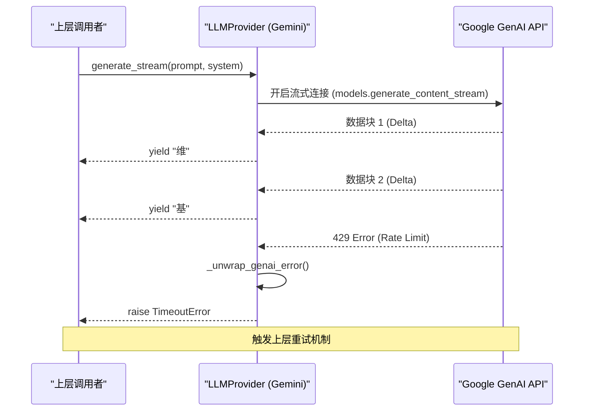

# 大语言模型驱动

在 AutoWiki 系统中，大语言模型（LLM）驱动层是核心基础设施，负责将复杂的维基页面规划、事实核查及草稿生成逻辑转化为与底层模型服务商（如 Anthropic, Google, OpenAI, Ollama）的交互。系统通过一套统一的抽象接口，实现了不同模型供应商的无缝切换，并支持结构化输出、流式响应和并发批处理等生产级特性。

### 架构概述与 LLM 接口抽象

AutoWiki 采用了典型的提供者模式（Provider Pattern）来解耦上层业务逻辑与底层 API 调用。核心抽象定义在 `LLMProvider` 基类中，确保了所有模型服务商在系统内部具有一致的行为表现。

**LLMProvider 抽象逻辑**

`LLMProvider` 是一个抽象基类，它不仅定义了生成文本的标准接口，还规定了处理结构化数据和流式数据的契约。开发者在调用模型时，无需关心底层使用的是 `anthropic` 库还是 `google-genai` 库，只需通过 `PromptInput`（支持字符串或提示词片段列表）传递输入即可。

这种设计的优势在于：
1.  **供应商中立性**：可以根据模型性能、价格或可用性随时更换后端。
2.  **增强的可扩展性**：通过 `LoggingLLMProvider` 等装饰器类，可以在不修改原始提供者代码的情况下，为所有模型调用增加日志记录、限流或监控功能。
3.  **统一的类型安全**：利用 Python 的类型提示和抽象方法，确保了所有实现类都必须提供 `generate`、`generate_stream` 等核心功能。

**Diagram: LLMProvider 类继承体系**



*Source: [worker/llm/base.py:49-155](https://github.com/lazyxiang/AutoWiki/blob/main/worker/llm/base.py#L49-L155), [worker/llm/anthropic_provider.py:58-61](https://github.com/lazyxiang/AutoWiki/blob/main/worker/llm/anthropic_provider.py#L58-L61), [worker/llm/gemini_provider.py:29-38](https://github.com/lazyxiang/AutoWiki/blob/main/worker/llm/gemini_provider.py#L29-L38)*

---

### 核心功能实现

AutoWiki 的 LLM 驱动层提供了四种主要的交互模式，涵盖了从简单的文本补全到大规模并发任务的处理需求。

#### 1. 基础文本生成 (generate)
这是最简单的同步调用方式（在异步环境中执行），返回模型生成的完整字符串。对于大多数不需要中间状态或结构化解析的任务，这是默认选择。

#### 2. 结构化数据生成 (generate_structured)
维基百科的规划和核查逻辑高度依赖于 JSON 格式的输出。`generate_structured` 方法允许传入一个 JSON Schema，要求模型返回符合该架构的数据。

在底层，该方法利用了 `_parse_json_response` 函数。该函数具有强大的容错性，能够处理以下三种常见的响应格式：
-   裸 JSON 字符串。
-   包裹在 Markdown 代码块中的 JSON（例如 ```json ... ```）。
-   包含在通用代码块中的 JSON（例如 ``` ... ```）。

#### 3. 流式响应 (generate_stream)
为了提升用户体验，特别是在生成长篇维基草稿时，系统支持流式输出。通过 `AsyncIterator[str]`，上层应用可以实时接收到模型产生的每一个字符块（Token），并立即将其推送到前端或日志流中。

#### 4. 并发批处理 (generate_batch)
在进行大规模事实核查或多文件处理时，串行调用 LLM 会造成巨大的延迟。`LLMProvider` 默认实现了 `generate_batch` 方法，该方法通过 `asyncio.Semaphore` 控制最大并发数（默认为 5），利用 `asyncio.gather` 并发执行多个请求。这种方式在保证效率的同时，防止了因瞬时请求过多而触发服务商的速率限制（Rate Limit）。

**核心方法对比表**

| 方法名 | 返回类型 | 主要用途 | 并发/流式特性 |
| :--- | :--- | :--- | :--- |
| `generate` | `str` | 通用文本生成 | 单一阻塞请求 |
| `generate_structured` | `dict[str, Any]` | 提取信息、生成规划、核查结果 | 包含 JSON 解析与容错 |
| `generate_stream` | `AsyncIterator[str]` | 生成长文章、实时对话 | 异步生成器，低延迟反馈 |
| `generate_batch` | `list[str]` | 批量核查事实、分析多个代码文件 | 自动并发管理（Semaphore） |

*Source: [worker/llm/base.py:51-85](https://github.com/lazyxiang/AutoWiki/blob/main/worker/llm/base.py#L51-L85), [worker/llm/base.py:15-39](https://github.com/lazyxiang/AutoWiki/blob/main/worker/llm/base.py#L15-L39)*

---

### 流式输出与错误处理机制

在生产环境中，LLM 调用经常会遇到网络波动、服务商宕机或速率限制。AutoWiki 针对这些场景设计了专门的处理逻辑。

#### 流式响应的消费过程
当调用 `generate_stream` 时，底层实现（如 `GeminiProvider` 或 `AnthropicProvider`）会建立一个异步长连接。随着服务端不断推送数据块，驱动层会解析具体的协议格式（如 Anthropic 的 `content_block_delta` 或 Gemini 的 `Candidate` 块），并将其中的文本部分提取出来，通过 `yield` 返回给调用者。

#### 错误转换与重试
对于不同的供应商，其错误代码各不相同。AutoWiki 在 `GeminiProvider` 中实现了一个关键的转换函数 `_unwrap_genai_error`。该函数捕获 Google GenAI 客户端抛出的异常，如果发现是 429 错误（Too Many Requests），则将其转换为 Python 标准的 `TimeoutError`。这样做的目的是为了配合上层的 `async_retry` 装饰器（如果存在），使得系统能够自动进行指数退避重试，提高了系统的稳健性。

#### 提示词截断与日志安全
在调试过程中，记录完整的提示词对于排查问题至关重要，但过长的输入会导致日志文件体积爆炸且难以阅读。`LLMProvider` 使用 `_truncate` 函数对输入进行处理，默认将超过 2000 字符的日志输出进行截断，只保留开头部分，确保日志的可读性。

**Diagram: 流式请求处理时序**



*Source: [worker/llm/gemini_provider.py:21-26](https://github.com/lazyxiang/AutoWiki/blob/main/worker/llm/gemini_provider.py#L21-L26), [worker/llm/gemini_provider.py:84-113](https://github.com/lazyxiang/AutoWiki/blob/main/worker/llm/gemini_provider.py#L84-L113), [worker/llm/base.py:42-46](https://github.com/lazyxiang/AutoWiki/blob/main/worker/llm/base.py#L42-L46)*

---

### 开发与调试工具

为了简化开发者的调试工作并优化模型的缓存性能，LLM 驱动层提供了一系列辅助工具。

#### LoggingLLMProvider 装饰器
这是一个非侵入式的调试工具。通过将任何 `LLMProvider` 实例传递给 `LoggingLLMProvider` 的构造函数，它可以自动包装所有方法调用。
-   在 `generate` 开始前，记录系统提示词和用户提示词的截断版本。
-   在生成结束后，记录模型返回的完整文本或结构化字典。
-   对于流式输出，它会记录每一个收到的片段，方便观察模型生成过程中的思考延迟。

#### 提示词片段化处理 (PromptSegment)
在处理长上下文（如维基百科中的参考资料）时，缓存机制对于降低成本和提高速度至关重要。`AnthropicProvider` 特别支持了基于片段的输入转换。

通过 `_segments_to_anthropic_content` 函数，系统可以将 `PromptInput` 转换为 Anthropic API 所需的特定格式。
-   如果输入中包含标记为 `cacheable` 的 `PromptSegment`，该函数会构建一个包含 `cache_control` 的字典列表。
-   如果不包含缓存标记，则回退为简单的字符串拼接。
这种细粒度的控制允许开发者显式指定哪些静态文档（如技术标准、参考手册）应该被模型缓存，从而大幅减少重复请求的 Token 消耗。

**主要开发特性列表**：

*   **日志自动化**：使用 `LoggingLLMProvider` 统一输出 `DEBUG` 级别的调用日志。
*   **输入转换**：`PromptInput` 支持联合类型 `str | list[PromptSegment]`，灵活适应简单提示词和复杂多段提示词。
*   **缓存优化**：在 `AnthropicProvider` 中自动处理 `cache_control` 标记，利用 Claude 的提示词缓存（Prompt Caching）功能。
*   **JSON 提取**：`_parse_json_response` 利用正则表达式和字符串切片，能够从杂乱的 LLM 响应中提取干净的 JSON 数据块。
*   **工厂模式集成**：通过 `make_llm_provider` 根据配置对象动态创建具体的实例，支持 `anthropic`、`gemini`、`openai`、`ollama` 等多种类型。

*Source: [worker/llm/base.py:88-155](https://github.com/lazyxiang/AutoWiki/blob/main/worker/llm/base.py#L88-L155), [worker/llm/anthropic_provider.py:15-55](https://github.com/lazyxiang/AutoWiki/blob/main/worker/llm/anthropic_provider.py#L15-L55), [docs/superpowers/plans/2026-04-10-wiki-page-quality-redesign.md:812-826](https://github.com/lazyxiang/AutoWiki/blob/main/docs/superpowers/plans/2026-04-10-wiki-page-quality-redesign.md#L812-L826)*

## Source Files

| File |
|------|
| [`worker/llm/base.py`](https://github.com/lazyxiang/AutoWiki/blob/main/worker/llm/base.py) |
| [`worker/llm/anthropic_provider.py`](https://github.com/lazyxiang/AutoWiki/blob/main/worker/llm/anthropic_provider.py) |
| [`worker/llm/gemini_provider.py`](https://github.com/lazyxiang/AutoWiki/blob/main/worker/llm/gemini_provider.py) |
| [`worker/llm/openai_provider.py`](https://github.com/lazyxiang/AutoWiki/blob/main/worker/llm/openai_provider.py) |
| [`worker/llm/prompt_segment.py`](https://github.com/lazyxiang/AutoWiki/blob/main/worker/llm/prompt_segment.py) |
| [`worker/llm/ollama_provider.py`](https://github.com/lazyxiang/AutoWiki/blob/main/worker/llm/ollama_provider.py) |