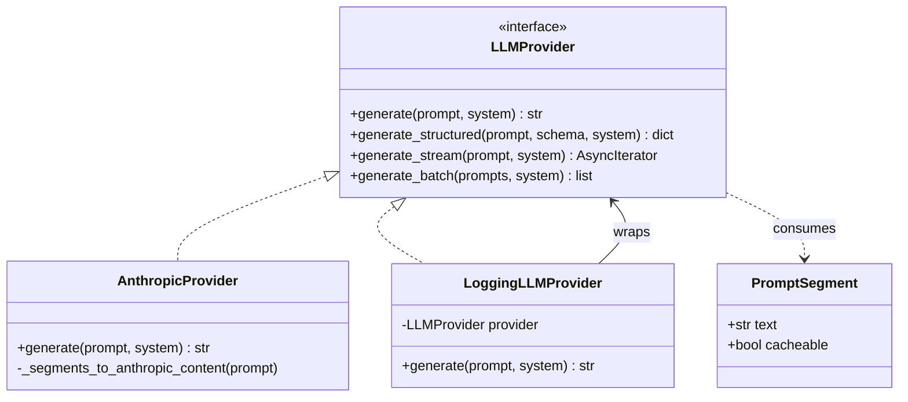
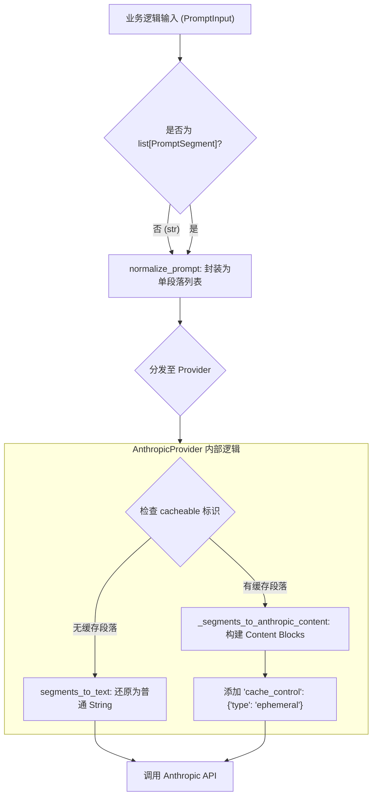

# 提示词段落化管理

### 提示词段落化架构概述

在 AutoWiki 的大型语言模型（LLM）交互框架中，提示词（Prompt）不再被视为单一、静态的字符串，而是被建模为一系列具有特定属性的段落。这种“段落化”设计旨在解决长上下文处理中的两个核心挑战：动态组合的灵活性与底层缓存的高效利用。通过 `PromptSegment` 这一核心抽象，开发者可以将系统指令、上下文背景、少样本示例（Few-shot examples）以及用户查询切分为独立的单元。

每个 `PromptSegment` 包含文本内容（`text`）和一个关键的元数据标识 `cacheable`。这种设计允许上层流水线（Pipeline）明确告知底层的 `LLMProvider` 哪些部分在多次请求中是保持不变的（例如大规模的代码库上下文或复杂的任务规范），从而触发服务商提供的提示词缓存机制（如 Anthropic 的 Prompt Caching）。

**Diagram: PromptSegment 结构及与 LLMProvider 的关系**



*Source: [worker/llm/prompt_segment.py:9-11; worker/llm/base.py:49-155](https://github.com/lazyxiang/AutoWiki/blob/main/worker/llm/prompt_segment.py#L9-L11; worker/llm/base.py)*

### 段落化处理流程

提示词从业务逻辑层传递到模型提供商层需要经过严格的规范化处理。AutoWiki 采用了统一的 `PromptInput` 类型定义，它既可以是一个简单的 `str`，也可以是 `PromptSegment` 对象的列表。处理流程的第一步是通过 `normalize_prompt` 函数。如果输入是纯字符串，系统会将其自动封装为一个默认 `cacheable=False` 的 `PromptSegment` 列表，确保后续逻辑的同构性。

在进入具体的 Provider（如 `AnthropicProvider`）后，系统会检查段落列表中的 `cacheable` 属性。对于支持缓存的模型，如果列表中存在被标记为可缓存的段落，系统会将其转换为特定厂商要求的结构化格式（如 Anthropic 的 `cache_control` 标记）；如果没有任何段落标记为可缓存，则系统会为了兼容性和效率，重新将段落合并为普通的文本字符串进行传输。

**Diagram: Prompt 处理与缓存转化的流水线**



*Source: [worker/llm/prompt_segment.py:17-32; worker/llm/anthropic_provider.py:15-55](https://github.com/lazyxiang/AutoWiki/blob/main/worker/llm/prompt_segment.py#L17-L32; worker/llm/anthropic_provider.py)*

### 核心工具函数说明

为了支撑段落化管理的高效运作，`worker/llm` 模块提供了一系列工具函数，用于执行类型转换、文本合并以及响应解析。这些函数确保了底层协议的复杂性对上层业务逻辑透明。

| 函数名称 | 输入参数 | 输出类型 | 功能描述 |
| :--- | :--- | :--- | :--- |
| `normalize_prompt` | `prompt: PromptInput` | `list[PromptSegment]` | 将字符串或列表统一转化为 `PromptSegment` 列表，是所有 Provider 的入口必经步骤。 |
| `segments_to_text` | `segments: list[PromptSegment]` | `str` | 将多个段落的 `text` 字段按顺序拼接，用于不支持结构化输入的 Provider。 |
| `_parse_json_response` | `raw: str` | `dict` | 清理模型返回的 Markdown 代码块标签（如 ```json），并将其解析为字典对象。 |
| `_truncate` | `text: str, max_len: int` | `str` | 为日志输出截断超长文本，默认长度为 2000 字符。 |
| `_segments_to_anthropic_content` | `prompt: PromptInput` | `str | list[dict]` | 核心转化逻辑，决定是否向 Anthropic 发送带有缓存标记的 content 列表。 |

这些工具函数在 `LLMProvider` 的各个实现类中被频繁调用。例如，`LoggingLLMProvider` 会在调用 `generate` 之前使用 `_truncate` 来确保日志的可读性，而 `AnthropicProvider` 则重度依赖 `_segments_to_anthropic_content` 来实现其核心的性能优化逻辑。

*Source: [worker/llm/prompt_segment.py:17-37; worker/llm/base.py:15-46; worker/llm/anthropic_provider.py:15-55](https://github.com/lazyxiang/AutoWiki/blob/main/worker/llm/prompt_segment.py#L17-L37; worker/llm/base.py)*

### 缓存机制实现原理

缓存机制的核心在于如何精准地识别并标记那些“代价高昂且重复出现”的上下文。在 `AnthropicProvider` 的实现中，这一逻辑被封装在私有方法 `_segments_to_anthropic_content` 内。

当传入的 `PromptInput` 中至少有一个 `PromptSegment` 的 `cacheable` 属性为 `True` 时，该方法会生成一个由多个 `dict` 组成的列表，每个 `dict` 代表一个内容块（Content Block）。对于每一个被标记为可缓存的段落，系统会附加 `cache_control` 属性，其类型通常设定为 `ephemeral`。根据 Anthropic 的 API 规范，这会指示模型在边缘节点缓存该段落的 KV Cache。

这种动态切换机制具有高度的鲁棒性：
1.  **自动降级**：如果输入中没有任何段落需要缓存，系统会自动返回一个合并后的 `str`。这是因为发送结构化的内容列表会带来微小的解析开销，对于短小的提示词，使用纯文本更为经济。
2.  **顺序敏感性**：缓存标记的顺序至关重要。`PromptSegment` 列表在转化为 API 调用时会严格保持业务逻辑指定的顺序，从而保证缓存命中的稳定性。
3.  **多段落缓存**：支持在一个 Prompt 中标记多个不同的段落为 `cacheable`，这在需要同时缓存“项目规约”和“大型代码上下文”时非常有用。

在 `LoggingLLMProvider` 中，这些段落化信息会被记录下来，方便开发者通过 `DEBUG` 日志确认缓存标记是否按照预期传递到了底层驱动。

*Source: [worker/llm/anthropic_provider.py:15-55; worker/llm/base.py:88-155; tests/worker/test_prompt_segment.py:10-12](https://github.com/lazyxiang/AutoWiki/blob/main/worker/llm/anthropic_provider.py#L15-L55; worker/llm/base.py)*

## Source Files

| File |
|------|
| [`worker/llm/base.py`](https://github.com/lazyxiang/AutoWiki/blob/main/worker/llm/base.py) |
| [`worker/llm/prompt_segment.py`](https://github.com/lazyxiang/AutoWiki/blob/main/worker/llm/prompt_segment.py) |
| [`worker/llm/anthropic_provider.py`](https://github.com/lazyxiang/AutoWiki/blob/main/worker/llm/anthropic_provider.py) |
| [`tests/worker/test_prompt_segment.py`](https://github.com/lazyxiang/AutoWiki/blob/main/tests/worker/test_prompt_segment.py) |