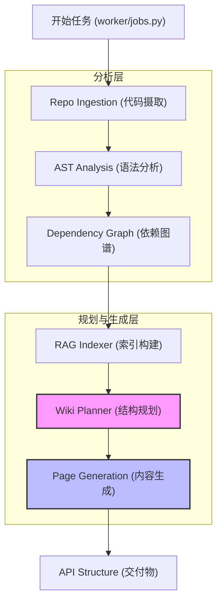
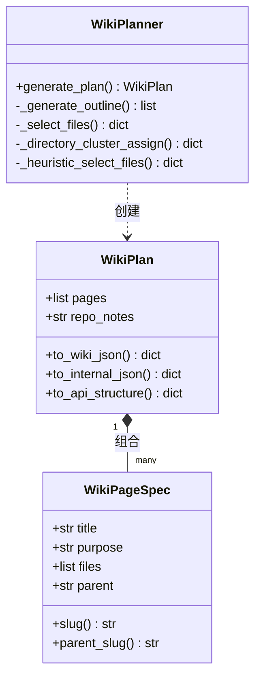

# Wiki 生成流水线

AutoWiki 的生成流水线是一个高度结构化的多阶段异步处理过程。它将原始的源代码仓库作为输入，通过静态分析、语义建模和生成式人工智能，最终产出结构严谨、内容详实且具备互联参考能力的 Wiki 文档。该流水线由 `worker/jobs.py` 调度，核心逻辑分布在 `worker/pipeline/` 目录下的多个专门模块中。

## Wiki 生成流水线概述

Wiki 的生成并非单一的 LLM 调用，而是一个涉及六个核心阶段的精密工程。流水线从底层的数据获取开始，逐步向上构建更高层级的抽象，直到形成完整的知识体系。

**Diagram: Wiki 生成的核心阶段流转**

*Source: [worker/jobs.py:1-120](https://github.com/lazyxiang/AutoWiki/blob/main/worker/jobs.py#L1-L120), [GEMINI.md:32-37](https://github.com/lazyxiang/AutoWiki/blob/main/GEMINI.md#L32-L37)*

1.  **Repo Ingestion**: 执行浅克隆并过滤无关文件。
2.  **AST Analysis**: 利用 Tree-Sitter 提取代码实体（类、函数、常量）。
3.  **Dependency Graph**: 建立文件间的导入关系。
4.  **RAG Indexer**: 对源代码进行分块并构建 FAISS 向量索引。
5.  **Wiki Planner**: 制定 Wiki 的整体架构，包括页面标题、层级和关联文件。
6.  **Page Generation**: 递归生成各个页面的 Markdown 内容并进行校验。

关于规划和生成的详细机制，请参阅子页面：[Wiki 结构规划器](Wiki-结构规划器.md) 和 [内容生成引擎](内容生成引擎.md)。

## 核心数据结构与实体模型

在整个流水线中，`WikiPlan` 和 `WikiPageSpec` 是承载结构化信息的关键载体。`WikiPlan` 代表了整个 Wiki 的蓝图，而 `WikiPageSpec` 定义了单个页面的生成规格。

`WikiPlanner` 会根据不同的消费场景，将这些实体序列化为多种格式：

| 格式名称 | 序列化方法 | 目标文件/输出 | 包含的关键字段 | 用途 |
| :--- | :--- | :--- | :--- | :--- |
| **User Wiki JSON** | `to_wiki_json()` | `.autowiki/wiki.json` | `title`, `purpose`, `parent` | 允许用户手动编辑和引导生成。 |
| **Internal JSON** | `to_internal_json()` | `ast/wiki_plan.json` | `files`, `repo_notes`, `pages` | 流水线内部持久化，支持增量生成。 |
| **API Structure** | `to_api_structure()` | API Response | `slug`, `parent_slug`, `has_user_notes` | 前端展示和导航树构建。 |

*Source: [worker/pipeline/wiki_planner.py:115-308](https://github.com/lazyxiang/AutoWiki/blob/main/worker/pipeline/wiki_planner.py#L115-L308)*

`WikiPageSpec` 包含一个独特的 `slug` 属性，该属性通过 `_slugify_title` 函数生成。它确保了页面在 URL 中的唯一性和安全性，支持 Unicode 字符，并在极端情况下通过哈希值保证唯一性。

*Source: [worker/pipeline/wiki_planner.py:89-98](https://github.com/lazyxiang/AutoWiki/blob/main/worker/pipeline/wiki_planner.py#L89-L98), 145-162*

## 页面规划与文件分配逻辑

`WikiPlanner` 的执行分为两个阶段（Phase 1 和 Phase 2），这种分离确保了在分配具体文件之前，Wiki 的逻辑结构（大纲）已经通过了一致性校验。

**Diagram: WikiPlanner 类关系与核心逻辑**

*Source: [worker/pipeline/wiki_planner.py:115-308](https://github.com/lazyxiang/AutoWiki/blob/main/worker/pipeline/wiki_planner.py#L115-L308)*

### 1. 结构大纲生成 (Phase 1)
系统首先调用 LLM 生成页面的树状结构。此过程由 `_generate_outline` 驱动，根据仓库的 `file_count` 和 `entity_count`（由 `_suggest_page_range` 建议），规划出 5 到 20 个不等的页面。系统会根据 `_depth` 函数校验标题前缀（如 "#" 或 "##"），确保目录树不超过两层深度。

### 2. 文件分配机制 (Phase 2)
一旦大纲确定，系统需要将源代码文件分配给具体的页面。
*   **LLM 优先分配**: 尝试让 LLM 根据文件摘要和依赖关系进行智能分配。
*   **启发式回退 (`_heuristic_select_files`)**: 如果 LLM 分配失败或不完整，系统会计算文件与页面的匹配分数。分数由路径重合度（`_tokenize`）、依赖关联和实体密度共同决定。
*   **目录聚类回退 (`_directory_cluster_assign`)**: 作为最后的保底手段，系统会将顶级目录作为聚类中心，将文件分配给标题词项最匹配的页面。

*Source: [worker/pipeline/wiki_planner.py:638-722](https://github.com/lazyxiang/AutoWiki/blob/main/worker/pipeline/wiki_planner.py#L638-L722), 821-944*

## 质量校验与自动化重试机制

为了应对大语言模型的不确定性，流水线内置了多层验证逻辑。如果某个生成阶段不符合预定义的规则，系统将捕获 `WikiPlannerError` 并触发带有上下文纠错信息的重试逻辑。

*   **大纲结构验证 (`_validate_outline_structure`)**:
    *   **数量约束**: 页面总数必须在建议范围内（由 `_suggest_page_range` 决定）。
    *   **层级约束**: 必须存在顶级标题，且二级标题不能脱离一级标题独立存在。
    *   **格式验证**: 必须包含有效的标题和用途描述。
*   **文件选择验证 (`_validate_selections`)**:
    *   **唯一性**: 确保一个文件原则上不被过度重复分配。
    *   **完整性**: 核心业务逻辑文件（通过依赖图分析得出）必须被覆盖。
*   **自动重试逻辑**:
    *   系统默认支持 `max_retries = 3`。
    *   每次重试时，`_build_selection_user` 会将上一次失败的错误信息（`last_error`）反馈给模型，实现闭环纠错。

*Source: [worker/pipeline/wiki_planner.py:79-86](https://github.com/lazyxiang/AutoWiki/blob/main/worker/pipeline/wiki_planner.py#L79-L86), 496-528, 531-601, 604-635*

在页面内容生成阶段，系统还会执行更为细致的“四阶段”（4-pass）校验。更多关于事实核查和修订的细节，请参阅：[质量校验与修订](质量校验与修订.md)。

## Source Files

| File |
|------|
| [`worker/pipeline/wiki_planner.py`](https://github.com/lazyxiang/AutoWiki/blob/main/worker/pipeline/wiki_planner.py) |
| [`worker/jobs.py`](https://github.com/lazyxiang/AutoWiki/blob/main/worker/jobs.py) |
| [`worker/pipeline/page_outline.py`](https://github.com/lazyxiang/AutoWiki/blob/main/worker/pipeline/page_outline.py) |
| [`worker/pipeline/page_generator.py`](https://github.com/lazyxiang/AutoWiki/blob/main/worker/pipeline/page_generator.py) |