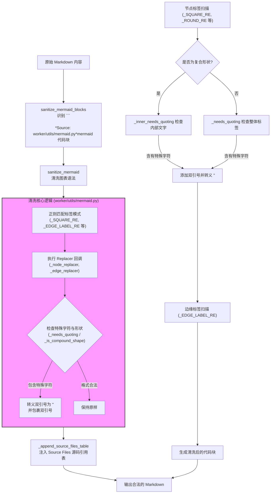
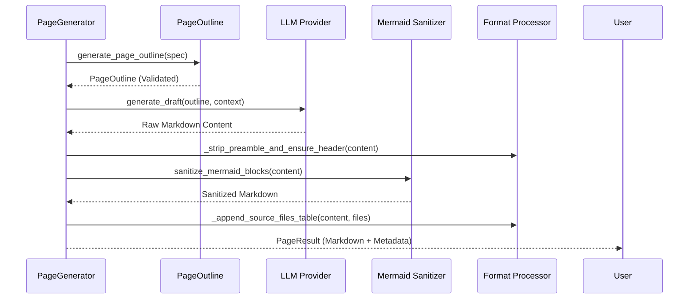

# Mermaid 图表优化

在 AutoWiki 系统中，架构图和流程图是由大语言模型（LLM）基于源码上下文自动生成的。然而，LLM 生成的 Mermaid 语法经常包含非法字符，导致前端渲染失败。为了保证文档质量，系统引入了一套完善的 Mermaid 语法自动清洗与页面排版后处理机制。

## Mermaid 语法自动清洗机制

LLM 在生成 Mermaid 架构图时，倾向于在节点标签（Node Labels）和边缘标签（Edge Labels）中使用具有特殊语义的字符。例如，路径中的 `/` 会被 Mermaid 误认为平行四边形节点，圆括号 `()` 会被识别为节点形状的开始。`worker/utils/mermaid.py` 模块通过多重正则表达式匹配和智能替换逻辑，确保生成的图表语法符合 Mermaid 标准。

### 核心清洗逻辑

清洗过程主要针对以下两类冲突进行处理：

1.  **节点标签冲突**：当节点名称中包含 `(`、`)`、`{`、`}`、`[`、`]`、`/` 或 `|` 时，必须使用双引号包裹。例如，`A[MCP Server (stdio)]` 会被清洗为 `A["MCP Server (stdio)"]`。
2.  **边缘标签冲突**：Mermaid 的边缘标签使用 `|text|` 定义。如果 `text` 中包含 `{}` 或 `/`，解析器会发生死锁或错误。清洗器通过 `_EDGE_LABEL_RE` 匹配这类标签并进行转义或引用。

此外，系统还特别处理了复合形状（Compound Shapes）。对于圆柱体 `[(text)]`、双圆圈 `((text))` 和六角形 `{{text}}`，清洗器能够识别出嵌套的语法标记，并仅对内部文字（Inner Text）进行引用处理，而不破坏外部的形状标记。

**Diagram: Mermaid 语法清洗流水线**

*Source: [worker/utils/mermaid.py:1-121](https://github.com/lazyxiang/AutoWiki/blob/main/worker/utils/mermaid.py#L1-L121)*

### 关键正则表达式与替换策略

清洗器维护了一组复杂的正则表达式，通过前瞻断言（Lookahead Assertions）避免误伤。

| 正则表达式变量 | 匹配目标 | 处理逻辑 |
| :--- | :--- | :--- |
| `_SQUARE_RE` | `ID[Label]` 形式的方块节点 | 捕获 Label，若包含 `_SPECIAL_CHARS` 则引用。 |
| `_DOUBLE_ROUND_RE` | `ID((Label))` 形式的双圆节点 | 处理 `(( ))` 内部文字，防止 `( )` 提前闭合。 |
| `_DOUBLE_CURLY_RE` | `ID{{Label}}` 形式的六角节点 | 处理 `{{ }}` 内部文字。 |
| `_EDGE_LABEL_RE` | `-->|Label|` 形式的边缘标签 | 对 `| |` 之间的文字进行 `_edge_replacer` 处理。 |

在 `_node_replacer` 函数中，系统会调用 `_is_compound_shape` 检查标签是否为 `[(...)]` 或 `([...])` 等类型。如果是，则由 `_node_replacer` 结合 `_inner_needs_quoting` 的判断结果来执行针对性的引用处理，确保仅对内部文字进行转义并保留外层形状标记。

*Source: [worker/utils/mermaid.py:44-118](https://github.com/lazyxiang/AutoWiki/blob/main/worker/utils/mermaid.py#L44-L118)*

## 页面生成与排版生命周期

页面的生成并非一蹴而就，而是一个多阶段的流水线过程。`worker/pipeline/page_generator.py` 协调了从大纲规划到最终格式修补的完整生命周期。

### 页面生成的四个阶段（Passes）

1.  **大纲阶段 (Outline Pass)**：由 `fast_llm` 执行。根据 `WikiPageSpec` 和实体摘要生成结构化的 `PageOutline`。此阶段会定义页面包含哪些小节（Sections）以及每个小节是否需要图表。
2.  **草稿阶段 (Draft Pass)**：由高性能 LLM 执行。根据大纲生成完整的 Markdown 内容。
3.  **事实核查阶段 (Fact Check Pass)**：针对生成的草稿进行源码一致性验证（由 `fact_check.py` 驱动）。
4.  **格式修补阶段 (Formatting Pass)**：这是优化的核心环节，包括标题标准化、清除 LLM 的前言（Preamble）、清洗 Mermaid 代码块以及注入源码参考表。

**Diagram: generate_page 调用链与后处理流程**

*Source: [worker/pipeline/page_generator.py:143-307](https://github.com/lazyxiang/AutoWiki/blob/main/worker/pipeline/page_generator.py#L143-L307)*

### 排版增强功能

在生成流程的最后，`_append_source_files_table` 函数会将当前页面关联的所有源文件路径汇集成一个“Source Files”表格，附加在页面末尾。这为读者提供了直接的源码导航入口。

同时，`_strip_preamble_and_ensure_header` 解决了 LLM 经常输出思维链（Chain of Thought）或解释性开场白的问题。它会扫描文本，删除第一个一级标题（`#`）之前的任何内容，确保文档直接以正确的页面标题开始。

*Source: [worker/pipeline/page_generator.py:49-83](https://github.com/lazyxiang/AutoWiki/blob/main/worker/pipeline/page_generator.py#L49-L83)*

## 配置模型与校验逻辑

为了确保生成的内容符合预期，系统定义了严格的数据模型来约束 LLM 的输出。`worker/pipeline/page_outline.py` 负责将 LLM 生成的 JSON 结构转化为强类型的 Python 对象。

### 数据结构 definition

*   **`DiagramPlan`**: 描述一个小节中图表的计划。
    *   `type`: Mermaid 图表类型（如 `flowchart TD`）。
    *   `purpose`: 图表旨在说明的逻辑关系。
    *   `source_files`: 生成该图表参考的源码文件列表。
*   **`SectionPlan`**: 定义一个小节。
    *   `heading`: 小节标题。
    *   `kind`: 内容类型（`prose`, `table`, `list` 等）。
    *   `focus`: 内容侧重点描述。
    *   `diagram`: 可选的 `DiagramPlan` 对象。
*   **`PageOutline`**: 整个页面的大纲，包含多个 `SectionPlan` 实例。

### 校验逻辑 `validate_outline`

`validate_outline` 函数会对 LLM 输出的原始字典进行严格校验，包括：
*   **结构完整性**：必须包含小节列表且每个小节必须有标题和类型。
*   **图表合法性**：如果定义了图表，必须指定合法的 Mermaid 类型。
*   **文件参考校验**：确保图表参考的文件确实属于该页面的权限范围。

如果在生成过程中校验失败，`generate_page_outline` 会根据配置的 `max_retries` 进行重试，并在 Prompt 中反馈错误信息，引导 LLM 修正输出。

*Source: [worker/pipeline/page_outline.py:93-203](https://github.com/lazyxiang/AutoWiki/blob/main/worker/pipeline/page_outline.py#L93-L203)*

## 模块依赖分析

Mermaid 处理与页面生成器高度依赖于底层的 AST 分析和 LLM 基础设施。下表汇总了各核心功能的职责及主要依赖。

| 功能模块 | 核心函数 | 关键依赖 | 职责描述 |
| :--- | :--- | :--- | :--- |
| **语法清洗** | `sanitize_mermaid` | `re` (Regex) | 处理节点标签和边缘标签中的特殊符号，防止渲染崩溃。 |
| **块级处理** | `sanitize_mermaid_blocks` | `sanitize_mermaid` | 检索 Markdown 文本中的代码块并进行局部清洗。 |
| **大纲生成** | `generate_page_outline` | `PageOutline`, `fast_llm` | 定义页面结构，规划图表位置和用途。 |
| **流水线管理** | `generate_page` | `FAISSStore`, `LLMProvider` | 调度 4-Pass 流程，整合上下文与后处理逻辑。 |
| **依赖拓扑** | `compute_generation_order` | `WikiPlan` | 计算页面生成的拓扑顺序，支持并行生成无关联页面。 |

在执行 `generate_page_batch` 时，系统会利用 `compute_generation_order` 确定的顺序，分批处理页面生成任务。这种方式确保了在生成子页面内容时，父页面可以引用其关键信息。

*Source: [worker/pipeline/page_generator.py:310-374](https://github.com/lazyxiang/AutoWiki/blob/main/worker/pipeline/page_generator.py#L310-L374)*

## Source Files

| File |
|------|
| [`worker/utils/mermaid.py`](https://github.com/lazyxiang/AutoWiki/blob/main/worker/utils/mermaid.py) |
| [`worker/pipeline/page_outline.py`](https://github.com/lazyxiang/AutoWiki/blob/main/worker/pipeline/page_outline.py) |
| [`worker/pipeline/page_generator.py`](https://github.com/lazyxiang/AutoWiki/blob/main/worker/pipeline/page_generator.py) |
| [`tests/worker/test_mermaid_sanitize.py`](https://github.com/lazyxiang/AutoWiki/blob/main/tests/worker/test_mermaid_sanitize.py) |