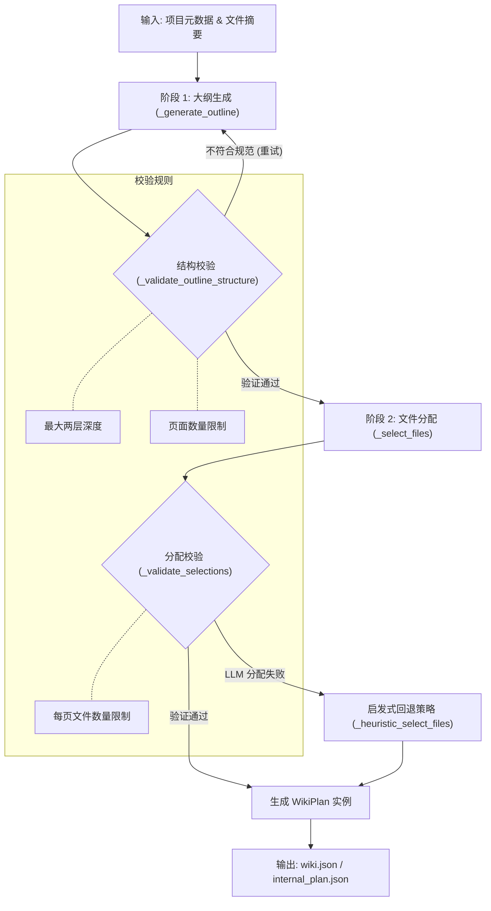
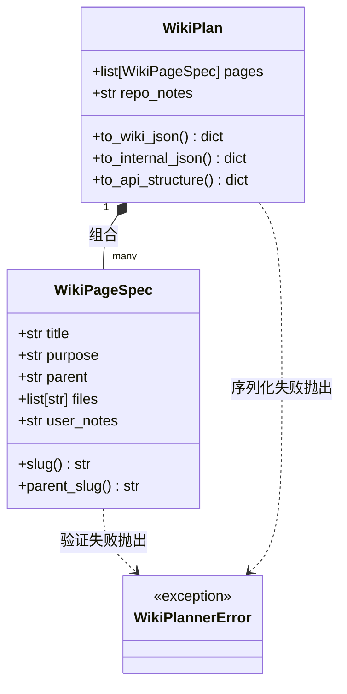

# Wiki 结构规划器

## Wiki 结构规划器概述

`WikiPlanner` 是 AutoWiki 流水线中的核心组件，负责将复杂的代码仓库抽象并组织为易于理解的两层 Wiki 目录树。它不仅决定了 Wiki 的广度和深度，还建立了源代码文件与 Wiki 页面之间的逻辑映射。其核心目标是根据项目的规模、复杂度和领域知识，生成一份既能覆盖核心功能又能保持结构清晰的生成蓝图。

该规划过程被严格划分为两个阶段：大纲生成（Outline Generation）和文件分配（File Assignment）。在第一阶段，`WikiPlanner` 调用大语言模型（LLM）基于文件摘要、README 和依赖关系图生成页面的层次结构。在第二阶段，它确定哪些源文件最能代表或支持该页面的主题，并将其分配给相应的页面规范。这种分阶段的设计允许系统在结构不合理时进行早期验证和重试，从而确保最终生成的 Wiki 具有高度的组织性。

**Diagram: Wiki 生成的核心阶段流转**

*Source: [worker/pipeline/wiki_planner.py:101-111](https://github.com/lazyxiang/AutoWiki/blob/main/worker/pipeline/wiki_planner.py#L101-L111), 385-478*

## 数据结构定义

`WikiPlanner` 使用一组精心设计的类来管理 Wiki 的结构信息。这些数据结构不仅承载了生成的元数据，还负责处理不同层级的序列化逻辑，以满足用户编辑、流水线内部传递和前端展示的不同需求。

### WikiPageSpec
`WikiPageSpec` 是 Wiki 计划中的基本构建单元。它定义了单个页面的所有属性，包括其在目录树中的位置、预期用途以及关联的源文件。

| 字段 | 类型 | 说明 |
| :--- | :--- | :--- |
| `title` | `str` | 页面的显示标题，是页面的唯一标识。 |
| `purpose` | `str` | 页面的功能描述，指导后续的页面生成逻辑。 |
| `parent` | `str \| None` | 父页面的标题。若为 `None`，则该页面为顶级分类。 |
| `files` | `list[str]` | 分配给该页面的源文件路径列表。 |
| `user_notes` | `str \| None` | 用户通过干预（Steering）提供的额外说明或备注。 |

### WikiPlan
`WikiPlan` 是整个 Wiki 结构的容器。它包含一个 `WikiPageSpec` 对象的有序列表，并支持多种导出格式。

*   **wiki.json (Human-Editable)**: 通过 `to_wiki_json()` 生成，省略了 slug 和内部路径信息，旨在让用户能直观地手动调整结构。
*   **ast/wiki_plan.json (Internal)**: 通过 `to_internal_json()` 生成，包含完整的文件映射，供增量生成逻辑使用。
*   **API Response (Frontend)**: 通过 `to_api_structure()` 生成，将标题转换为 URL 安全的 `slug`，并将 `purpose` 重命名为 `description` 以适配前端展示。

*Source: [worker/pipeline/wiki_planner.py:115-183](https://github.com/lazyxiang/AutoWiki/blob/main/worker/pipeline/wiki_planner.py#L115-L183), 187-308*

## 核心逻辑与处理流程

`WikiPlanner` 的处理流程结合了 LLM 的推理能力与硬性的结构约束。在生成过程中，系统会根据仓库的复杂性动态调整页面规模，并实施多级验证。

### 页面规模预测
为了避免生成过于冗长或过于简略的 Wiki，系统使用 `_suggest_page_range()` 函数根据文件总数和实体总数计算合理的页面数量范围。通常情况下，页面数量控制在 5 到 20 页之间，旨在确保每个页面都有足够的实质内容，同时不会让读者感到压力。

### 结构验证与重试
在 Phase 1 生成大纲后，`_validate_outline_structure()` 会立即介入。它执行以下硬性检查：
1.  **深度限制**：调用 `_depth()` 确保目录树不超过两层（即只有顶级分类和子页面）。
2.  **孤立页面检查**：确保所有子页面的父页面在计划中均有定义。
3.  **数量约束**：验证生成的页面总数是否落在建议的范围内。
4.  **内容完整性**：确保每个页面都有非空的 `title` 和 `purpose`。

如果验证失败，`_generate_outline()` 会记录错误并触发重试（最多 3 次），在重试提示词中会包含前一次失败的原因，指导 LLM 修正结构。

**Diagram: WikiPlanner 类关系与序列化**

*Source: [worker/pipeline/wiki_planner.py:531-601](https://github.com/lazyxiang/AutoWiki/blob/main/worker/pipeline/wiki_planner.py#L531-L601), 638-722*

### 启发式回退机制
当 LLM 在 Phase 2 无法在有效时间内完成文件分配，或者分配逻辑持续违反约束（例如每页分配文件过多）时，系统会激活回退机制。

*   **_heuristic_select_files**: 该方法首先保留 LLM 已成功完成的部分分配结果。对于剩余页面，它计算每个文件与页面 `purpose` 之间的相关性得分，并将得分最高的文件填补进去。
*   **_directory_cluster_assign**: 这是一个更底层的保底策略。它按照文件的目录层级进行聚类，并使用 `_best_matching_page()` 将整个目录分配给标题语义最接近的 Wiki 页面。这保证了即使在完全没有 LLM 参与的情况下，生成的 Wiki 结构依然能反映代码库的物理组织。

*Source: [worker/pipeline/wiki_planner.py:821-898](https://github.com/lazyxiang/AutoWiki/blob/main/worker/pipeline/wiki_planner.py#L821-L898), 901-944*

## 文件分配策略

文件分配是确保 Wiki 页面具有“事实来源”的关键步骤。`WikiPlanner` 采用了一种结合语义匹配和依赖分析的多加权评分算法。

### 分数计算逻辑
`_score_file_for_page()` 函数通过以下维度对文件进行评分：
1.  **路径匹配**：如果文件的路径段（如目录名）出现在页面标题或目的描述中，则获得显著加分。
2.  **命名空间重合**：利用 `_tokenize()` 对标题和文件路径进行分词，根据词元重合度计算基础分数。
3.  **依赖重要性**：如果在 `DependencyGraph` 中该文件被其他多个文件依赖，其权重会增加，因为它更有可能属于“核心架构”或“基础组件”页面。
4.  **README 关联**：如果文件在项目的 README 中被提及，会被优先分配到概览类页面。

### 候选文件筛选
为了避免 LLM 上下文溢出，系统不会将数千个文件全部交给 LLM 分配。`_prefilter_candidates()` 会为每个页面预选出前 25 个最相关的候选文件。这个预筛选过程确保了 LLM 只需在高质量的候选集中做最后的语义决策。

### 分配规则约束
在 `_validate_selections()` 中，系统会对最终的分配结果进行审计：
*   **文件唯一性**：虽然同一个文件可以出现在多个页面中，但系统鼓励将文件分配到最相关的页面。
*   **数量阈值**：单个页面关联的文件数量通常受到限制，以防止生成的文档过于臃肿。
*   **有效性检查**：所有分配的文件路径必须在仓库中真实存在。

*Source: [worker/pipeline/wiki_planner.py:725-767](https://github.com/lazyxiang/AutoWiki/blob/main/worker/pipeline/wiki_planner.py#L725-L767), 770-818, 604-635*

## Source Files

| File |
|------|
| `worker/pipeline/wiki_planner.py` |
| `tests/worker/test_wiki_planner.py` |