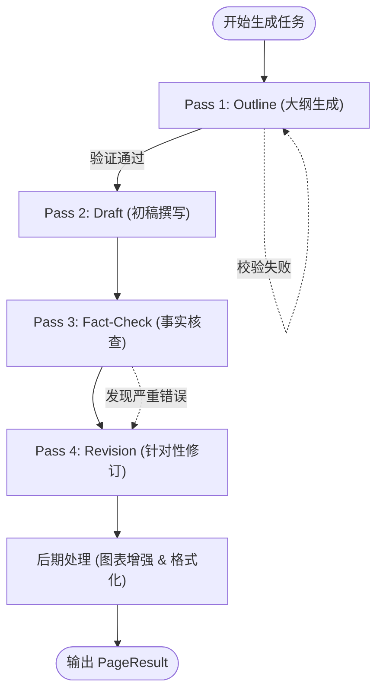
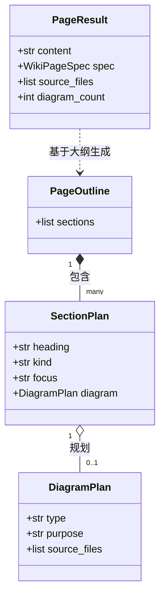

# 内容生成引擎

## 内容生成引擎架构概述

内容生成引擎是 AutoWiki 的核心，负责将结构化的代码分析数据和原始源代码转化为高质量、具备专业性的 Wiki 页面。该引擎采用了一种名为“四阶段流水线”（4-pass pipeline）的设计架构，通过分层处理和闭环反馈机制确保生成内容的准确性与一致性。这种设计将复杂的长文本生成任务分解为更小、可控的子任务，有效降低了 LLM（大语言模型）产生幻觉的可能性。

在 `generate_page` 函数中定义的生命周期包含以下四个阶段：
1.  **Pass 1 (Outline)**：使用 `fast_llm`（如 GPT-4o-mini 或 Gemini Flash）生成页面的结构化大纲。此阶段决定了页面的逻辑流向、章节划分以及应当插入的图表类型。
2.  **Pass 2 (Draft)**：基于 Pass 1 的大纲，使用推理能力更强的 `llm` 进行全文撰写。此阶段会通过 RAG（检索增强生成）获取代码片段和分析元数据。
3.  **Pass 3 (Fact-Check)**：对初稿进行事实核查。引擎会将生成的内容与原始源代码进行对比，识别技术性错误。
4.  **Pass 4 (Revision)**：根据事实核查的反馈对初稿进行针对性修正，最终输出 `PageResult` 对象。

**Diagram: 内容生成流水线四阶段流程**

*Source: [worker/pipeline/page_generator.py:143-307](https://github.com/lazyxiang/AutoWiki/blob/main/worker/pipeline/page_generator.py#L143-L307)*

## 文档大纲规划与校验机制

在内容生成的初始阶段，大纲的质量直接决定了最终页面的深度和广度。`generate_page_outline` 函数负责这一任务，它不仅生成章节标题，还规划了每个章节的重点（Focus）和展示形式（Kind）。

为了确保 LLM 生成的大纲符合系统要求，`validate_outline` 函数执行了严格的结构化验证逻辑：
*   **强制结构检查**：输入必须是一个包含 `sections` 列表的 JSON 对象。每个章节必须具备 `heading`、`kind` 和 `focus` 字段。
*   **类型合法性**：`kind` 字段必须属于预定义的类型（如 `prose`、`prose+diagram`、`prose+table` 等）。
*   **图表规范**：如果章节包含图表，则 `DiagramPlan` 必须指明有效的 `type`（如 `flowchart`、`sequenceDiagram`）以及相关的源代码文件路径，确保后续绘图阶段有据可依。
*   **自愈重试**：如果验证失败，`generate_page_outline` 会捕获 `ValueError`，并将错误描述附加到后续的提示词中，启动最多 2 次的重试机制，要求模型修正其输出格式。

这种“规划-验证-重试”的循环确保了流水线的下游环节（如 `PageDraft`）能够接收到完全符合预期的输入，避免了因格式错误导致的整体崩溃。

*Source: [worker/pipeline/page_outline.py:119-203](https://github.com/lazyxiang/AutoWiki/blob/main/worker/pipeline/page_outline.py#L119-L203), [worker/pipeline/page_outline.py:257-317](https://github.com/lazyxiang/AutoWiki/blob/main/worker/pipeline/page_outline.py#L257-L317)*

## 核心数据结构与实体模型

内容生成引擎依赖于一套严谨的数据模型来在不同阶段之间传递状态。这些模型使用 Python 的 `dataclasses` 实现，保证了类型安全和字段的自解释性。

### 核心实体对照表

| 类名 | 用途 | 核心字段 |
| :--- | :--- | :--- |
| `DiagramPlan` | 定义单个图表的生成计划 | `type`, `purpose`, `source_files` |
| `SectionPlan` | 定义 Wiki 页面中单个章节的规划 | `heading`, `kind`, `focus`, `diagram` |
| `PageOutline` | 经过校验的完整页面逻辑结构 | `sections` (List of SectionPlan) |
| `PageResult` | 最终生成的页面输出对象 | `content`, `spec`, `source_files`, `diagram_count` |
| `PromptSegment` | 用于跨 Provider 的多模态提示词构造 | `text`, `type`, `cacheable` |

**Diagram: 页面生成实体关系图**

*Source: [worker/pipeline/page_outline.py:93-116](https://github.com/lazyxiang/AutoWiki/blob/main/worker/pipeline/page_outline.py#L93-L116), [worker/pipeline/page_generator.py:123-140](https://github.com/lazyxiang/AutoWiki/blob/main/worker/pipeline/page_generator.py#L123-L140)*

## 锚点提取与上下文管理

为了让 LLM 在生成大纲时对代码仓库有全局视野，引擎引入了“锚点”（Anchors）机制。锚点提供了超出特定页面范围的高层上下文，帮助模型理解当前页面在整个项目架构中的位置。

`outline_anchors.py` 模块提供了三种核心提取工具：
1.  **目录树生成 (`build_directory_tree`)**：生成一个紧凑的 ASCII 树状图，显示文件的层级关系，并标注每个目录下包含的文件数量。它通过 `max_depth` 参数限制深度，防止提示词过长。
2.  **包级文档提取 (`extract_package_docstrings`)**：自动识别项目中的入口文件（如 Python 的 `__init__.py` 或 Rust 的 `lib.rs`），并提取其顶部 docstring。这为模型提供了模块的设计意图信息（Layer C1 上下文）。
3.  **README 结构分析 (`extract_readme_sections`)**：解析项目的根目录 README，提取其标题层级。

这些信息最终通过 `format_anchors_for_prompt` 组合成一个标准化的 Markdown 块，注入到 Pass 1 的系统提示词中。通过这种方式，即使 LLM 正在为一个底层的工具类生成大纲，它也能意识到该工具类属于哪个高级模块，以及它如何支撑整个系统的运行。

此外，`_strip_preamble_and_ensure_header` 等实用工具会处理模型输出中常见的冗余（如“好的，这是为您生成的大纲...”），确保输出内容直接以标准的 Markdown 标题开头，维持了文档的生产级质量。

*Source: [worker/pipeline/outline_anchors.py:55-114](https://github.com/lazyxiang/AutoWiki/blob/main/worker/pipeline/outline_anchors.py#L55-L114), [worker/pipeline/outline_anchors.py:155-209](https://github.com/lazyxiang/AutoWiki/blob/main/worker/pipeline/outline_anchors.py#L155-L209), [worker/pipeline/page_generator.py:63-83](https://github.com/lazyxiang/AutoWiki/blob/main/worker/pipeline/page_generator.py#L63-L83)*

## Source Files

| File |
|------|
| [`worker/pipeline/page_outline.py`](https://github.com/lazyxiang/AutoWiki/blob/main/worker/pipeline/page_outline.py) |
| [`worker/pipeline/page_generator.py`](https://github.com/lazyxiang/AutoWiki/blob/main/worker/pipeline/page_generator.py) |
| [`worker/pipeline/outline_anchors.py`](https://github.com/lazyxiang/AutoWiki/blob/main/worker/pipeline/outline_anchors.py) |
| [`worker/pipeline/fact_check.py`](https://github.com/lazyxiang/AutoWiki/blob/main/worker/pipeline/fact_check.py) |
| [`tests/worker/test_page_outline.py`](https://github.com/lazyxiang/AutoWiki/blob/main/tests/worker/test_page_outline.py) |
| [`worker/llm/prompt_segment.py`](https://github.com/lazyxiang/AutoWiki/blob/main/worker/llm/prompt_segment.py) |