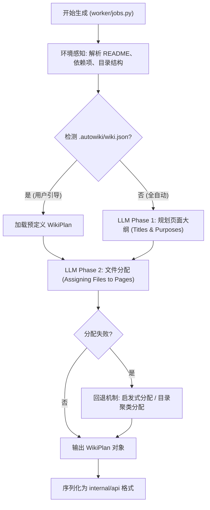
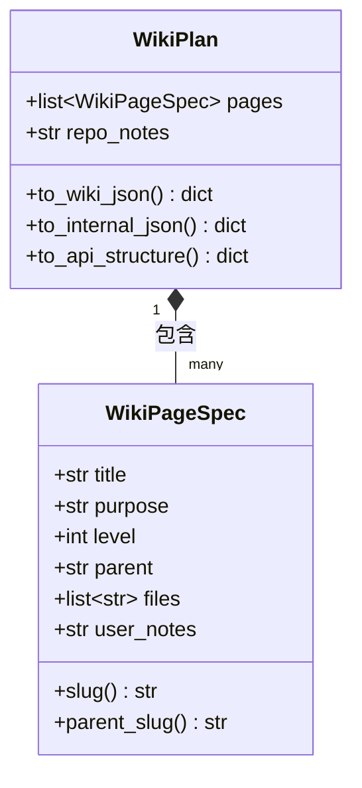

# 用户自定义引导

在 AutoWiki 的自动化生成流程中，`.autowiki/wiki.json` 文件充当了用户意图与 AI 生成逻辑之间的桥梁。虽然系统能够通过静态代码分析、依赖图谱和聚类算法自动推断代码库的结构，但 AI 往往缺乏对业务上下文、架构演进背景或特定文档偏好的深度理解。

通过在仓库根目录的 `.autowiki` 目录下提供 `wiki.json` 配置文件，用户可以显式地干预 `WikiPlanner` 的执行过程。这允许开发者定义自定义的页面层级、指定关键文件的归属关系、添加背景注释（`user_notes`），甚至完全接管文档的目录结构规划。

*Source: [worker/pipeline/wiki_planner.py:11-45*](https://github.com/lazyxiang/AutoWiki/blob/main/worker/pipeline/wiki_planner.py#L11-L45*)

## 规划器核心架构与工作流

`WikiPlanner` 是 AutoWiki 流水线中的核心决策组件，负责将散乱的源代码元数据转化为有序的文档蓝图。它并非一次性生成所有内容，而是采用了一种“先大纲、后分配”的分阶段策略。

当用户启动文档生成任务时，`worker/jobs.py` 会调用 `generate_wiki_plan`。如果检测到 `.autowiki/wiki.json` 存在，规划器会优先尊重其中的配置。

**Diagram: WikiPlanner 执行生命周期**

*Source: [worker/pipeline/wiki_planner.py:638-722*](https://github.com/lazyxiang/AutoWiki/blob/main/worker/pipeline/wiki_planner.py#L638-L722*)

在 `WikiPlanner` 的内部实现中，工作流被严格划分为两个阶段：

1.  **阶段 1：大纲生成 (_generate_outline)**：利用 `_build_outline_prompt` 生成页面树。在此阶段，AI 关注的是“有哪些页面”以及“每个页面的职责是什么”。如果用户在配置文件中定义了页面，此步骤将被缩减为对现有配置的补全或校验。
2.  **阶段 2：文件关联 (_select_files)**：这是计算量最大的部分。规划器需要决定哪些源文件最能代表该页面的主题。它会计算文件与页面描述的相似度，参考 `_score_file_for_page` 的得分。

如果 LLM 在文件分配阶段因为 Token 限制或逻辑错误而失败，系统会自动触发 `_directory_cluster_assign` 或 `_heuristic_select_files`。这些回退算法会利用文件系统的物理结构（如顶层目录 `_directory_key`）来强制完成分配，确保流水线不会因为 AI 的偶然波动而中断。

*Source: [worker/pipeline/wiki_planner.py:821-944*](https://github.com/lazyxiang/AutoWiki/blob/main/worker/pipeline/wiki_planner.py#L821-L944*)

## 页面规格定义

每个 Wiki 页面在系统中都由 `WikiPageSpec` 类来描述。这个类不仅承载了显示在界面上的标题和内容描述，还记录了复杂的层级关系。

`WikiPageSpec` 的关键属性决定了最终 Wiki 导航树的形状。

| 属性名 | 类型 | 说明 |
| :--- | :--- | :--- |
| `title` | `str` | 页面的显示标题。系统会自动调用 `_slugify_title` 生成 URL 安全的 Slug。 |
| `purpose` | `str` | 页面目标的详细描述。这是 AI 生成具体正文时的核心上下文输入。 |
| `level` | `int` | 页面在目录树中的深度。`0` 表示根级页面。 |
| `parent` | `str | None` | 父级页面的标题。用于构建父子关联，生成 `parent_slug`。 |
| `files` | `list[str]` | （内部使用）关联的源文件相对路径列表。手动配置时可留空由 AI 填充。 |
| `user_notes` | `str | None` | 用户提供的补充注释。AI 在生成正文时会将其视为“必须遵循的最高指示”。 |

*Source: [worker/pipeline/wiki_planner.py:115-183*](https://github.com/lazyxiang/AutoWiki/blob/main/worker/pipeline/wiki_planner.py#L115-L183*)

**Slug 生成逻辑**
`WikiPlanner` 使用 `_slugify_title` 函数来处理 URL 生成。它不仅支持标准的 ASCII 字符，还通过 Unicode 感知（`\w`）来处理多语言标题。如果标题包含特殊字符，函数会将其替换为短横线（`-`）；如果处理后的结果为空（例如全是非法字符），则会退而求其次使用标题的 `md5` 哈希值前 8 位作为 Slug，确保生成的静态文件路径在所有操作系统上都是合法的。

*Source: [worker/pipeline/wiki_planner.py:89-98*](https://github.com/lazyxiang/AutoWiki/blob/main/worker/pipeline/wiki_planner.py#L89-L98*)

## 序列化与集成机制

`WikiPlan` 是 `WikiPageSpec` 的容器类，它负责在整个系统的不同组件之间传递规划数据。为了适应不同的应用场景，`WikiPlan` 提供了三种不同的序列化方法。

**Diagram: WikiPlan 类结构与转换**

*Source: [worker/pipeline/wiki_planner.py:187-308*](https://github.com/lazyxiang/AutoWiki/blob/main/worker/pipeline/wiki_planner.py#L187-L308*)

### 1. 外部可见格式：to_wiki_json
这是用户最常接触的格式，即 `.autowiki/wiki.json` 的标准。
*   **特性**：移除了 `slug`、`parent_slug` 和 `files` 等派生或易变字段。
*   **设计初衷**：保持文件的可读性和可编辑性。用户只需关注标题、层级和描述，而不需要手动维护文件关联或 Slug 唯一性。

### 2. 内部持久化格式：to_internal_json
用于保存在 `storage/ast/wiki_plan.json` 中。
*   **特性**：保留了 `files` 字段。
*   **设计初衷**：支持增量更新。当某个文件发生变化时，系统可以快速通过此映射找到受影响的页面，而无需重新运行耗时的全量规划流程。

### 3. API 响应格式：to_api_structure
供前端 Web 界面渲染导航树使用。
*   **特性**：将 `purpose` 重命名为 `description`，显式暴露 `slug` 和 `parent_slug`。
*   **设计初衷**：降低前端处理负担，直接提供符合树形控件要求的扁平化数组。

*Source: [worker/pipeline/wiki_planner.py:207-308*](https://github.com/lazyxiang/AutoWiki/blob/main/worker/pipeline/wiki_planner.py#L207-L308*)

## 故障排除与校验逻辑

为了防止无意义或格式错误的配置进入生成流水线，`WikiPlanner` 实现了一套严格的校验机制。一旦发现结构性问题，系统会抛出 `WikiPlannerError` 并终止任务，而不是生成质量低下的内容。

**核心校验规则：**

*   **结构深度校验 (`_validate_outline_structure`)**：
    *   页面标题不能为空或仅包含空白字符。
    *   层级跳转必须合法：子页面的 `level` 必须等于父页面的 `level + 1`。
    *   层级深度上限：系统当前强制页面深度不能超过 4 层，以保证 Wiki 导航的可用性。
    *   数量限制：总页面数需在 `_suggest_page_range` 建议的范围内。例如，对于只有 10 个文件的小型项目，生成 50 个页面会被判定为异常。

*   **分配有效性校验 (`_validate_selections`)**：
    *   每个页面至少应尝试分配一个文件，除非该页面被定义为纯目录（Container Page）。
    *   分配的文件路径必须真实存在于当前仓库的分支中。
    *   如果 AI 尝试给一个页面分配超过 50 个文件，系统会发出警告或强制截断，防止生成的上下文超出 LLM 的处理窗口。

*   **回退逻辑触发**：
    在 `_generate_outline` 函数中，如果 LLM 反馈的内容无法通过 JSON 解析或上述结构校验，系统会进行最多 3 次重试。如果 3 次后依然失败，系统将放弃 AI 规划，转而执行 `_directory_cluster_assign`。该算法会根据文件的顶级目录名（如 `src/`, `tests/`, `docs/`）自动创建对应的页面并完成分配，确保用户至少能得到一个基于物理目录结构的初步文档。

*Source: [worker/pipeline/wiki_planner.py:79-86](https://github.com/lazyxiang/AutoWiki/blob/main/worker/pipeline/wiki_planner.py#L79-L86), 531-635, 821-898*

## Source Files

| File |
|------|
| `worker/pipeline/wiki_planner.py` |
| `worker/jobs.py` |
| `worker/pipeline/page_outline.py` |
| `tests/worker/test_wiki_planner.py` |