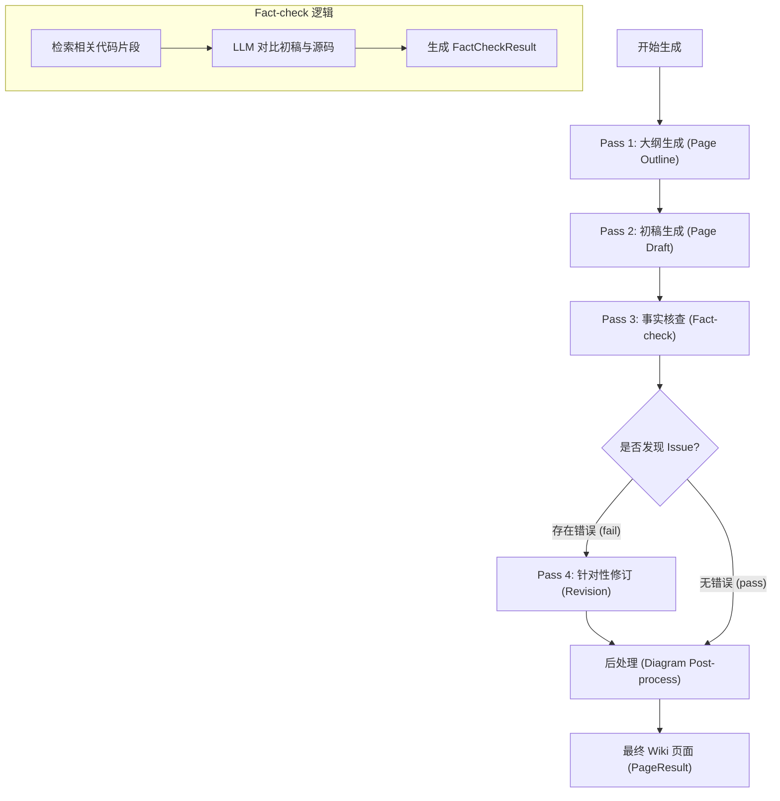
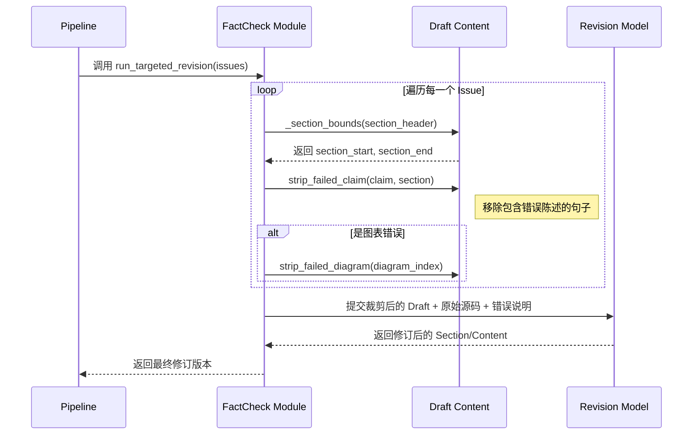

# 质量校验与修订

在 AutoWiki 的自动化文档生成流水线中，内容的准确性与结构的合规性是核心指标。系统通过一个严格的 4-pass（四阶段）流程来确保生成的 Wiki 页面不仅符合技术深度要求，且严谨地锚定于源代码事实。质量校验与修订主要发生在 Pass 3（事实核查）与 Pass 4（针对性修订）阶段，由 `worker/pipeline/fact_check.py` 模块负责。

## 质量校验流程概述

质量校验并不是在页面生成后的一个附加步骤，而是深度集成在 `generate_page` 函数所定义的生命周期中的。在初稿（Draft）生成后，系统并不会直接将其保存为最终结果，而是通过一个循环的反馈回路来验证内容的可靠性。

**Diagram: 4-pass 质量校验与修订流程**



*Source: worker/pipeline/page_generator.py:143-307, worker/pipeline/fact_check.py:149-195*

当 `generate_page` 执行时，它首先利用 `fast_llm` 获取结构化的 `PageOutline`。初稿生成后，`run_fact_check` 函数被触发。该函数将生成的 Markdown 内容与 `targeted_chunks`（从向量数据库中检索出的、与该页面强相关的源代码片段）进行对比。如果核查结果 `FactCheckResult` 的 `verdict` 为 `fail`，流程将进入针对性修订阶段。这种机制避免了 LLM 在处理复杂逻辑时可能产生的“幻觉”，确保每一个技术声称都有代码支撑。

## 事实核查核心组件

事实核查的核心在于将 LLM 的推理结果转化为可操作的数据结构。`FactCheckIssue` 和 `FactCheckResult` 两个类定义了校验结果的架构，使系统能够精确地识别出哪些段落、哪些声称或哪些图表存在偏差。

### 关键数据模型

| 类/属性 | 类型 | 说明 |
| :--- | :--- | :--- |
| `FactCheckIssue.claim` | `str` | 被认定为错误的具体陈述或事实声称。 |
| `FactCheckIssue.reason` | `str` | 核查失败的原因，通常是与源代码不一致的说明。 |
| `FactCheckIssue.section` | `str | None` | 错误发生的 Markdown 标题（可选），用于精准定位。 |
| `FactCheckIssue.diagram_index` | `int | None` | 如果是 Mermaid 图表错误，记录其在页面中的索引。 |
| `FactCheckResult.verdict` | `str` | 核查定论，可选值为 `"pass"` 或 `"fail"`。 |
| `FactCheckResult.issues` | `list[FactCheckIssue]` | 包含所有发现的错误列表。 |

*Source: worker/pipeline/fact_check.py:54-66*

### 执行逻辑与提示词构建

`run_fact_check` 函数负责编排核查过程。它首先通过 `_build_fact_check_prompt` 构建一个多段落的提示词。这个提示词将系统上下文（实体摘要、依赖关系）与核查目标（初稿、源代码片段）分离，以优化缓存利用率。

核查过程中，`fast_llm` 会根据 `targeted_chunks` 中的内容逐一审查初稿中的逻辑。例如，如果初稿声称一个函数返回 `int`，但 `targeted_chunks` 中的代码定义显示其返回 `Optional[int]`，核查器会生成一个 `FactCheckIssue`。`parse_fact_check_result` 函数会将 LLM 返回的 JSON 格式原始数据解析为结构化的 Python 对象，如果解析失败或模型未遵循格式，核查流程会默认“放行（fail-open）”以保证流水线不中断，但会记录相应的警告。

*Source: worker/pipeline/fact_check.py:69-83, 149-195*

## 针对性修订机制

一旦发现事实错误，AutoWiki 不会简单地重新生成整个页面，因为这可能引入新的幻觉。相反，它采用“精确定位与局部裁剪”的策略，即针对性修订（Targeted Revision）。

### 错误定位与内容裁剪

在调用修订模型之前，系统必须先清理初稿中的错误内容。`strip_failed_claim` 函数是这一过程的关键。它不仅在全文范围内搜索错误的 `claim`，还支持通过 `_section_bounds` 定位特定的 Markdown 章节。

**Diagram: 针对性修订调用序列**



*Source: worker/pipeline/fact_check.py:212-302, 323-411*

`strip_failed_claim` 的实现逻辑非常严谨：它使用 `re.split` 配合正则表达式（如 `[.!?]`）将文本拆分为句子，并移除任何包含错误 `claim` 字符串的句子。为了保持 Markdown 格式的完整性，`_strip_lines` 会处理空行和首尾空白。如果是 Mermaid 图表校验失败，`strip_failed_diagram` 则会根据索引移除整个 ` ```mermaid ` 代码块及其相关的 Header 和 Source 注释。

### 修订任务的执行

`run_targeted_revision` 函数接收裁剪后的初稿和 `FactCheckIssue` 列表。它会构建一个新的提示词，明确告诉 LLM 哪些地方被删除了以及为什么要删除（基于 `reason`）。LLM 的任务是填补这些被删除的空白，同时确保新生成的内容与提供的源代码参考完全一致。这种方法利用了模型对上下文的感知能力，通常能产生比初次生成更准确的结果。

*Source: worker/pipeline/fact_check.py:323-411*

## 大纲校验与生成优化

质量校验的起点其实早于事实核查，它始于 Pass 1 的 `PageOutline` 生成阶段。如果大纲本身存在逻辑缺陷（例如引用的文件不存在），后续的生成将失去意义。

### 大纲验证规则

`validate_outline` 函数对 LLM 生成的大纲字典进行严格审查。它确保：
- **文件归属准确性**：大纲中声明的每个文件必须属于该页面被分配的 `page_files` 列表。这防止了不同页面之间的内容重叠或引用越界。
- **结构完整性**：必须包含 `sections`，且每个 `section` 必须有非空的 `heading` 和 `description`。
- **图表合规性**：`diagrams`（如果存在）必须有明确的类型定义（符合 Mermaid 规范）。

如果校验失败，`validate_outline` 会抛出 `ValueError`。`generate_page_outline` 函数捕获此异常，并将错误信息反馈给 `fast_llm` 进行重试（最多重试 `max_retries` 次，默认为 2 次）。这种闭环重试机制极大地提高了大纲阶段的成功率。

*Source: worker/pipeline/page_outline.py:119-203, 257-317*

### 生成过程中的连贯性优化

为了确保多个页面之间的连贯性，`generate_page` 在调用大纲生成时会传入 `child_titles`。这意味着父页面的大纲会意识到其子页面的存在，从而在内容规划上做到层次分明，避免在高层级页面中过多堆砌本应出现在子页面中的实现细节。

此外，在生成的最后阶段，`_append_source_files_table` 会在页面底部自动追加一个“Source Files”表格，列出所有作为该页面参考源的原始代码文件。这不仅增强了 Wiki 的专业感，也为读者提供了溯源依据。

*Source: worker/pipeline/page_generator.py:49-60, 224-254*

## Source Files

| File |
|------|
| `worker/pipeline/fact_check.py` |
| `worker/pipeline/page_outline.py` |
| `worker/pipeline/page_generator.py` |
| `tests/worker/test_fact_check.py` |
| `worker/llm/prompt_segment.py` |