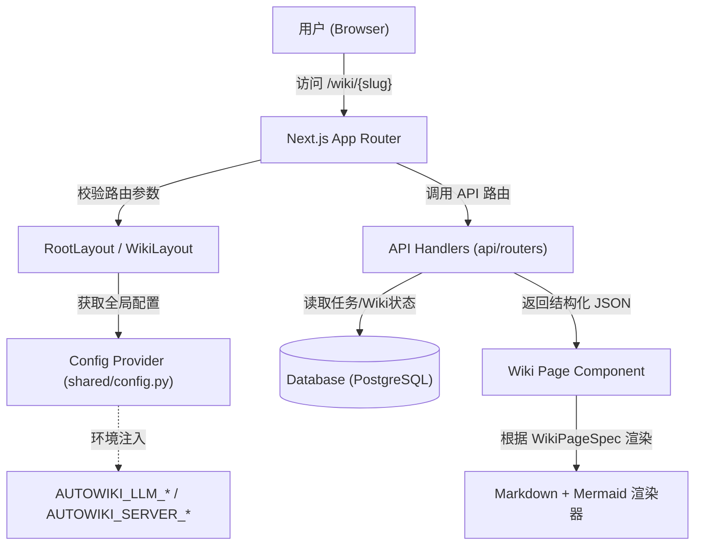
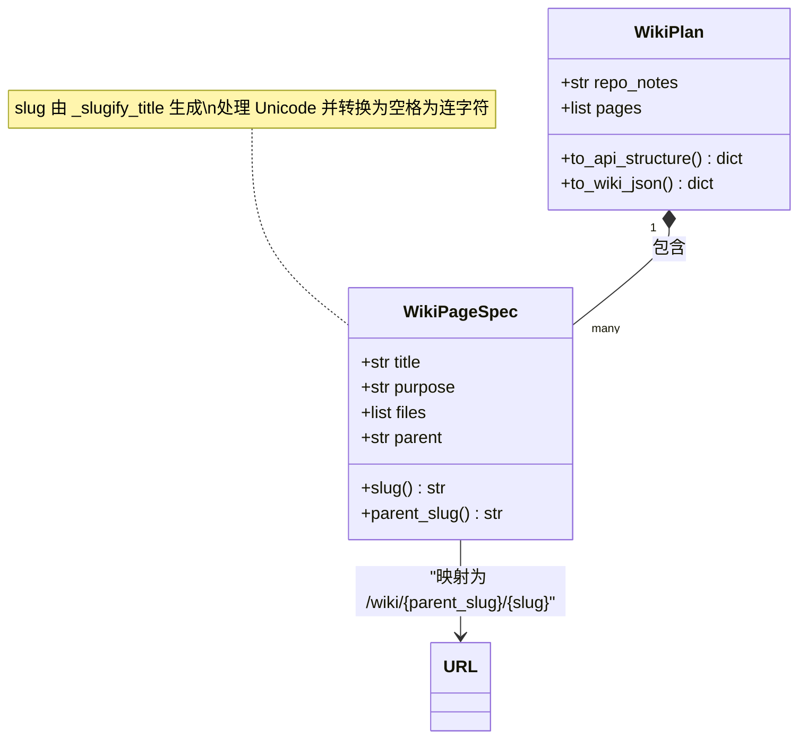

# 前端应用架构

AutoWiki 的前端部分采用 Next.js 框架构建，旨在为用户提供一个响应迅速、逻辑清晰的文档浏览与管理界面。前端架构的核心任务是将复杂的后端分析结果（由 `WikiPlanner` 生成的页面拓扑结构）与动态的实时任务进度（通过 WebSocket 同步）无缝结合。整个架构遵循关注点分离原则，将路由导航、配置驱动的 UI 渲染以及基于 `WikiPageSpec` 的内容展示逻辑进行解耦。

## 前端架构概览

Next.js 应用采用了典型的 App Router 架构，通过声明式路由管理页面状态。前端架构不仅承担视图渲染的任务，还负责将全局配置从后端通过 `ServerConfig` 和 `LLMConfig` 注入到用户界面中，以确保用户感知的模型状态与后台运行的 Worker 保持一致。

核心交互模式围绕“任务驱动”和“文档驱动”展开。当用户发起一个仓库索引任务时，前端通过 API 层触发后端流水线，并订阅 WebSocket 更新。一旦 `WikiPlan` 生成，前端路由将动态映射到生成的 `slug` 路径上。

**Diagram: 前端应用请求流转与路由分发**

*Source: [shared/config.py:1-103](https://github.com/lazyxiang/AutoWiki/blob/main/shared/config.py#L1-L103)*

在这种架构下，前端不仅仅是一个静态的展示层，而是一个动态的、与后端状态机强耦合的交互实体。它通过 `shared/config.py` 中定义的配置项来决定界面的功能可用性（例如，根据 `EmbeddingConfig.provider` 的不同切换搜索 UI）。

## 配置管理与服务注入

AutoWiki 的前后端一致性很大程度上依赖于 `shared/config.py` 中定义的 Pydantic 模型。前端在初始化阶段或通过服务端组件（Server Components）直接读取这些配置，以确保 API 基地址、端口号以及正在使用的 LLM 供应商信息准确无误。

`LLMConfig` 和 `EmbeddingConfig` 类不仅控制后端的模型调用逻辑，还决定了前端“调研”模式（Deep Research）的参数校验范围。例如，如果 `AUTOWIKI_LLM_PROVIDER` 被设置为 `anthropic`，前端会自动调整相应的 Token 限制提示。

| 配置分类 | 核心类名 | 关键属性 | 描述 |
| :--- | :--- | :--- | :--- |
| **语言模型配置** | `LLMConfig` | `provider`, `model`, `cache_ttl` | 定义当前系统使用的 LLM，前端根据 `provider` 展示对应的 API 状态。 |
| **向量嵌入配置** | `EmbeddingConfig` | `provider`, `model` | 影响文档搜索与索引的精度，前端据此展示索引状态。 |
| **服务器配置** | `ServerConfig` | `host`, `port` | 确定前端 API 请求的 Base URL。 |
| **聊天窗口配置** | `ChatConfig` | `history_window` | 限制前端聊天组件显示的上下文轮数。 |

通过 `_coerce_empty_to_default` 和 `_coerce_empty_provider` 等校验器，系统能够处理环境变量缺失的情况，为前端提供稳定的默认值。这种机制确保了即使在复杂的部署环境下，前端也能获得预期的配置对象，避免了因 `null` 引用导致的页面崩溃。

*Source: [shared/config.py:11-69](https://github.com/lazyxiang/AutoWiki/blob/main/shared/config.py#L11-L69)*

## 页面规划与路由设计

前端路由的拓扑结构直接由后端的 `WikiPlanner` 决定。在 `worker/pipeline/wiki_planner.py` 中，`WikiPageSpec` 定义了每一页的元数据。其中，`slug` 属性是连接后端逻辑与前端 URL 的纽带。

前端通过调用 `WikiPlan.to_api_structure()` 获取完整的 Wiki 树状结构。该方法会将后端的 `WikiPageSpec` 列表转换为前端易于消费的 JSON，其中包含了标题、目的（作为简介）以及递归生成的 Slug 路径。

**Diagram: WikiPageSpec 数据结构与 URL 映射关系**

*Source: [worker/pipeline/wiki_planner.py:115-183](https://github.com/lazyxiang/AutoWiki/blob/main/worker/pipeline/wiki_planner.py#L115-L183)*

在路由生成过程中，`_slugify_title` 函数（位于 `worker/pipeline/wiki_planner.py:89-98`）扮演了关键角色。它使用 Unicode 感知的正则表达式将页面标题转换为 URL 安全的字符串。前端 Next.js 的动态路由 `[...slug]/page.tsx` 会捕获这些路径，并向 API 请求对应的 `WikiPageSpec` 数据。

如果页面具有父级引用（即 `parent` 字段非空），前端会构建面包屑导航（Breadcrumbs），这主要通过 `parent_slug()` 方法实现。该方法应用与 `slug()` 相同的逻辑，确保路径的一致性。

## 组件交互与数据流

AutoWiki 的组件交互逻辑围绕着异步任务的生命周期展开。由于生成一个完整的 Wiki 规划（`WikiPlan`）涉及到对代码库的深度扫描（AST 分析、依赖图构建等），前端必须处理中间状态。

1.  **初始化阶段**：前端通过 API 获取当前的 `ServerConfig`。如果仓库尚未索引，则引导用户进入“接入（Ingestion）”流程。
2.  **规划生成阶段**：调用 `/api/wiki/plan` 触发 `WikiPlanner`。此时，后端会根据仓库的复杂程度（文件数与实体数）通过 `_suggest_page_range` 自动计算建议的页面规模。
3.  **数据转换与传递**：
    *   后端调用 `to_api_structure()`。
    *   该方法会将 `purpose` 字段重命名为前端组件更易理解的 `description`。
    *   `files` 列表（包含文件路径）被保留，以便前端可以提供“跳转至源代码”的链接。
4.  **内容渲染**：
    *   前端组件解析 Markdown 内容。
    *   遇到 Mermaid 代码块时，调用集成在 `worker/utils/mermaid.py` 中定义的逻辑（虽然渲染在前端执行，但 DSL 的生成规则由后端统制）。
5.  **增量更新**：通过 `to_internal_json()` 保留的 `files` 映射，前端可以支持增量刷新功能，即只更新受特定文件变动影响的页面，而无需重新加载整个路由树。

这种数据流设计确保了前端保持“无状态”特性，所有的页面结构信息均从 `WikiPlan` 的序列化结果中获取。正如 `WikiPlannerError` 所指示的，如果 Phase 1（规划生成）失败，前端将捕获该异常并通过 UI 提供重试机制或错误日志展示，日志路径由 `Config.task_log_path()` 等方法在后端动态配置。

*Source: [worker/pipeline/wiki_planner.py:273-308](https://github.com/lazyxiang/AutoWiki/blob/main/worker/pipeline/wiki_planner.py#L273-L308)*

## Source Files

| File |
|------|
| [`shared/config.py`](https://github.com/lazyxiang/AutoWiki/blob/main/shared/config.py) |
| [`worker/pipeline/wiki_planner.py`](https://github.com/lazyxiang/AutoWiki/blob/main/worker/pipeline/wiki_planner.py) |
| [`shared/models.py`](https://github.com/lazyxiang/AutoWiki/blob/main/shared/models.py) |
| [`worker/utils/mermaid.py`](https://github.com/lazyxiang/AutoWiki/blob/main/worker/utils/mermaid.py) |
| [`tests/worker/test_dependency_graph.py`](https://github.com/lazyxiang/AutoWiki/blob/main/tests/worker/test_dependency_graph.py) |