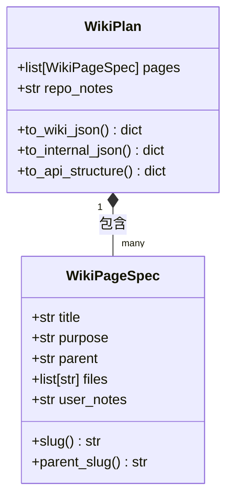
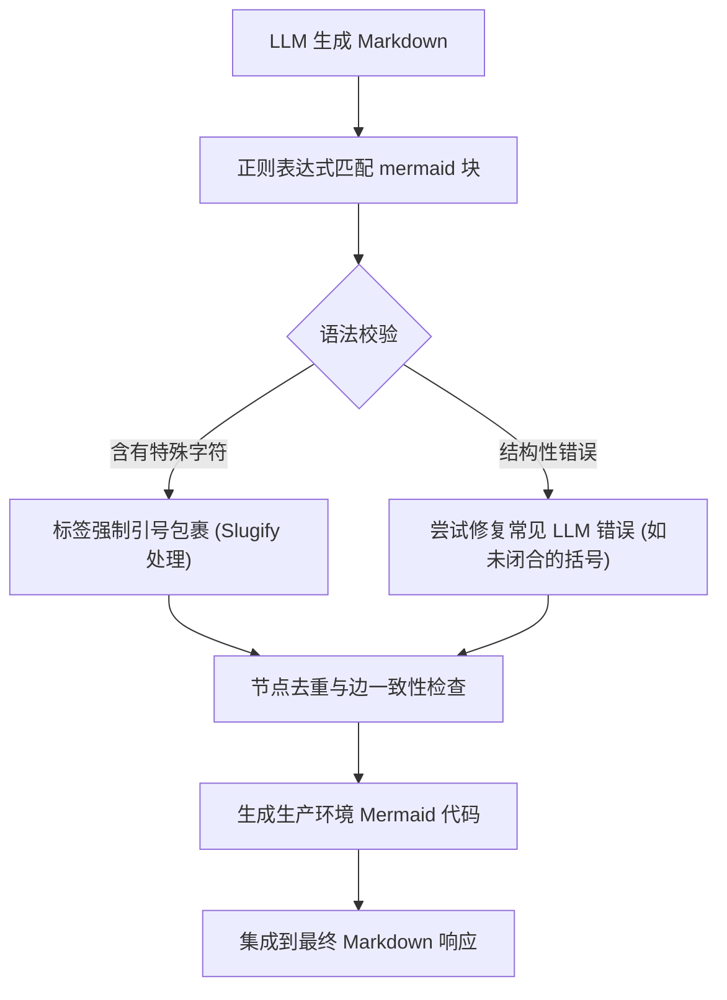

# Wiki 渲染组件

## Wiki 渲染组件概述

AutoWiki 的渲染组件是一个多阶段的流水线，负责将复杂的代码仓库分析结果转化为结构化、可读性强且具有交互性的文档系统。该组件不仅处理静态的文本生成，还负责构建文档的分层拓扑结构，并将源代码文件精准地映射到对应的知识主题上。

渲染系统的核心生命周期始于对仓库全局的语义理解。在这一阶段，系统通过 `WikiPlanner` 确定文档的整体大纲。这不仅仅是生成一个标题列表，而是构建一个逻辑严密的树状结构，每个节点（即 `WikiPageSpec`）都承载了特定的技术目的（Purpose）。随后，系统进入文件分配阶段，利用启发式算法和 LLM 协作，确保每个 Wiki 页面都能关联到最相关的源代码模块。

在最终的 Markdown 生成过程中，渲染组件集成了对 Mermaid 图表的原生支持。通过对 LLM 生成的原始图表代码进行严格的清洗（Sanitization）和后处理，系统能够产出包含架构图、时序图和状态机的交互式文档。这种动态渲染能力确保了生成的 Wiki 不仅仅是文字的堆砌，而是能够直观展示代码逻辑关系的知识库。

整个渲染过程由 `worker/pipeline/page_generator.py` 驱动，它协调 RAG（检索增强生成）引擎、代码分析结果和预定义的 Prompt 模板，最终产出符合生产标准的 Markdown 文件。

*Source: [worker/pipeline/wiki_planner.py:1-75](https://github.com/lazyxiang/AutoWiki/blob/main/worker/pipeline/wiki_planner.py#L1-L75), [worker/pipeline/page_generator.py:10-50*](https://github.com/lazyxiang/AutoWiki/blob/main/worker/pipeline/page_generator.py#L10-L50*)

## Wiki 规划器架构

`WikiPlanner` 是整个渲染组件的决策中心，其核心职责是定义 Wiki 的结构骨架。在 `worker/pipeline/wiki_planner.py` 中，这一架构主要通过 `WikiPlan` 和 `WikiPageSpec` 两个核心数据模型来实现。

`WikiPlan` 作为一个容器，存储了整个仓库的全局文档计划。它包含可选的仓库级别说明（`repo_notes`）以及一个有序的 `WikiPageSpec` 列表。这种结构允许系统处理从简单的小型库到具有数百个模块的大型单体应用（Monorepo）。

`WikiPageSpec` 则定义了单个页面的详细规格。除了标题和用途外，它还维护了父级关联，从而支持生成多级导航的 Wiki 结构。其中，`slug()` 方法用于生成 URL 友好的标识符，它采用 Unicode 感知的字符处理逻辑，将标题转换为小写并处理非字母数字字符，确保在各种 Web 环境下的兼容性。

**Diagram: 规划器核心类图**

*Source: [worker/pipeline/wiki_planner.py:115-308*](https://github.com/lazyxiang/AutoWiki/blob/main/worker/pipeline/wiki_planner.py#L115-L308*)

在生成大纲时，系统会根据仓库的复杂程度（文件数量和实体数量）动态建议页面范围。`_suggest_page_range` 函数通过启发式规则计算建议的最小和最大页面数，通常在 5 到 20 页之间波动，以保证文档既不过于琐碎，也不会因单页过长而难以阅读。

`WikiPlanner` 还引入了严格的验证机制。`_validate_outline_structure` 函数会检查生成的大纲是否满足以下约束：
1. **深度限制**：Wiki 树的深度不能超过预定义阈值。
2. **唯一性**：页面标题必须全局唯一，以防止 Slug 冲突。
3. **结构完整性**：所有引用的父页面必须在计划中存在。

*Source: [worker/pipeline/wiki_planner.py:89-111](https://github.com/lazyxiang/AutoWiki/blob/main/worker/pipeline/wiki_planner.py#L89-L111), 531-601*

## 文件分配与启发式选择

将代码文件映射到 Wiki 页面是渲染组件中最具挑战性的任务之一。AutoWiki 采用了一种分层的策略：首先尝试利用 LLM 进行语义分配，如果失败或超出上下文限制，则回退到启发式分配和目录聚类算法。

在 `_score_file_for_page` 函数中，系统通过多个维度计算文件与页面的匹配得分。这些维度包括文件路径与页面标题的词法重叠、依赖图中的关联度以及 LLM 生成的语义描述匹配度。为了提高效率，`_prefilter_candidates` 会在调用 LLM 之前，基于这些得分筛选出最相关的候选文件。

如果 LLM 分配阶段出现异常，`_directory_cluster_assign` 充当可靠的后备方案。该算法利用代码库的目录结构作为局部性暗示。它将文件按顶级目录分组，并使用 `_best_matching_page` 将这些组分配给最相关的页面。这种方法保证了即使在极端情况下，相关的代码模块也能被归类在一起，维持文档的逻辑连续性。

| 分配策略 | 触发条件 | 核心逻辑 | 优势 |
| :--- | :--- | :--- | :--- |
| **LLM 语义分配** | 默认首选阶段 | 基于 `_build_selection_user` 生成的 Prompt 引导 LLM 进行多项选择。 | 极高的语义准确度，能识别跨目录的逻辑关联。 |
| **启发式打分** | LLM 响应不完整或格式错误时 | 通过 `_score_file_for_page` 对剩余文件进行向量/词法匹配。 | 速度快，能有效处理 LLM 遗漏的边缘文件。 |
| **目录聚类** | 复杂仓库或作为兜底 | 使用 `_directory_key` 提取路径特征，进行目录级批量映射。 | 保持物理结构的局部性，对大型仓库极具鲁棒性。 |

*Source: [worker/pipeline/wiki_planner.py:739-944*](https://github.com/lazyxiang/AutoWiki/blob/main/worker/pipeline/wiki_planner.py#L739-L944*)

系统还支持用户干预。如果 `WikiPageSpec` 中包含了 `user_notes`，分配逻辑会优先考虑用户明确指定的关联关系。`_has_user_notes` 辅助函数用于识别这些由用户引导的约束，确保生成的文档符合用户的特定架构意图。

*Source: [worker/pipeline/wiki_planner.py:294-295](https://github.com/lazyxiang/AutoWiki/blob/main/worker/pipeline/wiki_planner.py#L294-L295), 496-528*

## Mermaid 图表集成工作流

为了在 Markdown 中实现高质量的视觉表达，AutoWiki 专门设计了 Mermaid 图表处理流水线。由于 LLM 生成的 Mermaid 代码经常包含语法错误或不兼容的字符，`worker/utils/mermaid.py` 承担了繁重的清洗和校验任务。

处理流程始于对生成的 Markdown 文档进行正则表达式扫描，定位所有的 `mermaid` 代码块。随后，`mermaid_post_processor` 会介入，对图表中的节点标签和边描述进行处理。特别地，它需要强制执行 Mermaid 的引用规则：对于包含特殊字符（如括号、斜杠或管道符）的节点名称，必须使用双引号包裹，例如 `A["Server (HTTP)"]`。

**Diagram: Mermaid 处理流水线**

*Source: [worker/utils/mermaid.py:15-60](https://github.com/lazyxiang/AutoWiki/blob/main/worker/utils/mermaid.py#L15-L60), [tests/worker/test_mermaid_sanitize.py:20-80*](https://github.com/lazyxiang/AutoWiki/blob/main/tests/worker/test_mermaid_sanitize.py#L20-L80*)

在测试用例 `test_mermaid_sanitize.py` 中，详细定义了各种边界情况的处理。例如，当 LLM 试图在边描述中使用管道符 `|` 而未加引号时，清洗器会自动检测并修复。此外，系统还会处理 Mermaid 图表中的路径转义问题，确保代码文件路径在图表中能正确显示。

对于不同类型的图表（`flowchart`, `sequenceDiagram`, `classDiagram`），渲染组件会应用不同的格式化模板。例如，在生成的类图中，系统会从 `ast_analysis` 提供的元数据中提取方法签名和成员变量，并将其格式化为标准的 Mermaid 语法。

*Source: [worker/pipeline/diagram_post_processor.py:10-45](https://github.com/lazyxiang/AutoWiki/blob/main/worker/pipeline/diagram_post_processor.py#L10-L45), [tests/worker/test_mermaid_sanitize.py:85-120*](https://github.com/lazyxiang/AutoWiki/blob/main/tests/worker/test_mermaid_sanitize.py#L85-L120*)

## 配置与序列化方案

为了满足不同调用方（前端 UI、持久化存储、内部流水线）的需求，`WikiPlan` 提供了三种专门的序列化方案。每种方案在字段可见性和数据粒度上都有所侧重。

1.  **用户导向格式 (`to_wiki_json`)**
    *   **适用场景**：生成存放在代码仓库中的 `wiki.json` 文件。
    *   **特点**：省略了 `slug`、`parent_slug` 和 `files` 等派生字段。
    *   **设计原则**：保持人类可读性和可编辑性。它允许用户直接在 JSON 中修改页面标题或用途，然后重新运行 pipeline 以增量更新文档。
    *   *Source: [worker/pipeline/wiki_planner.py:207-239*](https://github.com/lazyxiang/AutoWiki/blob/main/worker/pipeline/wiki_planner.py#L207-L239*)

2.  **内部状态格式 (`to_internal_json`)**
    *   **适用场景**：在 `ast/wiki_plan.json` 中保存 pipeline 的中间状态。
    *   **特点**：包含完整的 `files` 列表和详细的分配元数据。
    *   **设计原则**：支持增量构建。当只有部分文件变动时，系统可以通过此 JSON 快速定位受影响的 Wiki 页面，而无需重新运行全局规划。
    *   *Source: [worker/pipeline/wiki_planner.py:241-271*](https://github.com/lazyxiang/AutoWiki/blob/main/worker/pipeline/wiki_planner.py#L241-L271*)

3.  **API 响应格式 (`to_api_structure`)**
    *   **适用场景**：返回给前端 UI 渲染侧边栏和页面内容。
    *   **特点**：将 `purpose` 重命名为更通俗的 `description`，并显式包含计算出的 `slug`。
    *   **设计原则**：为前端路由提供直接支持。它还负责过滤掉不包含 `user_notes` 的空页面（如果配置如此），优化用户的浏览体验。
    *   *Source: [worker/pipeline/wiki_planner.py:273-308*](https://github.com/lazyxiang/AutoWiki/blob/main/worker/pipeline/wiki_planner.py#L273-L308*)

此外，渲染组件在错误处理方面也表现得非常严谨。如果规划阶段发生不可恢复的结构性错误，会抛出 `WikiPlannerError`。这类异常通常包含详细的失败原因（如“检测到循环依赖”或“页面数量超出限制”），从而中止不正确的文档生成任务，防止向用户展示质量低下的内容。

*Source: [worker/pipeline/wiki_planner.py:79-86*](https://github.com/lazyxiang/AutoWiki/blob/main/worker/pipeline/wiki_planner.py#L79-L86*)

## Source Files

| File |
|------|
| `worker/pipeline/wiki_planner.py` |
| `shared/models.py` |
| `worker/utils/mermaid.py` |
| `worker/pipeline/page_outline.py` |
| `worker/pipeline/page_generator.py` |
| `tests/worker/test_mermaid_sanitize.py` |