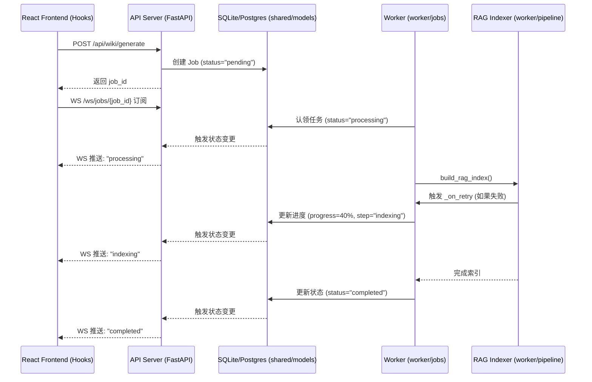
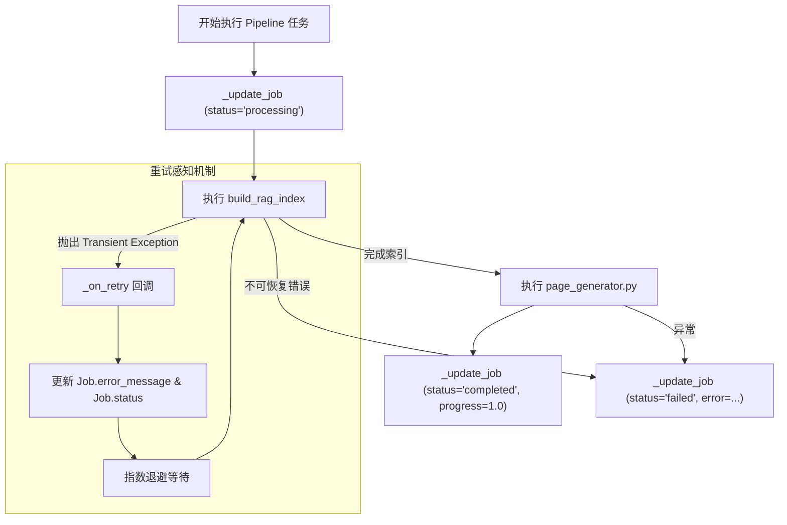

# 实时通信机制

AutoWiki 的实时通信机制旨在为用户提供透明、高效的任务执行监控体验。由于 Wiki 生成和深度调研任务涉及大量复杂的计算（如 AST 分析、FAISS 向量索引构建、LLM 生成等），这些任务通常以异步作业（Job）的形式在后台执行。为了让前端 React 应用能够实时反映任务进度，系统构建了一套从后台 Worker 到数据库，再到 WebSocket 的状态同步链路。

### 实时通信架构概览

AutoWiki 采用基于状态轮询与 WebSocket 推送相结合的混合模式。任务执行流的核心在于状态的原子化更新。当用户发起 Wiki 生成请求时，API 层首先在数据库中创建一个 `Job` 记录，并将其状态初始化为 `pending`。随后，Worker 进程接收到任务，开始执行多阶段流水线。

在流水线执行的每个关键节点，Worker 会调用 `_update_job` 或通过 `_make_on_retry` 生成的延迟回调机制，将任务的当前步骤（Step）、进度（Progress）以及可能的错误信息（Error Message）写入数据库。API 层监听数据库状态的变化（或通过特定的事件总线），并通过 WebSocket 连接将这些更新实时推送至前端。前端通过自定义的 React Hooks 订阅对应的 `job_id`，从而在 UI 上实现无刷新的状态更新。

**Diagram: 任务处理流程与 WebSocket 事件推送机制**

*Source: [worker/jobs.py:66-177](https://github.com/lazyxiang/AutoWiki/blob/main/worker/jobs.py#L66-L177), [worker/pipeline/rag_indexer.py:577-669](https://github.com/lazyxiang/AutoWiki/blob/main/worker/pipeline/rag_indexer.py#L577-L669)*

### 状态持久化与管理

任务状态的持久化是实时通信的基础。在 `shared/models.py` 中定义的 `Job` 模型充当了后端与前端通信的“信箱”。Worker 不直接向前端发送消息，而是通过修改数据库中的 `Job` 字段来间接驱动 UI 更新。这种设计解耦了计算密集型的 Worker 和 I/O 密集型的 API 模块，确保了系统在高并发情况下的稳定性。

`worker/jobs.py` 中定义的 `_update_job` 函数是一个关键的内部接口，它利用 `setattr` 动态地更新 `Job` 模型中的任意字段。该函数通过异步上下文管理器获取数据库会话，确保状态更新操作是非阻塞的，从而不会干扰 Worker 的主要执行逻辑。

**表 1：Job 模型状态管理核心字段**

| 字段名 | 类型 | 说明 | 实时同步用途 |
| :--- | :--- | :--- | :--- |
| `id` | String | 作业唯一标识符 | 前端订阅 WebSocket 的 Key |
| `status` | Enum | 任务状态 (pending, processing, completed, failed) | 驱动 UI 的主要状态切换（如 Loading 动画） |
| `current_step` | String | 当前执行的流水线阶段 (e.g., "ingestion", "indexing") | 在进度条下方显示具体描述信息 |
| `progress` | Float | 任务完成百分比 (0.0 - 1.0) | 直接驱动前端 ProgressBar 组件 |
| `error_message` | Text | 失败时的详细错误描述 | 触发前端的 Error Toast 或错误诊断视图 |
| `updated_at` | DateTime | 最后更新时间 | 用于检测心跳或任务是否超时 |

*Source: [shared/models.py:35-48](https://github.com/lazyxiang/AutoWiki/blob/main/shared/models.py#L35-L48), [worker/jobs.py:66-87](https://github.com/lazyxiang/AutoWiki/blob/main/worker/jobs.py#L66-L87)*

### 后端任务更新流程

在 Worker 的执行生命周期中，状态更新是多维度的。以 `build_rag_index` 为例，该过程涉及大量的文本分片和嵌入计算。为了确保用户能够看到实时进度，Worker 会在处理每个文件或每个批次后调用进度报告回调。

特别值得注意的是 `_make_on_retry` 机制。在分布式环境或调用外部 LLM API 时，网络波动是常态。`worker/jobs.py` 实现了一个闭包函数，它返回一个 `_on_retry` 协程。当 `worker.utils.retry.async_retry` 捕获到异常并决定重试时，它会触发此回调。该回调会将重试次数、预计等待时间和异常详情写入数据库，使得前端能够实时展示“正在重试（第 2/5 次）...”等调试信息，极大提升了用户体验。

**Diagram: 任务处理阶段中的状态更新回调链路**

*Source: [worker/jobs.py:139-177](https://github.com/lazyxiang/AutoWiki/blob/main/worker/jobs.py#L139-L177), [worker/pipeline/rag_indexer.py:577-669](https://github.com/lazyxiang/AutoWiki/blob/main/worker/pipeline/rag_indexer.py#L577-L669)*

### 关键数据结构

为了支撑上述实时通信机制，AutoWiki 定义了一系列核心数据结构，涵盖了从代码仓库元数据到具体任务状态的方方面面。

*   **Repository (仓库模型)**: 
    存储仓库的基本信息，如 `clone_url`、`branch` 和 `last_indexed_at`。当 `build_rag_index` 完成时，Worker 会调用 `_update_repo` 更新索引时间戳，告知前端该仓库已具备查询条件。
*   **Job (作业模型)**:
    实时通信的主体。除了基本的 `status` 和 `progress` 外，它还关联了 `repo_id`。前端通常会根据 `repo_id` 查询该仓库下所有相关的 `Job` 列表。
*   **FAISSStore (向量存储元数据)**:
    虽然 `FAISSStore` 本身是二进制索引，但其配套的 `meta_path` 存储了每个文本块的详细元数据（如 `file_path` 和 `line_numbers`）。当 Worker 在进行 RAG 检索时，这些元数据会被实时反馈到前端的“引用来源”列表中。
*   **ResearchReport (研究报告模型)**:
    对于 `deep_research.py` 触发的长任务，生成的中间发现会存储在该模型中。前端通过订阅任务状态，可以在报告生成的过程中逐步流式地渲染已发现的结论。

在 `worker/pipeline/rag_indexer.py` 中，`FAISSStore` 的 `save` 和 `load` 方法确保了索引状态的持久化，这与 `Job` 的状态更新同步进行。例如，当 `save()` 被调用并成功写入磁盘后，`Job` 记录才会标记为 `indexing_completed`。

*Source: [shared/models.py:13-112](https://github.com/lazyxiang/AutoWiki/blob/main/shared/models.py#L13-L112), [worker/pipeline/rag_indexer.py:494-543](https://github.com/lazyxiang/AutoWiki/blob/main/worker/pipeline/rag_indexer.py#L494-L543)*

## Source Files

| File |
|------|
| [`worker/pipeline/rag_indexer.py`](https://github.com/lazyxiang/AutoWiki/blob/main/worker/pipeline/rag_indexer.py) |
| [`shared/models.py`](https://github.com/lazyxiang/AutoWiki/blob/main/shared/models.py) |
| [`worker/jobs.py`](https://github.com/lazyxiang/AutoWiki/blob/main/worker/jobs.py) |
| [`worker/pipeline/page_generator.py`](https://github.com/lazyxiang/AutoWiki/blob/main/worker/pipeline/page_generator.py) |
| [`worker/deep_research.py`](https://github.com/lazyxiang/AutoWiki/blob/main/worker/deep_research.py) |
| [`tests/worker/test_deep_research.py`](https://github.com/lazyxiang/AutoWiki/blob/main/tests/worker/test_deep_research.py) |