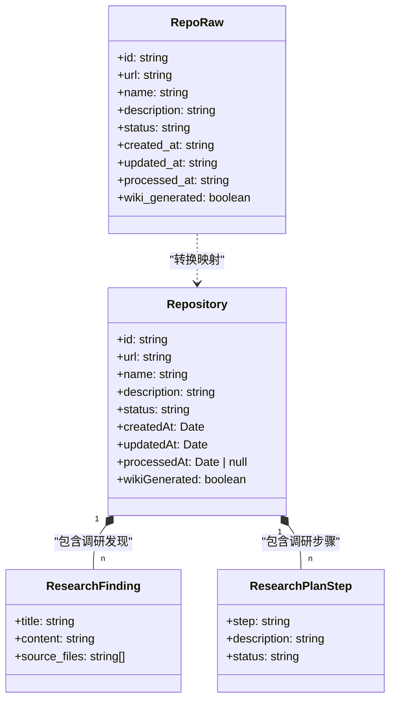
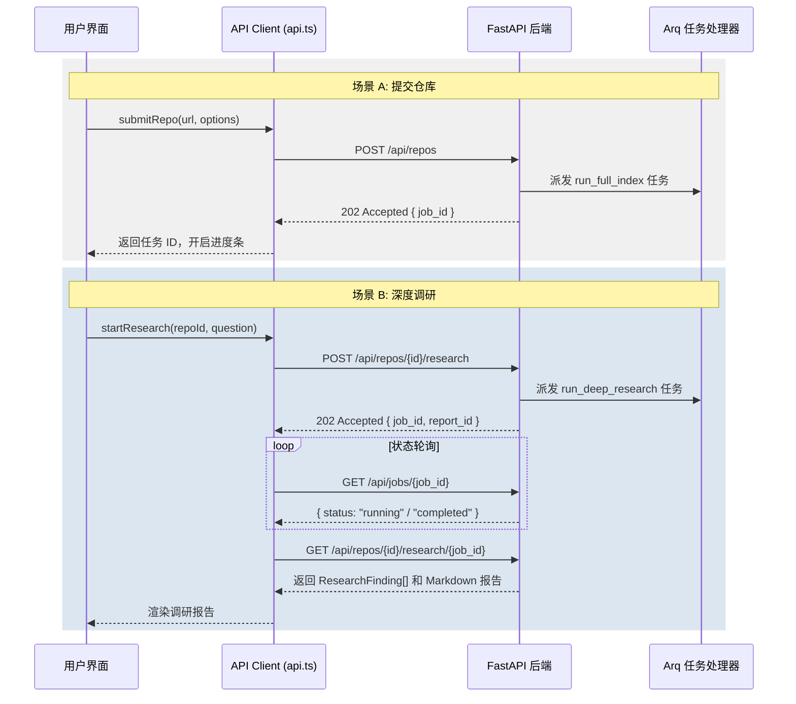

# 后端接口与服务

AutoWiki 的后端架构采用 FastAPI 构建高性能 REST API，并结合 WebSocket 提供实时交互能力。作为系统的神经中枢，后端接口不仅负责管理代码仓库的元数据，还作为前端与底层异步执行引擎（详见“异步任务调度”）之间的桥梁。

### API 客户端概述

在前端实现中，`web/lib/api.ts` 封装了所有与后端交互的逻辑。它不仅是一个简单的请求封装层，还承担了以下核心职责：

*   **类型安全保障**：通过 TypeScript 接口（如 `Repository`, `RepoRaw`）定义后端返回的原始 JSON 数据结构，确保数据在传递过程中的一致性。
*   **异步任务桥接**：AutoWiki 的大部分核心操作（如索引构建、深度调研）都是耗时任务。API 层负责发起请求并获取 `job_id`，随后与后端的任务追踪系统配合，实现对“异步任务调度”中描述的任务流的生命周期管理。
*   **统一错误处理**：通过 `ApiError` 类封装 HTTP 状态码与业务逻辑错误，提供诸如 `404 Not Found` 或 `500 Internal Server Error` 的标准化捕获机制。
*   **数据转换与清洗**：将后端返回的原始格式（`RepoRaw`）转换为 UI 友好的模型（`Repository`），处理诸如日期格式转换、默认值填充等操作。

*Source: [web/lib/api.ts:23-274*](https://github.com/lazyxiang/AutoWiki/blob/main/web/lib/api.ts#L23-L274*)

### 数据模型定义

在 API 通信中，数据的表现形式分为两个阶段：后端返回的“原始数据”和前端使用的“应用模型”。

**Diagram: 后端数据对象在前端的映射关系**

*Source: [web/lib/api.ts:161-226*](https://github.com/lazyxiang/AutoWiki/blob/main/web/lib/api.ts#L161-L226*)

后端通过 `RepoRaw` 返回数据库中的原始记录，包含符合 API 规范的下划线命名法字段。前端 `getRepo` 或 `getRepositories` 函数在接收到数据后，会将其转换为 `Repository` 类型，将 `created_at` 等字符串转换为 JavaScript `Date` 对象，并将 `snake_case` 转换为 `camelCase` 以符合前端编程规范。

对于复杂的深度调研任务，`ResearchFinding` 和 `ResearchPlanStep` 定义了“深度研究引擎”生成内容的结构化呈现方式，包括调研步骤的执行状态和具体的代码发现。

### 核心业务接口映射

下表详细说明了 `web/lib/api.ts` 中定义的关键函数及其对应的业务领域：

| 函数名称 | 主要参数 | 返回值类型 | 业务职责 |
| :--- | :--- | :--- | :--- |
| `submitRepo` | `url`, `options` | `Promise<{repo_id, job_id}>` | 提交新仓库地址，初始化 Wiki 生成流水线。支持 `reuseIndex` 等选项。 |
| `getRepositories` | - | `Promise<Repository[]>` | 获取当前系统中所有已注册仓库的列表及其处理状态。 |
| `getRepo` | `repoId` | `Promise<Repository>` | 获取特定仓库的详细元数据，包括索引完成状态。 |
| `getWikiPage` | `repoId`, `slug` | `Promise<{content, title}>` | 检索特定 Wiki 页面的 Markdown 内容，支持动态页面加载。 |
| `refreshRepo` | `repoId` | `Promise<{job_id, status}>` | 触发增量索引刷新或全量索引重构。 |
| `startResearch` | `repoId`, `question` | `Promise<{job_id, report_id}>` | 启动针对特定问题的“深度研究引擎”任务。 |
| `getResearchReport` | `repoId`, `jobId` | `Promise<ResearchResult>` | 获取异步调研任务的最终报告、步骤轨迹和参考代码块。 |
| `createChatSession` | `repoId` | `Promise<{session_id}>` | 为 RAG 对话初始化会话上下文，关联“对话式问答系统”。 |
| `getJob` | `jobId` | `Promise<JobStatus>` | 轮询异步任务（Arq 任务）的当前执行进度。 |

*Source: [web/lib/api.ts:23-274*](https://github.com/lazyxiang/AutoWiki/blob/main/web/lib/api.ts#L23-L274*)

这些接口通过标准化的 HTTP 动作进行交互。例如，`submitRepo` 通常对应 `POST` 请求，而获取调研结果则对应带有路径参数的 `GET` 请求。

### 异步处理流程

由于代码库索引和深度调研往往需要消耗大量算力和时间，API 接口采用了“异步提交-轮询结果”的设计模式。当用户在前端发起操作时，API 立即返回一个任务标识符，后续逻辑在后台工作进程中完成。

**Diagram: 仓库提交与深度调研的异步交互时序**

*Source: [web/lib/api.ts:23-40](https://github.com/lazyxiang/AutoWiki/blob/main/web/lib/api.ts#L23-L40), 204-245*

在上述流程中，`submitRepo` 是进入“异步任务调度”系统的入口。API 层通过 `job_id` 维持与前端的通信，直到任务状态从 `queued` 变为 `success`。深度调研流程则更加复杂，它不仅需要轮询任务状态，还需要在任务完成后调用 `getResearchReport` 来获取由“深度研究引擎”生成的结构化数据。

这种设计保证了前端界面的响应性，即使是在处理超大规模代码库（如 Linux kernel 或 React）时，用户也能实时看到处理进度。有关 RAG 检索在对话中的应用细节，可参阅“对话式问答系统”页面。

## Source Files

| File |
|------|
| `web/lib/api.ts` |