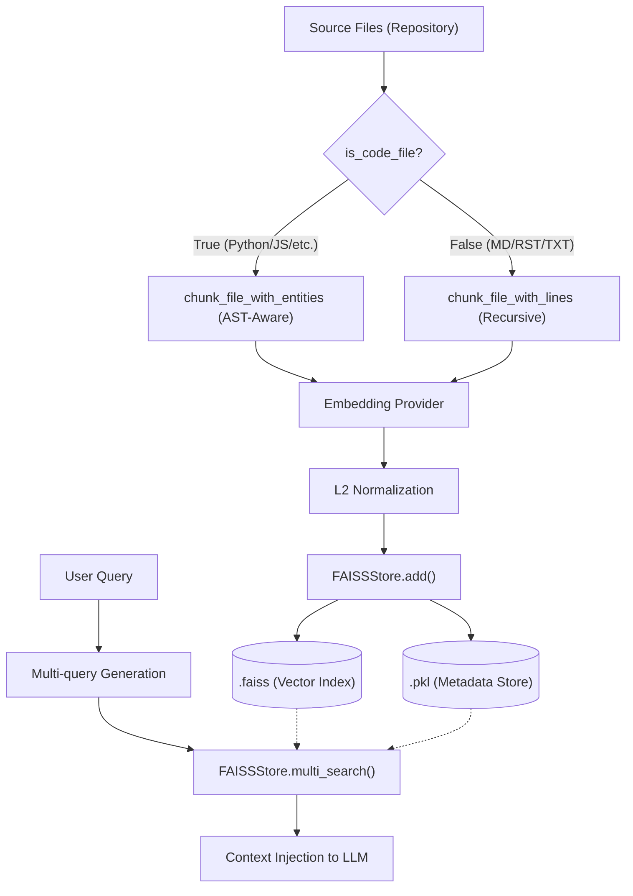
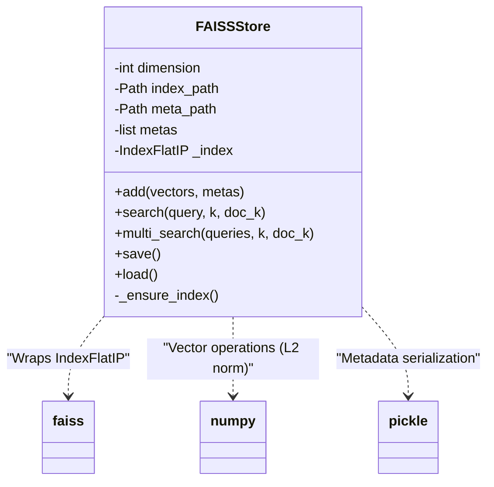

# 对话式问答系统

## RAG 索引架构概述

AutoWiki 的对话式问答系统建立在检索增强生成（Retrieval-Augmented Generation, RAG）架构之上，旨在为用户提供基于特定代码库上下文的精准回答。该系统的核心逻辑位于索引构建阶段，即通过对源码仓库进行深度解析，将其转化为可检索的向量表示。

索引构建流程由 `build_rag_index` 函数统一调度。该过程并非简单的文本切片，而是区分了代码文件（Source Code）与文档文件（Documentation）。对于代码文件，系统会识别文件中的 AST 实体（如类、函数），以确保代码块的语义完整性；对于文档文件，则采用基于行号的递归切分。切分后的文本块（Chunks）通过 `embedding_provider` 转换为高维向量，并最终持久化到基于 FAISS 的向量数据库中。

在查询阶段，系统能够同时处理多个查询向量（Multi-query），并从代码和文档两个维度检索最相关的上下文。这种双轨检索机制通过 `FAISSStore` 实现，它不仅支持标准的相似度搜索，还能根据元数据标签区分内容来源，从而为 LLM 提供更丰富的背景信息。

**Diagram: RAG 索引构建与检索流程**

*Source: [worker/pipeline/rag_indexer.py:577-669*](https://github.com/lazyxiang/AutoWiki/blob/main/worker/pipeline/rag_indexer.py#L577-L669*)

## 文档分块策略

为了保证检索质量，AutoWiki 实现了两种互补的分块策略，分别处理结构化的代码逻辑和半结构化的文本文档。分块的核心目标是在满足 LLM 上下文窗口限制的同时，尽可能保留信息的完整性。

### 1. 基于实体的代码分块 (Entity-aware Chunking)

`chunk_file_with_entities` 是针对代码文件的核心算法。它利用预先提取的 AST 实体信息（由代码库分析阶段生成），尝试将整个类或函数保留在同一个块中。如果某个实体（如一个极长的类）超过了 `chunk_size`，系统会将其降级为基于行的细粒度切分，但仍会保留其实体归属信息。这种方式有效避免了函数实现被机械地从中截断，导致 RAG 检索到的代码片段不可用的问题。

### 2. 基于行的递归分块 (Line-based Chunking)

对于 Markdown、reStructuredText 或普通文本文件，系统使用 `chunk_file_with_lines`。它内部封装了 `langchain_text_splitters.RecursiveCharacterTextSplitter`，通过预定义的各种分隔符（如段落、标题、换行符）进行智能切分。此外，该方法通过 `_is_doc_chunk` 辅助函数为每个块标记 `is_doc=True` 标签，并在元数据中精确记录起始行号 `start_line` 和结束行号 `end_line`。

| 分块策略 | 适用文件类型 | 核心逻辑 | 元数据特性 |
| :--- | :--- | :--- | :--- |
| **Entity-aware** | 源代码 (`.py`, `.js` 等) | 优先保留类 (Class) 和函数 (Function) 的完整性 | 包含 `entity_name`, `entity_type` |
| **Line-based** | 文档 (`.md`, `.rst`, `.txt`) | 递归字符切分，维护语义段落 | 包含 `is_doc=True`, 严格的行号区间 |

*Source: [worker/pipeline/rag_indexer.py:47-287*](https://github.com/lazyxiang/AutoWiki/blob/main/worker/pipeline/rag_indexer.py#L47-L287*)

## FAISS 向量检索机制

系统的向量检索功能由 `FAISSStore` 类承载。它通过对 `faiss.IndexFlatIP` 进行轻量级封装，实现了高效的内积搜索。为了确保内积搜索等价于余弦相似度，`FAISSStore` 在添加向量和执行查询前都会强制执行 L2 归一化（L2-normalization）。

### 向量存储与持久化

`FAISSStore` 采用双文件持久化方案：
- **索引文件 (`index_path`)**：存储由 FAISS 生成的二进制向量索引。
- **元数据文件 (`meta_path`)**：使用 `pickle` 序列化存储与向量一一对应的元数据字典。在调用 `load()` 时，系统会同步加载这两个文件以重建检索状态。

### 多路检索与去重

在 `multi_search` 方法中，系统支持传入多个查询向量（例如由 LLM 生成的多个同义问题）。检索过程会针对每个向量执行 `search` 操作，并根据块的唯一标识（通常是文件路径与行号的组合）进行去重。此外，检索逻辑支持通过 `doc_k` 参数调节文档块与代码块的混合比例，确保返回的上下文既包含逻辑实现也包含使用说明。

**Diagram: FAISSStore 类结构与方法关联**

*Source: [worker/pipeline/rag_indexer.py:290-543*](https://github.com/lazyxiang/AutoWiki/blob/main/worker/pipeline/rag_indexer.py#L290-L543*)

## 会话数据模型

AutoWiki 的对话系统状态存储在关系型数据库中，通过 `ChatSession` 和 `ChatMessage` 模型进行持久化。这些模型定义了用户与 AI 之间的交互结构，并与底层代码库（`Repository`）和作业（`Job`）相关联。

- **ChatSession (会话)**
  - `id`: 会话的唯一标识符。
  - `repository_id`: 关联的代码库 ID，决定了 RAG 检索的范围。
  - `title`: 会话标题，通常由首条消息自动生成。
  - `created_at` / `updated_at`: 时间戳，用于管理用户历史记录。

- **ChatMessage (消息)**
  - `session_id`: 外键，指向所属的会话。
  - `role`: 消息角色，取值为 `user`（用户输入）、`assistant`（AI 回答）或 `system`（系统提示词）。
  - `content`: 消息文本内容，支持 Markdown 格式。
  - `metadata`: JSON 类型字段，存储 RAG 检索到的参考源（如引用的文件名、行号等）。

- **关联模型 (Contextual Entities)**
  - `Repository`: 存储仓库元数据（URL, branch），是所有对话的根上下文。
  - `WikiPage`: 对话过程中可能会引用或建议更新的 Wiki 页面实体。
  - `ResearchReport`: 深度研究任务生成的报告，可作为对话的增强背景。

*Source: [shared/models.py:67-112*](https://github.com/lazyxiang/AutoWiki/blob/main/shared/models.py#L67-L112*)

## Source Files

| File |
|------|
| `worker/pipeline/rag_indexer.py` |
| `shared/models.py` |
| `tests/worker/test_rag_indexer.py` |