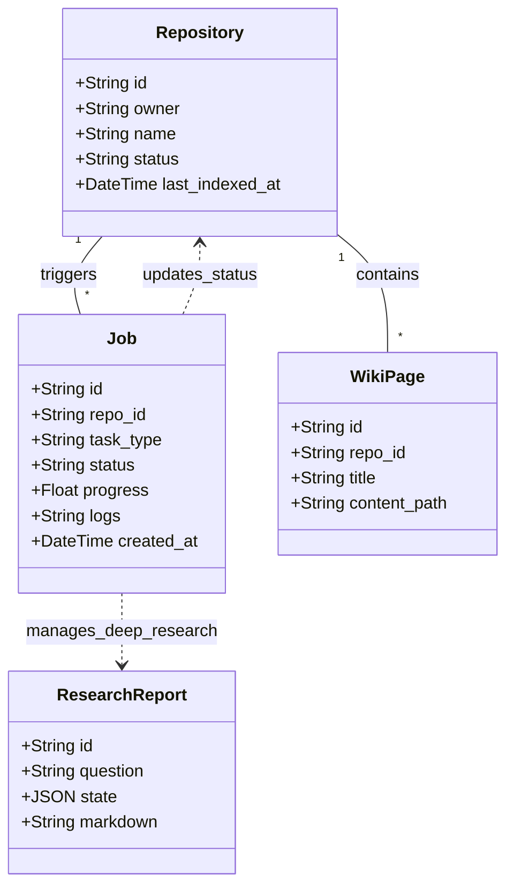
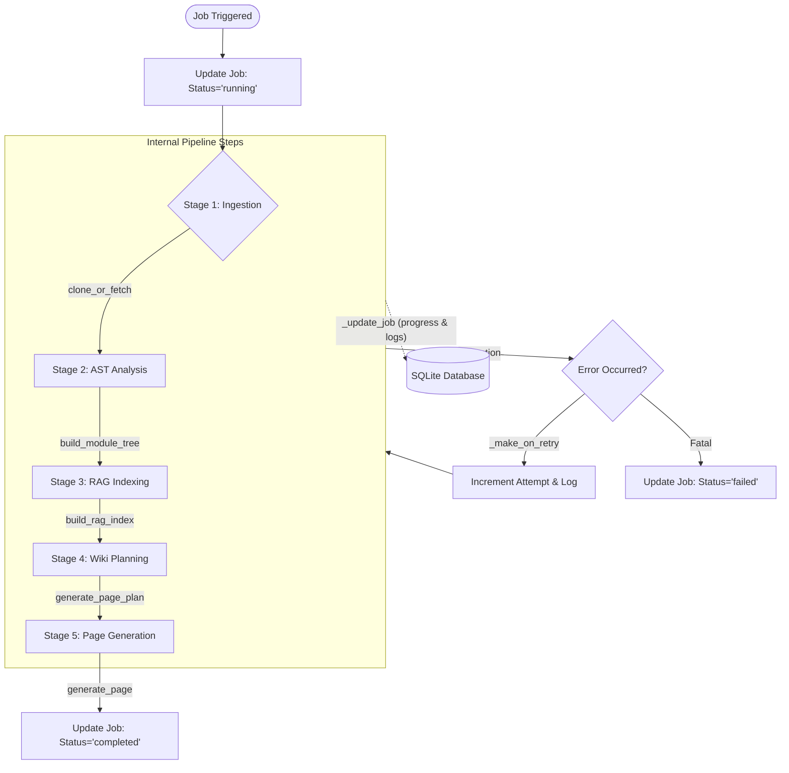

# 异步任务调度

## 架构概览与任务模型

AutoWiki 的异步任务体系构建在 Arq 之上，利用 Redis 作为任务队列，实现了耗时任务与 API 响应的解耦。整个系统的核心在于通过共享的数据库模型来跟踪任务的生命周期、处理进度以及产生的构件。在 `shared/models.py` 中定义的实体类不仅描述了持久化数据，还充当了 API 层与 Worker 节点之间的通信协议。

`Job` 模型是异步调度的核心，它记录了任务的当前状态（如 `pending`, `running`, `completed`, `failed`）、执行日志以及实时的进度百分比。对于 Wiki 生成任务，`Repository` 模型保存了仓库的克隆状态和处理元数据；而 `ResearchReport` 则用于存储 Deep Research 任务的中间过程和最终产出。

**Diagram: 共享数据模型与任务关联结构**

*Source: shared/models.py:13-112*

在 `worker/jobs.py` 中，Worker 节点订阅 Redis 队列并执行具体的 Python 函数。任务执行过程中，Worker 会频繁调用数据库更新函数，确保前端可以通过 API 实时获取任务的最细粒度状态。

*Source: worker/jobs.py:285-300*

## 核心任务处理逻辑

`worker/jobs.py` 封装了系统中最为繁重的计算逻辑，主要分为索引构建（Indexing）和深度调研（Deep Research）两大流转体系。

### 1. 全量索引构建 (run_full_index)

这是系统的核心流水线，负责从零开始为仓库生成 Wiki。其执行步骤如下：
*   **清理环境**：通过 `_clear_repo_artifacts` 移除旧的 Markdown 页面和搜索索引，确保生成环境的纯净。
*   **代码获取**：调用 `clone_or_fetch` 将仓库同步至本地磁盘。
*   **AST 分析**：利用 `build_module_tree` 解析源代码结构，识别类、函数及其实体关系。
*   **RAG 索引构建**：通过 `build_rag_index` 生成代码片段的向量表示，并存入 FAISS 向量数据库。
*   **Wiki 规划**：由 `generate_page_plan` 根据仓库拓扑结构制定 Wiki 目录和页面划分。
*   **页面生成**：并发调用 `generate_page`，结合 LLM 和代码上下文生成各个页面的 Markdown 内容。

### 2. 增量索引刷新 (run_refresh_index)

为了优化大型仓库的更新速度，`run_refresh_index` 实现了增量更新策略。它会对比当前代码库与上次索引时的差异，仅对受影响的文件相关的 Wiki 页面进行重新生成，避免了全量 LLM 调用的成本。

### 3. 深度调研流 (run_deep_research)

该任务处理用户针对代码库提出的复杂技术问题：
*   **状态初始化**：创建并持久化 `ResearchReport` 实体。
*   **事件驱动调研**：利用 `DeepResearch` 类进行多步推理，任务过程中通过 `_on_event` 回调实时向数据库写入调研进度。
*   **结果持久化**：将最终生成的 Markdown 报告更新至 `ResearchReport.markdown`。

*Source: worker/jobs.py:285-1389*

## 异步处理流程与状态流转

Wiki 生成是一个复杂的多阶段过程。每个阶段的开始和结束都会触发数据库状态的原子更新，从而允许系统在发生故障时能够准确上报错误位置。

**Diagram: Wiki 生成流水线及状态更新流**

*Source: worker/jobs.py:285-693, shared/database.py:14-33*

任务在执行过程中，会通过 `_update_job` 记录实时的进度百分比（如 `progress=0.15` 代表完成了代码摄取）。如果任务配置了重试机制，`_make_on_retry` 产生的回调函数会在 Arq 尝试重新执行前记录当前的异常信息和等待时间。

*Source: worker/jobs.py:139-177*

## 关键工具函数说明

为了保证异步环境下的高性能与数据一致性，`worker/jobs.py` 提供了一系列底层工具函数，用于处理数据库交互和文件系统操作。

| 函数名 | 功能描述 | 核心实现细节 |
| :--- | :--- | :--- |
| `_update_job` | 原子化更新任务表 | 使用 `get_session` 获取异步连接，通过 `setattr` 动态更新 `Job` 模型字段并提交。 |
| `_update_repo` | 更新仓库元数据 | 专门用于在任务完成后更新 `Repository` 的索引状态或最后更新时间。 |
| `_write_text_async` | 非阻塞磁盘写入 | 使用 `loop.run_in_executor` 将 `Path.write_text` 调度到线程池，避免阻塞事件循环。 |
| `_make_on_retry` | 生成重试回调 | 返回一个闭包，捕获 `job_id`，在 Arq 重试时将异常堆栈和重试计数写入数据库。 |
| `_load_faiss_for_research` | 加载向量库 | 在执行调研任务前，通过执行器加载 FAISS 索引文件，确保大文件读取不影响异步调度。 |
| `_collect_page_entities` | 收集页面实体信息 | 遍历 `WikiPageSpec` 中的文件列表，从 AST 分析结果中提取相关的类和函数元数据。 |

*Source: worker/jobs.py:66-131, 139-177, 180-214, 273-277*

特别值得注意的是 `_write_text_async` 的实现。由于 Wiki 生成过程涉及大量的 Markdown 文件写入，直接使用同步的 `pathlib` 操作会拖慢 Worker 的并发能力。通过将 I/O 操作委托给线程池，Worker 可以继续处理其他 LLM 请求的并发响应，极大提升了整体吞吐量。

*Source: worker/jobs.py:113-131*

## Source Files

| File |
|------|
| `shared/models.py` |
| `worker/jobs.py` |
| `shared/database.py` |