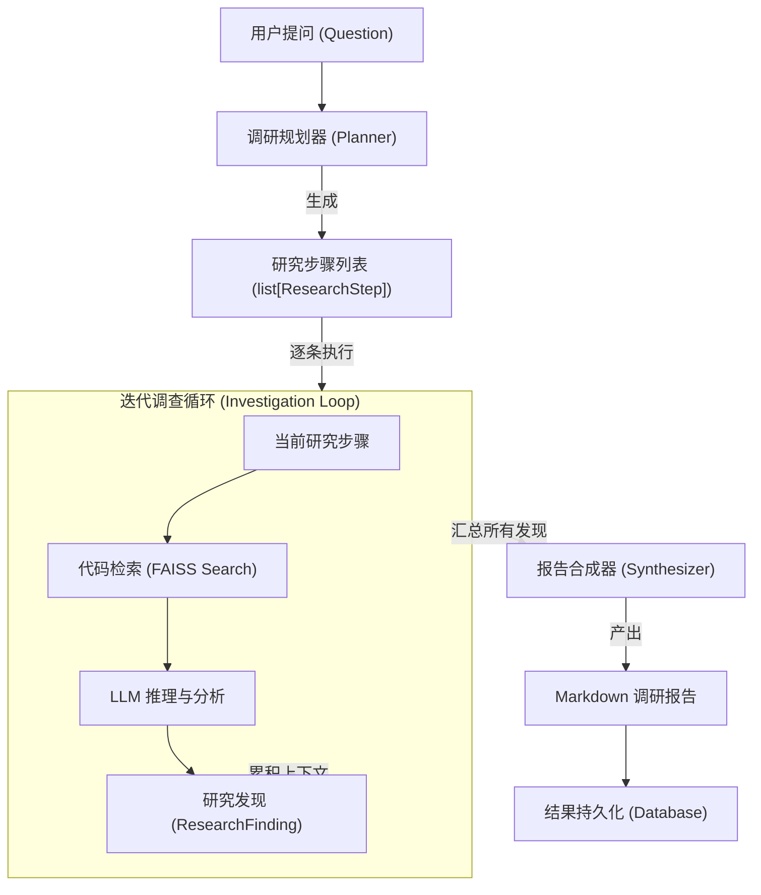
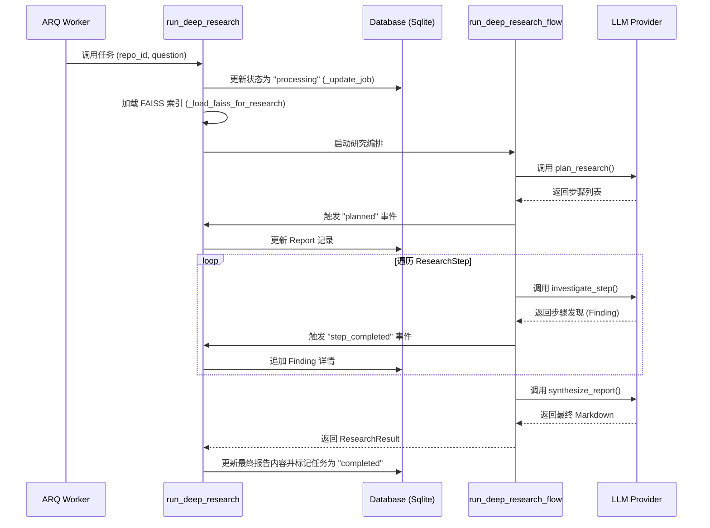

# 深度研究引擎

## 深度研究引擎架构概述

深度研究引擎（Deep Research Engine）是 AutoWiki 的核心高级功能，旨在解决复杂的代码咨询问题。不同于基础的文档生成，深度研究引擎能够针对用户提出的特定、深度的技术问题，通过多步规划、自动化代码检索和证据合成，生成详尽的调研报告。该引擎采用了典型的“规划-执行-合成”编排模式，确保 LLM 在处理大规模代码库时不会因为上下文限制而丢失关键细节。

该引擎的架构设计遵循逻辑与副作用分离的原则。核心编排逻辑封装在 `worker/deep_research.py` 中，这是一个纯异步的协调器，不直接依赖数据库或 WebSocket。这种设计不仅提高了代码的可测试性，也使得研究流程可以在 CLI 或测试环境中独立运行。而具体的任务调度、持久化和实时事件推送则由 `worker/jobs.py` 中的 `run_deep_research` 函数负责，它充当了 ARQ 任务队列与核心引擎之间的粘合层。

在执行过程中，引擎首先利用 LLM 对原始问题进行分解，生成一系列相互关联的调研步骤。随后，引擎会针对每个步骤调用代码检索工具，从基于 FAISS 的向量存储中提取相关的代码片段和上下文。每一个步骤的发现（Finding）都会被实时记录并作为后续步骤的背景参考。最后，所有的发现、引用的代码片段以及最初的规划将被输入到报告合成器中，产出最终的 Markdown 格式报告。

**Diagram: 深度研究业务处理流水线**

*Source: [worker/deep_research.py:206-254](https://github.com/lazyxiang/AutoWiki/blob/main/worker/deep_research.py#L206-L254)*

## 执行流与任务调度

深度研究的执行由 ARQ 框架驱动，通过 `run_deep_research` 这一异步 Job 函数实现。当 API 接收到研究请求后，会将任务推送到 Redis 队列，Worker 节点获取任务并启动执行流。该过程涉及复杂的转态管理，包括更新任务状态、初始化向量数据库连接、流式推送研究进度以及最终结果的存储。

`run_deep_research` 函数的首要职责是环境准备。它会调用 `_load_faiss_for_research` 函数，在线程池中异步加载指定仓库的 FAISS 索引文件，以避免阻塞事件循环。在研究执行期间，系统通过 `_on_event` 回调函数将每一个中间状态（如“正在规划”、“正在执行步骤 X”、“正在合成报告”）同步到数据库的 `Report` 表中，并通过 WebSocket 协议实时反馈给前端用户。

下表详细说明了深度研究 Job 的输入参数及其在调度过程中的作用：

| 参数名称 | 类型 | 说明 |
| :--- | :--- | :--- |
| `repo_id` | `str` | 目标代码库的唯一标识符，用于定位索引文件。 |
| `job_id` | `str` | ARQ 任务 ID，用于追踪任务状态。 |
| `report_id` | `str` | 预先在数据库中创建的报告记录 ID，用于存储最终产出。 |
| `question` | `str` | 用户提出的原始研究问题。 |
| `ctx` | `dict` | ARQ 任务上下文，包含 Redis 连接和配置信息。 |

**Diagram: run_deep_research 任务执行时序**

在异常处理方面，`run_deep_research` 利用了 `_make_on_retry` 提供的回调机制。如果任务因为网络波动（如 LLM API 调用超时）而触发重试，系统会自动记录重试次数和异常信息到数据库，确保整个过程对用户透明且具备容错性。

*Source: [worker/jobs.py:1278-1389](https://github.com/lazyxiang/AutoWiki/blob/main/worker/jobs.py#L1278-L1389)*

## 核心数据模型与组件

深度研究引擎的稳定运行依赖于定义明确的数据模型。这些模型不仅定义了研究过程中的信息流转格式，还确保了各个阶段（规划、调查、合成）之间的数据一致性。

### 研究步骤 (ResearchStep)
`ResearchStep` 是规划阶段的产物。它将一个宏观的问题拆解为可操作的微观任务。
- `id`: 步骤的唯一标识（通常为序号）。
- `task`: 本步骤需要解决的具体问题描述。
- `context_requirement`: 对本步骤所需的代码上下文的指导性描述，用于辅助检索。

### 研究发现 (ResearchFinding)
`ResearchFinding` 记录了针对特定步骤的调查结果。
- `step`: 关联的 `ResearchStep` 对象。
- `reasoning`: LLM 结合代码后的推理过程。
- `answer`: 本步骤的直接答案。
- `citations`: 引用的代码片段或文件路径列表，用于确保报告的准确性与可溯源性。

### 研究结果 (ResearchResult)
`ResearchResult` 是整个研究周期的最终汇总对象，它不仅包含最终生成的报告字符串，还包含完整的执行轨迹。
- `question`: 原始问题。
- `plan`: 完整的步骤列表。
- `findings`: 每个步骤对应的发现。
- `final_report`: 最终生成的 Markdown 格式文本。

这些模型通过 `dataclasses` 实现，并提供了 `to_serialisable` 方法，以便将其状态无缝转换为 JSON 格式存储于数据库的 `json` 类型字段中。在 `worker/jobs.py` 中，`asdict_s` 辅助函数用于在不破坏数据结构的前提下将这些复杂的嵌套对象序列化。

*Source: [worker/deep_research.py:40-54](https://github.com/lazyxiang/AutoWiki/blob/main/worker/deep_research.py#L40-L54), 191-203*

## 检索增强生成 (RAG) 实现

深度研究的核心技术基础是 RAG（Retrieval-Augmented Generation）。由于代码库通常体量巨大，无法一次性读入 LLM 的上下文窗口，引擎必须精准地提取与当前调研步骤最相关的代码。

### 向量检索流程
在 `investigate_step` 函数中，系统首先将 `ResearchStep` 的任务描述通过 `EmbeddingProvider` 转化为向量。随后，利用 `FAISSStore.similarity_search` 在预先构建的索引中进行近邻搜索。默认情况下，系统会提取 `top_k = 8` 的最相关代码块。这些代码块不仅包含原始文本，还携带了元数据（如文件路径、起止行号、所属类或函数名）。

### 上下文增强与推理
检索到的代码片段会连同该步骤的描述、以及之前步骤已经取得的发现，共同构建成一个详尽的 Prompt 发送给 LLM。这种“累积上下文”的策略非常关键：例如，如果步骤 1 发现了某个核心接口的定义，那么在执行步骤 2 调查该接口的实现时，步骤 1 的发现将作为背景知识，防止 LLM 进行重复或孤立的推理。

### 报告合成逻辑
在所有步骤完成后，`synthesize_report` 函数会执行最后的“整合”操作。它不仅是简单的文本拼接，而是要求 LLM 站在全局视角，审视所有步骤的发现，识别不同模块之间的隐藏关联，并按照专业的文档标准组织 Markdown 结构。最终生成的报告通常包含：
1. 调研背景与问题定义。
2. 核心架构与逻辑流分析。
3. 详细的代码证据（包含跳转链接）。
4. 调研结论与建议。

这种基于 RAG 的多步推理流程，使得深度研究引擎能够处理诸如“分析该项目的身份验证流程及其在各个模块中的分布”这类跨文件、高复杂度的架构级问题。

*Source: [worker/deep_research.py:115-152](https://github.com/lazyxiang/AutoWiki/blob/main/worker/deep_research.py#L115-L152), 166-187*

## Source Files

| File |
|------|
| [`worker/jobs.py`](https://github.com/lazyxiang/AutoWiki/blob/main/worker/jobs.py) |
| [`worker/deep_research.py`](https://github.com/lazyxiang/AutoWiki/blob/main/worker/deep_research.py) |
| [`tests/worker/test_deep_research.py`](https://github.com/lazyxiang/AutoWiki/blob/main/tests/worker/test_deep_research.py) |
| [`tests/api/test_research.py`](https://github.com/lazyxiang/AutoWiki/blob/main/tests/api/test_research.py) |