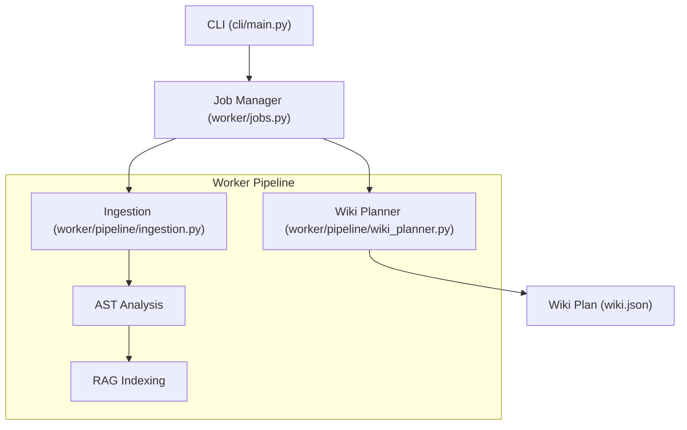
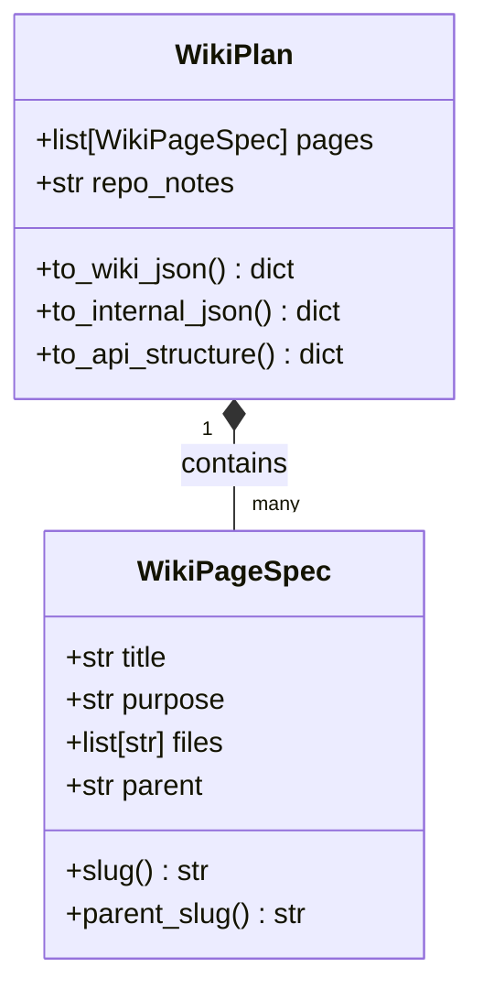

# 命令行管理工具

AutoWiki 的命令行界面（CLI）是开发者管理存储库索引、验证配置以及执行本地分析任务的核心入口。CLI 允许用户在不依赖 Web UI 的情况下直接操作后端逻辑，并提供了一套严密的机制来确保从代码扫描到 Wiki 计划生成的全流程可控。

### 命令行工具概览

CLI 在系统架构中充当触发器和观测窗口。当开发者启动一个索引任务或配置校验命令时，CLI 会通过调用 `worker/jobs.py` 中的作业管理逻辑，驱动底层的摄取（Ingestion）和处理管线。这种解耦设计允许 CLI 在本地开发环境和容器化环境中保持行为的一致性。

在执行流程上，CLI 命令通常遵循“解析配置 -> 初始化环境 -> 触发管线”的路径。例如，在进行本地索引时，CLI 会调用 `worker/pipeline/ingestion.py` 来处理文件系统的扫描与过滤，并将结果传递给后续的分析模块。

**Diagram: CLI 与核心管线交互流程**

*Source: [worker/jobs.py:10-50](https://github.com/lazyxiang/AutoWiki/blob/main/worker/jobs.py#L10-L50), [worker/pipeline/ingestion.py:1-40*](https://github.com/lazyxiang/AutoWiki/blob/main/worker/pipeline/ingestion.py#L1-L40*)

CLI 不仅限于简单的命令触发，它还负责环境预检。在任何重型计算（如 LLM 分析）开始前，CLI 会验证数据库连接状态（通过 `shared/database.py`）和环境变量的完整性。这种前置校验机制有效地减少了因配置错误导致的昂贵 API 调用失败。

### 配置管理与校验

AutoWiki 使用 Pydantic 的 `BaseSettings` 进行强类型的配置管理。这一机制确保了配置在加载阶段即经过严格的类型验证，防止了运行时因配置项缺失或格式错误导致的崩溃。所有的系统参数都集中在 `shared/config.py` 中，通过 `Config` 主类及其嵌套的专项配置类进行组织。CLI 提供了一套完善的逻辑来动态读取、校验并重置这些配置，以支持从本地开发到自动化测试的各种场景。

#### 配置类结构

系统配置被划分为多个逻辑模块，每个模块通过 `env_prefix` 与环境变量挂钩。这种结构允许通过 `.env` 文件或直接设置系统环境变量来覆盖默认值。通过 Pydantic 的自动映射，环境变量（如 `AUTOWIKI_LLM_MODEL`）可以直接转换为配置对象中的属性。

| 配置类 | 环境变量前缀 | 关键字段 | 默认值 | 字段用途描述 |
| :--- | :--- | :--- | :--- | :--- |
| `LLMConfig` | `AUTOWIKI_LLM_` | `provider` | `anthropic` | 定义 LLM 服务商，支持多种主流模型接口 |
| `EmbeddingConfig` | `AUTOWIKI_EMBEDDING_` | `provider` | `openai` | 定义向量化服务商，默认为 OpenAI |
| `ServerConfig` | `AUTOWIKI_SERVER_` | `port` | `8000` | 后端 API 服务器监听的通信端口 |
| `ChatConfig` | `AUTOWIKI_CHAT_` | `history_window` | `10` | 交互式对话时保留的历史消息上下文窗口长度 |

每个配置类都有其特定的职责。`LLMConfig` 除了基本的 `provider` 外，还包含了 `model`（主模型）、`fast_model`（轻量任务模型）、`api_key` 和 `base_url`。它还预留了 `cache_ttl` 字段，专门用于未来对接 Anthropic 的缓存机制。`EmbeddingConfig` 则专注于向量化所需的 `model` 和 `api_key`。`ServerConfig` 负责底层网络配置，而 `ChatConfig` 则控制用户交互体验的深度。

*Source: [shared/config.py:11-69*](https://github.com/lazyxiang/AutoWiki/blob/main/shared/config.py#L11-L69*)

#### 动态校验与默认值填充

在 CLI 启动过程中，`_coerce_empty_to_default` 等验证函数起着至关重要的作用。这些验证器使用 Pydantic 的 `field_validator` 装饰器，并设置 `mode="before"`，以便在标准转换流程启动前对原始输入进行清洗。

这种设计主要为了处理 CI/CD 或特定 shell 脚本环境中的边缘情况：如果环境变量被显式设置为空字符串（例如在环境中执行了 `export AUTOWIKI_LLM_PROVIDER=""`），系统会自动将其回滚到预定义的默认值，而不是抛出类型错误。例如，`LLMConfig` 中的 `provider` 如果被赋为空字符串值，校验器会介入并将其默认填充为 `anthropic`。

类似的逻辑也应用于 `EmbeddingConfig` 的 `_coerce_empty_provider`（回滚至 `openai`）、`ServerConfig` 的 `_coerce_empty_port` 以及 `ChatConfig` 的 `_coerce_empty_history_window`。这种“空值容错”机制极大提高了工具链在复杂配置环境下的可靠性。

在测试场景中，CLI 经常需要切换不同的配置环境。`shared/config.py` 导出了 `get_config()` 函数来获取单例配置，同时提供了 `reset_config()` 函数。`reset_config()` 的核心作用是重置内部缓存的配置单例（将其置为 `None`），从而强制系统在下一次访问配置时重新从环境变量中加载数据。这在 `tests/cli/test_cli.py` 中被频繁使用，确保每个测试用例都能在隔离的配置状态下运行，避免了测试间的状态干扰。

此外，`Config` 类还通过动态属性提供了日志路径的管理。`error_log_path`、`task_log_path` 和 `llm_log_path` 均基于 `base_dir` 属性自动计算。这些路径让 CLI 能够准确地将运行轨迹和错误摘要输出到指定的磁盘位置，方便开发者进行事后审计。

*Source: [shared/config.py:27-32](https://github.com/lazyxiang/AutoWiki/blob/main/shared/config.py#L27-L32), 116-119, 88-97*

### 本地索引与规划流程

当开发者运行本地索引命令时，`WikiPlanner` 模块会被激活。该模块的任务是根据摄取的代码元数据生成一份详细的 Wiki 生成计划。CLI 驱动下的 `WikiPlanner` 涉及复杂的 Slug 生成、页面范围建议以及多维度的序列化操作。

#### 数据模型：WikiPlan 与 WikiPageSpec

`WikiPlan` 是整个规划阶段的产出容器，它包含了一系列 `WikiPageSpec` 对象。每个 `WikiPageSpec` 定义了一个 Wiki 页面的标题、用途、所属文件范围以及父页面关系。

**Diagram: Wiki 计划数据结构类图**

*Source: [worker/pipeline/wiki_planner.py:115-308*](https://github.com/lazyxiang/AutoWiki/blob/main/worker/pipeline/wiki_planner.py#L115-L308*)

#### 标识符生成与 Slug 逻辑

为了确保生成的 Wiki 页面在 URL 中是安全的且可预测的，`WikiPlanner` 使用了 `_slugify_title` 函数。该函数支持 Unicode 字符，通过将非字母数字字符替换为连字符并转换为小写来生成 Slug。如果生成的 Slug 为空（例如标题全是特殊符号），它会回推到一个基于标题内容的哈希值，以保证唯一性。

`WikiPageSpec.slug()` 和 `WikiPageSpec.parent_slug()` 方法封装了这一逻辑，确保在整个序列化过程中，页面间的引用关系保持一致。

*Source: [worker/pipeline/wiki_planner.py:89-98](https://github.com/lazyxiang/AutoWiki/blob/main/worker/pipeline/wiki_planner.py#L89-L98), 145-183*

#### 序列化策略

CLI 需要支持多种输出格式以适应不同的下游消费场景：
1.  **用户可见格式 (`to_wiki_json`)**: 产生一个精简的 `wiki.json`，省略了诸如 `slug` 和 `files` 等技术字段，以便于人类阅读和手动编辑。
2.  **内部流程格式 (`to_internal_json`)**: 保留完整的 `files` 列表，这对于增量更新和 AST 分析至关重要。
3.  **API 响应格式 (`to_api_structure`)**: 专门为前端 UI 设计，包含了自动计算的 Slug 和父子层级结构。

*Source: [worker/pipeline/wiki_planner.py:207-308*](https://github.com/lazyxiang/AutoWiki/blob/main/worker/pipeline/wiki_planner.py#L207-L308*)

### 故障排除与调试

在 CLI 运行过程中，由于 LLM 响应不稳定或代码库结构异常，可能会出现各种故障。AutoWiki 的设计允许通过详细的日志路径配置和特定的错误类型来进行深度诊断。

#### 日志路径管理

`Config` 类提供了多个动态属性来定位日志文件。开发者可以通过这些路径直接定位问题：
*   `task_log_path`: 记录特定后台任务的详细执行步骤，是排查 Ingestion 失败的首选。
*   `error_log_path`: 汇总系统运行期间的所有未捕获异常。
*   `llm_log_path`: 记录与 LLM 交互的所有 Prompt 和 Response，用于分析生成质量问题。

*Source: [shared/config.py:88-97*](https://github.com/lazyxiang/AutoWiki/blob/main/shared/config.py#L88-L97*)

#### 关键错误处理：WikiPlannerError

在规划阶段，最严重的异常是 `WikiPlannerError`。这种错误通常发生在 Phase 1（大纲生成）彻底失败时。当 CLI 捕获到此异常时，它会立即终止后续的页面生成任务。

排查 `WikiPlannerError` 的典型步骤：
1.  检查 `task_log_path` 以确认 Ingestion 是否成功扫描了文件。
2.  调用 `_suggest_page_range` 逻辑（通过 CLI 调试命令），检查系统建议的页面范围是否因代码库过大或过小而超出了 LLM 的处理能力。
3.  验证 `LLMConfig` 中的 `fast_model` 是否可用，因为规划器通常优先使用高性能模型。
4.  检查 `_slugify_title` 是否因为极端的目录名称导致了非法的 Slug 生成。

*Source: [worker/pipeline/wiki_planner.py:79-86](https://github.com/lazyxiang/AutoWiki/blob/main/worker/pipeline/wiki_planner.py#L79-L86), 101-111*

通过合理利用 CLI 提供的这些管理工具，开发者可以有效地在本地复现生产环境中的索引行为，从而显著缩短文档自动化流程的调试周期。

## Source Files

| File |
|------|
| `shared/config.py` |
| `worker/pipeline/wiki_planner.py` |
| `worker/pipeline/ingestion.py` |
| `worker/jobs.py` |
| `tests/cli/test_cli.py` |
| `shared/database.py` |