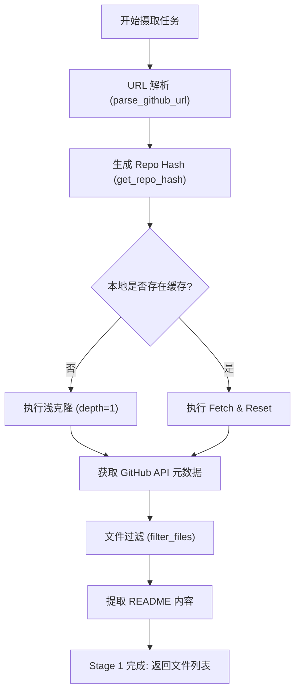
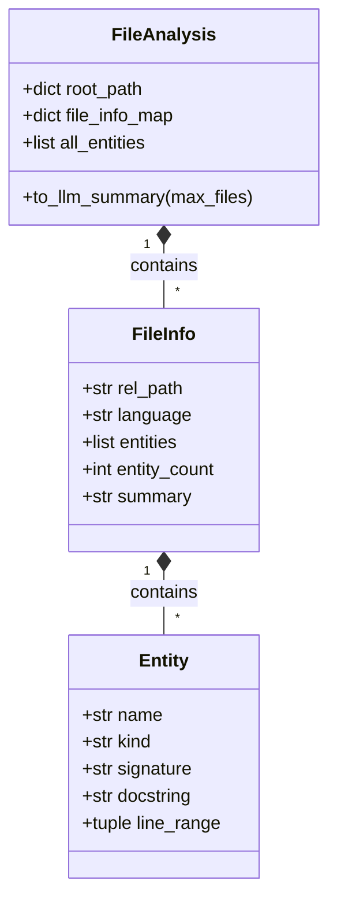

# 源码摄取与分析

在 AutoWiki 的自动化文档生成流水线中，源码摄取与分析是所有后续步骤的基石。该流程负责将远程 GitHub 存储库转化为系统可理解的结构化数据。这一阶段不仅涉及文件的物理获取，更通过深度语法分析（AST）和依赖关系建模，构建出代码库的“语义地图”。本页面旨在提供该预处理阶段的高层架构视图，并详细阐述各组件之间的协作逻辑。

## 代码摄取流程概览

代码摄取（Ingestion）是整个管线的 Stage 1，由 `worker/pipeline/ingestion.py` 驱动。其核心目标是高效、安全地获取源代码并进行初步过滤。

整个过程始于对仓库标识符的解析。`parse_github_url` 函数能够处理多种格式的输入，包括完整的 HTTPS URL（如 `https://github.com/owner/repo`）或简写的字符串（如 `owner/repo`），并将其规范化为所有者和存储库名称的二元组。为了在系统中唯一标识一个存储库，`get_repo_hash` 会根据平台、所有者和名称生成一个稳定的 MD5 哈希值，用于确定本地存储路径。

在物理获取阶段，系统通过 `clone_or_fetch` 函数执行 Git 操作。为了平衡速度与存储，系统默认执行深度为 1 的浅克隆（Shallow Clone）。如果本地已存在克隆，系统则会执行 Fetch 并将 HEAD 重置为远程分支，以确保代码的实时性。

摄取后的关键步骤是文件过滤。`filter_files` 函数负责从数以万计的文件中筛选出具有索引价值的源文件。过滤逻辑包括：
1.  **大小限制**：忽略超过 1MB 的超大文件，以防止处理溢出。
2.  **黑名单过滤**：自动排除 `node_modules`、`.git`、`vendor` 等依赖目录。
3.  **扩展名校验**：仅保留受支持的编程语言源文件（如 `.py`, `.js`, `.rs`, `.go` 等）。
4.  **自定义忽略**：通过 `pathspec` 解析 `.gitignore` 或项目定义的忽略规则。

此外，`extract_readme` 还会优先尝试从根目录提取 `README.md` 或相关说明文件，为后续的 Wiki 规划提供初步的项目上下文。

**Diagram: 代码摄取与预处理执行步骤**

*Source: [worker/pipeline/ingestion.py:88-340](https://github.com/lazyxiang/AutoWiki/blob/main/worker/pipeline/ingestion.py#L88-L340)*

## 语法结构解析 (AST Analysis)

一旦文件列表准备就绪，管线将进入 Stage 2：AST 分析。这一阶段由 `worker/pipeline/ast_analysis.py` 负责，其核心是利用 Tree-Sitter 库对每一份源文件进行单次解析（Single-pass），提取出类、函数、结构体等命名实体。

`analyze_file` 是此阶段的原子操作。它读取文件的原始字节，并根据文件后缀选择对应的 Tree-Sitter 语言解析器。解析过程并不生成完整的语法树对象（这会消耗大量内存），而是通过 `_extract_entities` 函数进行深度优先遍历，仅捕获特定的关键节点。

针对每个提取的实体，系统会收集以下信息：
*   **名称与类型**：实体的标识符（如类名 `DatabaseClient`）及其类型（如 `class`, `function`, `method`）。
*   **签名（Signature）**：通过 `_get_signature` 提取函数或方法的参数列表，保留原始代码中的类型提示。
*   **文档字符串（Docstring）**：`_get_docstring` 实现了复杂的回退机制，优先寻找 Python 风格的块文档字符串，其次是前置注释，最后是关联的块注释，确保能够捕获开发者留下的语义说明。

所有这些元数据被封装在 `FileInfo` 对象中。最终，整个存储库的分析结果被聚合为 `FileAnalysis` 类，它不仅存储了文件路径到 `FileInfo` 的映射，还提供了计算整体统计信息（如总实体数、语言分布）的方法。

| 核心实体属性 | 描述 | 提取逻辑参考 |
| :--- | :--- | :--- |
| `name` | 实体的唯一标识符名称 | 查找 AST 中的 `identifier` 节点 |
| `kind` | 实体类型（function, struct 等） | 基于 Tree-Sitter 节点标签 |
| `signature` | 完整的声明签名 | 组合 `parameters` 节点及其子节点文本 |
| `docstring` | 开发文档或说明注释 | 向上搜索 `comment` 节点或内部第一个字符串常量 |
| `line_range` | 实体的起始与结束行号 | `node.start_point` 与 `node.end_point` |

**Diagram: AST 解析核心数据结构类图**

*Source: [worker/pipeline/ast_analysis.py:348-537](https://github.com/lazyxiang/AutoWiki/blob/main/worker/pipeline/ast_analysis.py#L348-L537)*

## 依赖图谱构建与分析

在理解了单个文件的内部结构后，系统需要构建文件间的拓扑关系。`worker/pipeline/dependency_graph.py` 实现了这一逻辑，通过解析源代码中的 `import` 或 `require` 语句，生成一个有向图 `DependencyGraph`。

1.  **导入提取**：`_extract_imports` 使用针对不同语言优化的正则表达式（由 `_LANG_PATTERNS` 定义），快速扫描文件顶部的模块引用。
2.  **路径解析与归一化**：这是最复杂的一步。`_resolve_import` 函数负责将逻辑导入路径（如 `from ..utils import helper`）映射到仓库内的物理文件路径。它处理 Python 的点号路径、Rust 的模块系统以及 JavaScript 的相对路径，并配合 `file_index`（文件查找表）进行快速匹配。
3.  **连接分量聚类**：为了帮助后续的 `WikiPlanner` 进行模块划分，系统使用 `_compute_clusters` 函数通过并查集（Union-Find）算法计算图的弱连接分量（Connected Components）。这可以将逻辑上紧密耦合的一组文件识别为一个“模块簇”。
4.  **度量计算**：
    *   **入度（In-degree）**：表示该文件被多少其他文件引用，通常反映了该文件作为工具类或底层定义的通用性。
    *   **出度（Out-degree）**：表示该文件依赖于多少其他文件，反映了其逻辑复杂度和位置。

这一图谱不仅用于生成维基页面的导航，还直接影响到 Stage 4 中的页面划分策略。

*   **节点 (Nodes)**：项目中的每个源文件。
*   **边 (Edges)**：文件 A 显式导入文件 B 中的符号。
*   **路径解析逻辑**：支持相对路径转换、绝对包名匹配及常见后缀（.py, .js, .ts）的启发式猜测。

*Source: [worker/pipeline/dependency_graph.py:143-370](https://github.com/lazyxiang/AutoWiki/blob/main/worker/pipeline/dependency_graph.py#L143-L370)*

## LLM 上下文优化

源代码及其分析结果通常极其庞大，无法直接塞进 LLM 的上下文窗口。因此，`FileAnalysis` 提供了关键的优化手段，通过 `_rank_files_by_importance` 函数对文件进行排序。

排序逻辑综合了多个维度：
*   **启发式评分 (`_score`)**：优先考虑位于根目录的文件、具有特定名称（如 `main.py`, `app.go`）的文件。
*   **中心性分析**：基于依赖图谱，入度较高的文件（被广泛引用的基础组件）会被排在前面。
*   **实体密度**：包含大量类和函数的复杂文件通常比简单的配置脚本更重要。

在调用 `to_llm_summary` 时，系统会生成一份压缩后的摘要。对于排名前 N 的重要文件，它会包含完整的实体列表、函数签名和文档字符串；而对于其余文件，仅保留基本的文件路径和实体计数。此外，`summarize_page_deps` 函数会专门为特定的维基页面计算其“内部依赖”（页面内文件的引用）和“外部接口”（该页面对外暴露的 API），从而为 LLM 描述模块间交互提供最精准的上下文。

通过这种“有损但保留关键特征”的压缩方式，AutoWiki 能够确保即使是数万行的代码库，其核心架构设计也能被 LLM 完整捕获。

*Source: [worker/pipeline/ast_analysis.py:377-537](https://github.com/lazyxiang/AutoWiki/blob/main/worker/pipeline/ast_analysis.py#L377-L537), [worker/pipeline/dependency_graph.py:430-489](https://github.com/lazyxiang/AutoWiki/blob/main/worker/pipeline/dependency_graph.py#L430-L489)*

## Source Files

| File |
|------|
| [`worker/pipeline/ast_analysis.py`](https://github.com/lazyxiang/AutoWiki/blob/main/worker/pipeline/ast_analysis.py) |
| [`worker/pipeline/dependency_graph.py`](https://github.com/lazyxiang/AutoWiki/blob/main/worker/pipeline/dependency_graph.py) |
| [`worker/pipeline/ingestion.py`](https://github.com/lazyxiang/AutoWiki/blob/main/worker/pipeline/ingestion.py) |
| [`worker/pipeline/outline_anchors.py`](https://github.com/lazyxiang/AutoWiki/blob/main/worker/pipeline/outline_anchors.py) |