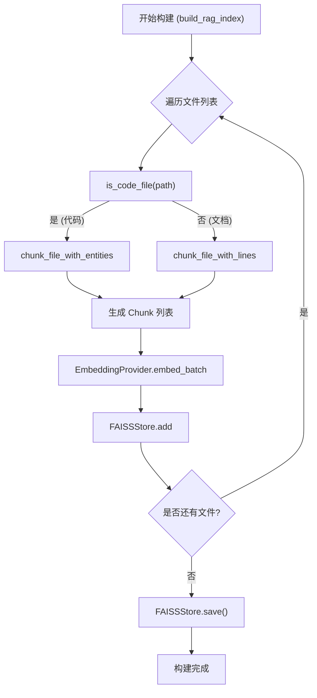
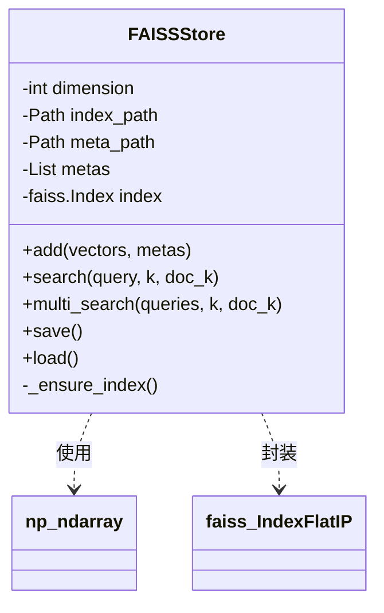

# RAG 与向量索引

在 AutoWiki 系统中，RAG（检索增强生成）管线是连接原始源代码与大语言模型（LLM）的关键桥梁。通过将庞大的代码库分解为可管理的语义单元（Chunks），并利用向量搜索技术进行精准检索，系统能够为生成的维基页面提供准确的上下文参考。这一过程主要由 `worker/pipeline/rag_indexer.py` 负责实现，涵盖了从代码解析、分块、嵌入（Embedding）到向量存储（Vector Store）构建的完整链路。

## RAG 索引管线概览

`build_rag_index` 函数是整个索引构建阶段的入口点。它协调了文件扫描、分块策略选择、向量生成以及持久化存储等多个子系统。该流程的设计目标是确保代码的结构信息（如类定义、函数范围）在转化为向量序列时能够得到最大程度的保留。

在构建索引时，管线首先会遍历仓库中的所有文件。对于每一个文件，系统会根据其文件扩展名判定其类型：若是源代码文件，则尝试进行语义感知的实体分块；若是文档文件（如 `.md`, `.rst`），则采用基于行号的常规分块。分块完成后，这些文本段落会被送往 `EmbeddingProvider` 进行批量向量化。最终，生成的向量及其关联的元数据（如文件路径、起止行号、实体名称）会被存入 `FAISSStore`。

**Diagram: 从原始文件到 FAISS 索引的转换流程**

*Source: worker/pipeline/rag_indexer.py:577-669*

在 `build_rag_index` 的实现中，通过 `async_retry` 装饰器对嵌入过程进行了容错处理，以应对网络抖动或 API 配额限制（参考 `worker/utils/retry.py`）。此外，系统支持通过 `file_entities` 参数传入预先提取的 AST（抽象语法树）信息，这直接决定了分块的质量。

*Source: worker/pipeline/rag_indexer.py:577-600*

## 文档分块策略

代码分块不仅仅是简单的字符串切割。为了让 LLM 理解代码逻辑，分块必须尽可能保持实体的完整性。AutoWiki 提供了两种主要的分块策略，分别应对不同的文件类型和处理深度。

### 分块策略对比

| 策略名称 | 实现函数 | 核心逻辑 | 适用场景 |
| :--- | :--- | :--- | :--- |
| **常规分块** | `chunk_file_with_lines` | 使用 `RecursiveCharacterTextSplitter` 进行递归字符分割，严格跟踪物理行号。 | 文档文件（Markdown, reStructuredText）或无法解析 AST 的简单文件。 |
| **实体感知分块** | `chunk_file_with_entities` | 优先根据 AST 实体（类、函数）边界进行切割。若实体过大则进行子分块，未覆盖的“间隙”代码单独收集。 | 支持 AST 解析的源代码文件（如 Python, JavaScript 等）。 |

### 常规分块 (chunk_file_with_lines)
该策略依赖于 `langchain_text_splitters.RecursiveCharacterTextSplitter`。其关键特性在于 `chunk_size` 和 `overlap` 的动态调整，同时在元数据中记录 `start_line` 和 `end_line`。这确保了在检索阶段，系统能够定位到代码的确切位置。

*Source: worker/pipeline/rag_indexer.py:47-120*

### 实体感知分块 (chunk_file_with_entities)
这是 AutoWiki 的核心优势所在。它接受一个 `entities` 列表，其中包含 AST 提取出的 `start_line` 和 `end_line`。
1. **实体保护**：如果一个函数或类的长度小于 `chunk_size`，它会被作为一个整体对待，不被拆分。
2. **超大实体拆分**：如果实体超出阈值，则在实体内部进行带有 `overlap` 的子分块。
3. **残留代码收集**：对于文件开头、结尾或实体之间的零散代码段（如模块级变量定义、导入语句），算法会自动识别并独立分块。

*Source: worker/pipeline/rag_indexer.py:123-287*

## FAISS 向量存储管理

`FAISSStore` 类是对 `faiss.IndexFlatIP` 的封装。它不仅管理向量的相似度搜索，还负责维护与之并行的元数据列表。

### 向量归一化与相似度计算
`FAISSStore` 使用内积索引（Inner Product Index）。在调用 `add()` 方法添加向量或调用 `search()` 方法查询时，系统会对 `numpy` 数组进行 L2 归一化处理。根据线性代数原理，两个 L2 归一化向量的内积等同于它们的余弦相似度（Cosine Similarity）。

**Diagram: FAISSStore 类结构及向量操作关系**

*Source: worker/pipeline/rag_indexer.py:290-348*

### 检索优化
在检索阶段，`search()` 方法支持一种特殊的“文档优先”逻辑。如果设置了 `doc_k` 参数，系统会优先从元数据中标记为文档（`_is_doc_chunk`）的块中筛选结果。
`multi_search()` 方法则进一步提升了 RAG 的召回率。它允许同时输入多个查询向量（例如，由 LLM 生成的多个重写问题），并在内部对结果进行去重处理，确保返回的 `k` 个结果是最相关的且不重复。

*Source: worker/pipeline/rag_indexer.py:350-492*

### 持久化机制
`FAISSStore` 将数据持久化为两个文件：
*   **Index Path**：存储 FAISS 的二进制索引数据，通过 `faiss.write_index` 写入。
*   **Meta Path**：使用 `pickle` 序列化的元数据列表，包含每个向量对应的文本、文件路径和行号信息。

加载时，`load()` 方法通过 `faiss.read_index` 和 `pickle.loads` 恢复内存结构。如果文件不存在或损坏，将抛出 `FileNotFoundError`。

*Source: worker/pipeline/rag_indexer.py:494-543*

## 测试与验证

为了确保索引系统的可靠性，`tests/worker/test_rag_indexer.py` 中包含了详尽的测试用例。这些测试不仅覆盖了核心功能的正确性，还模拟了边缘情况。

*   **分块准确性验证**：
    *   `test_chunk_file_with_lines_tracks_line_numbers`：验证行号跟踪是否精确。
    *   `test_chunk_file_with_lines_multiple_chunks`：验证在多段分割下文本是否完整且有重叠。
    *   `test_chunk_file_with_entities_keeps_small_entities`：确保短小的函数在分块过程中不会被腰斩。
    *   `test_chunk_file_with_entities_falls_back_without_entities`：测试当没有 AST 信息时，系统能否平滑降级到行分块策略。
*   **存储与检索验证**：
    *   `test_faiss_store_add_and_search`：通过随机生成的向量验证 FAISS 的基本存取和相似度排序。
    *   `test_faiss_store_multi_search`：验证多向量查询下的去重逻辑是否正确。
    *   `test_faiss_store_persist_and_load`：模拟磁盘存取流程，确保索引和元数据在持久化后能够完美复原。
*   **集成测试**：
    *   `test_build_rag_index`：使用 Mock 对象模拟 `EmbeddingProvider`，验证 `build_rag_index` 是否能够正确遍历目录并协调各组件完成索引构建。

*Source: tests/worker/test_rag_indexer.py:13-142*

## Source Files

| File |
|------|
| `worker/pipeline/rag_indexer.py` |
| `worker/embedding/base.py` |
| `tests/worker/test_rag_indexer.py` |