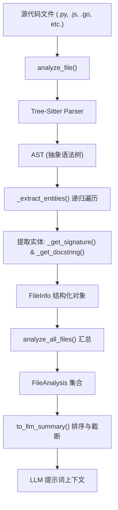
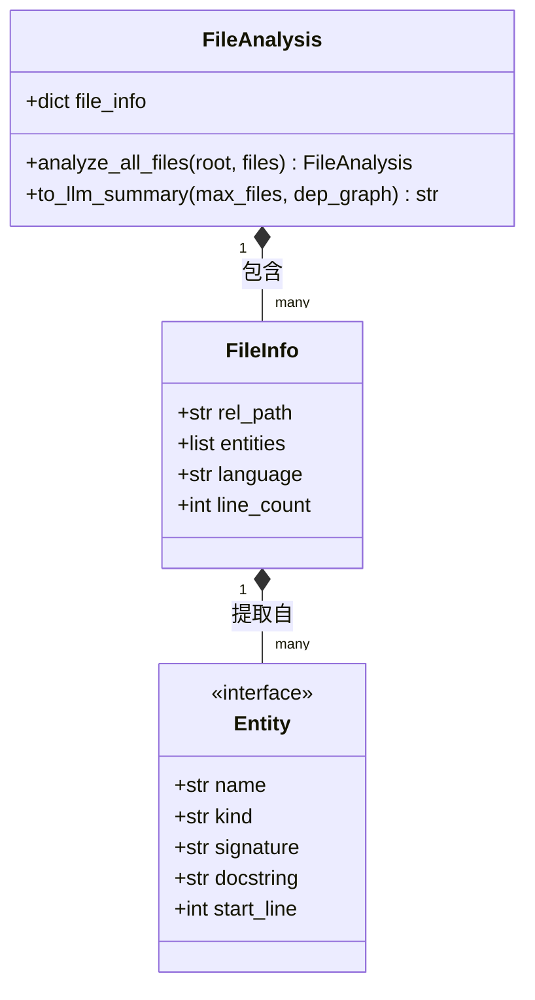

# Tree-Sitter 语法分析

## 概述与架构

在 AutoWiki 的自动化文档生成流程中，抽象语法树（AST）分析是理解代码结构的核心步骤。通过集成 Tree-Sitter 解析器，系统能够深度理解多语言源代码的层次结构，而不仅仅是将其视为纯文本。这一阶段位于依赖图构建之后，在 Wiki 规划器和页面生成器之前，为后续的 LLM 推理提供结构化的代码上下文。

AST 分析流水线的主要任务是遍历文件系统，对每种支持的编程语言调用相应的 Tree-Sitter 语言绑定，提取出类、函数、方法等命名实体的签名和文档注释。

**Diagram: 从源代码到 LLM 摘要的 AST 提取数据流**

*Source: [worker/pipeline/ast_analysis.py:91-598*](https://github.com/lazyxiang/AutoWiki/blob/main/worker/pipeline/ast_analysis.py#L91-L598*)

## 核心组件与实体提取

AST 分析的核心在于 `analyze_file` 函数和 `FileAnalysis` 类。系统支持多种主流编程语言，包括 Python、JavaScript、TypeScript、Java、Go、Rust、C、C++ 和 C#。

当 `analyze_file` 处理一个文件时，它首先根据文件扩展名识别语言，然后读取文件字节流并构建解析树。随后，`_extract_entities` 函数会进行深度优先搜索（DFS），识别特定类型的节点（如 `function_definition` 或 `class_definition`）。针对每个识别出的实体，系统会通过专门的辅助函数提取关键元数据。

| 组件/函数 | 输入 | 核心功能 | 输出 |
| :--- | :--- | :--- | :--- |
| `analyze_file` | `Path` 对象 | 识别语言，调用 Tree-Sitter 解析并驱动实体提取。 | 包含实体列表的字典或 `None` |
| `_extract_entities` | AST 节点与源码字节 | 递归遍历语法树，过滤出类、函数和方法节点。 | 实体字典列表 (name, type, line, etc.) |
| `_get_signature` | AST 节点与源码字节 | 提取函数参数或类定义的声明部分，生成可读签名。 | 格式化的签名字符串 |
| `_get_docstring` | AST 节点与源码字节 | 提取 Python 块注释或 C 风格的前置单行/多行注释。 | 清理后的文档字符串 |
| `analyze_all_files` | 根路径与文件列表 | 并行或顺序处理文件，封装为 `FileAnalysis` 对象。 | `FileAnalysis` 实例 |

在 `_get_docstring` 的实现中，系统采用了三层降级策略：首先尝试匹配 Python 特有的块状文档字符串；如果不存在，则在 AST 中向上查找紧邻当前节点的前置注释节点；最后处理多行连续注释。这种策略确保了无论在何种语言风格下，都能最大程度保留开发者的原生意图。

*Source: [worker/pipeline/ast_analysis.py:152-344*](https://github.com/lazyxiang/AutoWiki/blob/main/worker/pipeline/ast_analysis.py#L152-L344*)

## 处理策略与重要性排序

当处理大型仓库时，将所有 AST 信息全部推送到 LLM 会导致上下文窗口溢出。因此，`FileAnalysis` 引入了基于依赖关系的排序和截断机制。

`_rank_files_by_importance` 函数是这一机制的核心。它结合了 `DependencyGraph`（如果可用）和文件路径深度来对文件进行评分。其核心逻辑是：被更多文件依赖的模块（如底层库、接口定义）具有更高的权重。

**Diagram: AST 分析核心数据结构类图**

*Source: [worker/pipeline/ast_analysis.py:348-537*](https://github.com/lazyxiang/AutoWiki/blob/main/worker/pipeline/ast_analysis.py#L348-L537*)

在生成发送给 LLM 的摘要时，`to_llm_summary` 遵循以下截断逻辑：
1. **优先排序**：利用 `_score` 函数和依赖图对所有文件进行降序排列。
2. **详细摘要**：前 `max_files`（默认 200）个文件会包含完整的实体列表、签名和文档字符串。
3. **路径清单**：超过 `max_files` 但在安全上限（800 个文件）之内的文件，仅保留其相对路径，不提供详细 AST 信息。
4. **彻底截断**：超过安全上限的文件将被完全忽略，以防止上下文过载。

这种分级展示策略确保了 LLM 能够看到项目最核心的 API 设计，同时通过路径清单保持对项目全貌的感知。

*Source: [worker/pipeline/ast_analysis.py:377-537*](https://github.com/lazyxiang/AutoWiki/blob/main/worker/pipeline/ast_analysis.py#L377-L537*)

## 测试覆盖与验证

为了确保多语言解析的稳健性，`tests/worker/test_ast_analysis.py` 包含了针对各种边缘情况的详尽测试套件。验证重点在于解析结果的准确性和系统在极端负载下的表现。

*   **多语言兼容性验证**：
    *   通过 `test_analyze_python_file`、`test_analyze_javascript_file` 和 `test_analyze_typescript_file` 验证不同语言的语法解析。
    *   即便在某些特殊环境下，如 `test_analyze_kotlin_file`，系统也能通过 Tree-Sitter 扩展进行处理。
    *   `test_unsupported_language_returns_none` 确保当遇到无法识别的文件类型（如图片或非代码文件）时，系统能够安全跳过。
*   **特征提取精度**：
    *   `test_extract_python_docstring` 验证能够正确剥离引号并处理多行 Python 文档字符串。
    *   `test_extract_python_function_signature` 确保参数列表（包括可选参数和类型注解）被完整保留。
*   **摘要生成逻辑**：
    *   `test_to_llm_summary_with_dep_graph` 确认在提供依赖图时，重要文件的排序是否符合预期。
    *   `test_to_llm_summary_safety_cap` 验证当文件数量超过 800 时，系统是否正确地将后续文件降级为纯路径显示。
    *   `test_analyze_all_files_no_entities` 确保对于空文件或没有任何类/函数定义的文件，系统不会崩溃并返回空列表。

通过这些自动化测试，AutoWiki 保证了 AST 分析层能够为上层 LLM 任务提供高质量、高可靠性的结构化数据。

*Source: [tests/worker/test_ast_analysis.py:14-271*](https://github.com/lazyxiang/AutoWiki/blob/main/tests/worker/test_ast_analysis.py#L14-L271*)

## Source Files

| File |
|------|
| `worker/pipeline/ast_analysis.py` |
| `tests/worker/test_ast_analysis.py` |