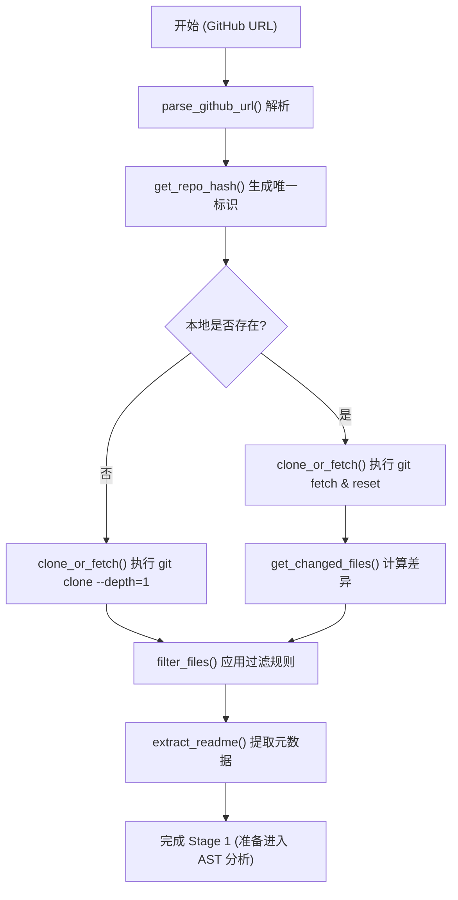
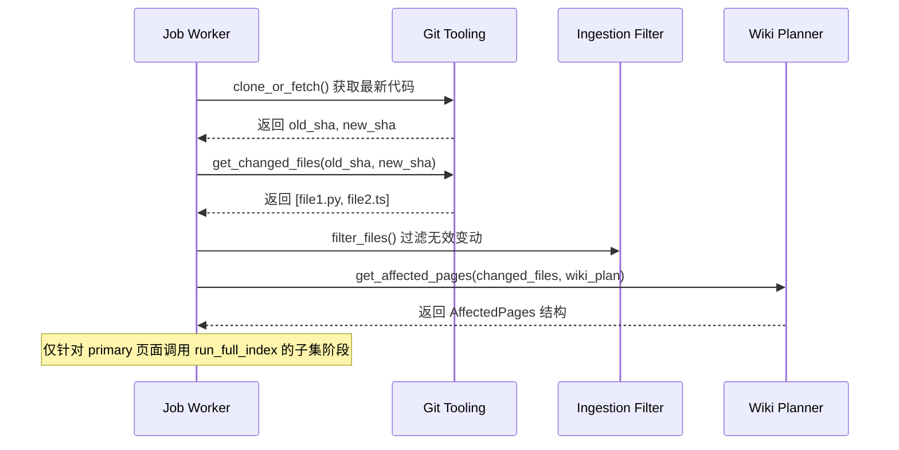

# 代码摄取与过滤

代码摄取（Ingestion）是 AutoWiki 生成管线的第一阶段。这一阶段的核心任务是从远程存储库获取源代码，并将其转化为系统可处理的本地文件集合。它不仅负责初始的克隆操作，还承担了文件过滤、元数据提取以及为增量更新提供差异分析的重要职责。

### 代码摄取流程概述

在 AutoWiki 中，代码摄取的完整生命周期从解析 GitHub URL 开始，到生成待分析的过滤文件列表结束。系统首先将输入的 URL 规范化为所有者和存储库名称的元组，然后通过计算稳定的哈希值来确定本地存储路径。在获取代码时，系统优先采用浅克隆（Shallow Clone）策略以节省磁盘空间和带宽。

获取代码后，管线会立即执行过滤逻辑。这确保了后续的 AST 分析和 LLM 处理阶段只会接触到有意义的源文件，自动排除诸如二进制文件、依赖库（如 `node_modules`）以及过大的自动生成文件。

**Diagram: 代码摄取与过滤逻辑流**

*Source: [worker/pipeline/ingestion.py:1-87*](https://github.com/lazyxiang/AutoWiki/blob/main/worker/pipeline/ingestion.py#L1-L87*)

### 存储库克隆与更新机制

AutoWiki 主要通过 `clone_or_fetch` 函数管理存储库的生命周期。该函数利用 `GitPython` 库与底层的 Git 工具进行交互。为了保证效率和一致性，系统采用了以下策略：

*   **浅克隆 (Shallow Clone)**：在首次克隆时，系统使用 `depth=1` 参数。这仅获取最近的一次提交记录，极大地减少了大型项目（如 Linux 内核或 Chromium）的摄取时间。
*   **硬重置更新 (Hard Reset)**：如果存储库已存在，系统不会执行简单的 `git pull`，而是执行 `fetch` 后紧跟 `reset --hard origin/{branch}`。这种做法可以确保本地工作区处于一个干净的状态，避免由于之前的处理残留导致的冲突。
*   **并发处理**：克隆和获取操作属于典型的 I/O 密集型任务。在 `worker/pipeline/ingestion.py` 中，实际的 Git 操作被包装在 `_do_clone_or_fetch` 中，并通常在线程执行器中运行，以避免阻塞 `asyncio` 事件循环。
*   **唯一标识寻址**：通过 `get_repo_hash` 函数，系统根据 `platform:owner/name` 生成一个稳定的短哈希值。这确保了即使存储库名称发生细微变化（如大小写），也能映射到相同的物理存储路径。

*Source: [worker/pipeline/ingestion.py:289-340*](https://github.com/lazyxiang/AutoWiki/blob/main/worker/pipeline/ingestion.py#L289-L340*)

### 文件过滤与清理规则

并非存储库中的所有文件都适合作为 Wiki 内容的来源。`filter_files` 函数负责执行多层过滤，以剔除干扰信息。过滤过程严格遵循以下标准：

| 过滤维度 | 规则描述 | 实现细节 |
| :--- | :--- | :--- |
| **扩展名白名单** | 仅保留受支持的源代码和文档格式。 | 检查 `SOURCE_EXTENSIONS` 集合，包括 `.py`, `.js`, `.go`, `.md`, `.toml` 等。 |
| **忽略配置文件** | 遵守 Git 风格的忽略模式。 | 加载 `.autowikiignore` 文件并使用 `pathspec` 进行匹配。 |
| **文件大小限制** | 防止处理巨型自动生成文件。 | 默认跳过超过 `max_file_bytes` (1MB) 的文件。 |
| **预定义排除** | 自动跳过常见的非代码目录。 | 内置排除 `.git`, `node_modules`, `vendor`, `dist` 等目录。 |
| **排序一致性** | 保证输出列表的确定性。 | 最终返回经过排序的 `Path` 列表，确保多次运行结果一致。 |

此外，`extract_readme` 函数会尝试在根目录下寻找 `README.md`, `README.rst` 或 `README.txt`。提取的内容（通常限制在 3000 字符内）将作为 `WikiPlan` 阶段的重要背景信息，帮助 LLM 理解项目的总体意图。

*Source: [worker/pipeline/ingestion.py:150-245*](https://github.com/lazyxiang/AutoWiki/blob/main/worker/pipeline/ingestion.py#L150-L245*)

### 增量更新与影响分析

为了提高大型项目的处理效率，AutoWiki 支持增量刷新机制。这由 `run_refresh_index` 任务驱动，其核心在于识别哪些代码变动导致了哪些 Wiki 页面需要重新生成。

**影响分析流程：**

1.  **差异检测**：`get_changed_files` 函数通过 `git diff --name-only` 对比上一次成功处理的 SHA 和当前 HEAD 之间的文件变化。
2.  **页面映射**：`get_affected_pages` 将这些变动的文件路径与已有的 `WikiPlan` 进行比对。
3.  **受影响页面分类**：
    *   **Primary (主要影响)**：如果页面的 `WikiPageSpec` 中显式列出的源文件发生了变化，该页面被标记为必须重新生成。
    *   **Dependency (依赖影响)**：虽然在 `ingestion.py` 的 `AffectedPages` 定义中主要关注文件重叠，但 `worker/jobs.py` 会进一步结合 `DependencyGraph` 判断间接影响。

**Diagram: 增量更新触发流程**

在 `worker/jobs.py` 的 `run_refresh_index` 实现中，如果检测到受影响页面，系统会选择性地清除这些页面的旧制品（Markdown 文件），并仅针对这些页面运行生成管线的后续阶段。这种“精准打击”的策略显著降低了对 LLM Token 的消耗和处理时长。

*Source: [worker/pipeline/ingestion.py:343-417; worker/jobs.py:696-1275*](https://github.com/lazyxiang/AutoWiki/blob/main/worker/pipeline/ingestion.py#L343-L417; worker/jobs.py)

## Source Files

| File |
|------|
| `worker/pipeline/ingestion.py` |
| `worker/jobs.py` |