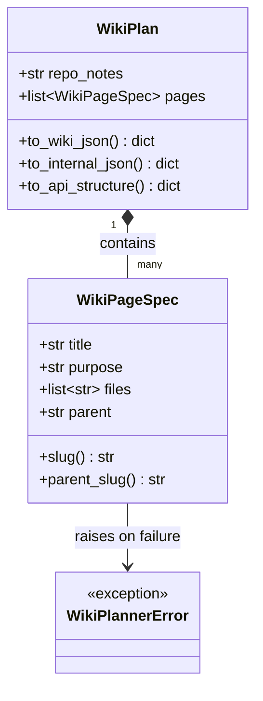
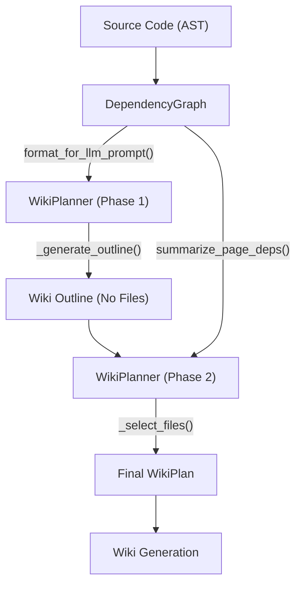

# 依赖图谱构建

在 AutoWiki 系统中，`WikiPlanner` 是构建整个维基结构的核心组件。它不仅负责将复杂的代码库逻辑拆解为易于理解的文档大纲，还承担着维护文件间物理依赖与逻辑关联一致性的重任。通过结合 LLM（大语言模型）的语义理解能力与 AST（抽象语法树）生成的硬性依赖图谱，`WikiPlanner` 能够生成既符合人类阅读习惯又具备工程严谨性的维基计划（`WikiPlan`）。

## WikiPlanner 架构概览

`WikiPlanner` 的核心职责是将扁平化的源代码文件集合转化为具有层次结构的维基页面。这一过程分为两个阶段：大纲生成（Outline Generation）和文件分配（File Assignment）。为了支撑这两个阶段，系统定义了精细的数据模型来捕获页面间的父子关系、页面的用途描述以及关联的源文件。

**Diagram: WikiPlanner 核心类及数据流转**

*Source: [worker/pipeline/wiki_planner.py:79-183*](https://github.com/lazyxiang/AutoWiki/blob/main/worker/pipeline/wiki_planner.py#L79-L183*)

### 核心数据模型

1.  **WikiPageSpec**: 这是维基计划的最小单位。每个 `WikiPageSpec` 对象包含了页面的标题（`title`）、设计意图（`purpose`）以及该页面负责解释的源文件列表（`files`）。它通过 `slug()` 方法生成 URL 安全的标识符，处理 Unicode 字符并确保在文档引用中的唯一性。
2.  **WikiPlan**: 作为 `WikiPageSpec` 的容器，它封装了整个仓库的全局说明（`repo_notes`）。其核心价值在于提供了三种不同维度的序列化方法：
    *   `to_wiki_json()`: 面向用户，隐藏了内部文件分配细节，保留可读性强的标题和用途。
    *   `to_internal_json()`: 面向管线内部，保留 `files` 列表以便后续的增量生成引擎追踪变更。
    *   `to_api_structure()`: 面向前端展示，自动计算 `slug` 和 `parent_slug` 关系。

### 初始参数建议
为了确保生成的维基规模适中，系统通过 `_suggest_page_range()` 函数根据文件数量和实体（Entity）复杂度动态建议页面总数。这避免了小项目过度拆分或大项目页面过长的问题。

*Source: [worker/pipeline/wiki_planner.py:101-111*](https://github.com/lazyxiang/AutoWiki/blob/main/worker/pipeline/wiki_planner.py#L101-L111*)

## 依赖关系与模块解耦

`WikiPlanner` 并非孤立运行，它深度依赖于 `DependencyGraph` 提供的结构化数据。在构建依赖图谱时，系统通过分析 `import` 语句和调用链，确定文件间的拓扑权重。

**Diagram: 依赖分析与维基规划集成流图**

*Source: [worker/pipeline/wiki_planner.py:385-478](https://github.com/lazyxiang/AutoWiki/blob/main/worker/pipeline/wiki_planner.py#L385-L478), [worker/pipeline/dependency_graph.py:163-176*](https://github.com/lazyxiang/AutoWiki/blob/main/worker/pipeline/dependency_graph.py#L163-L176*)

### 跨模块交互逻辑

*   **AST 分析集成**: `WikiPlanner` 接收由 `ast_analysis.py` 提取的文件摘要（`file_summary`）。这些摘要包含了类定义、函数签名等关键元数据。
*   **依赖图谱增强**: 在生成提示词（Prompt）时，`_build_outline_prompt` 会注入 `dep_info`。这一信息来源于 `DependencyGraph.format_for_llm_prompt()`，它筛选出最重要的前 150 个依赖边缘（Edges），帮助 LLM 理解系统的架构骨干而非陷入细节泥潭。
*   **聚类辅助**: 系统利用 `DependencyGraph._compute_clusters()` 预先计算的文件簇（Clusters）作为 LLM 的参考，确保逻辑上紧密耦合的文件更有可能被分配到同一个维基页面下。

*Source: [worker/pipeline/wiki_planner.py:385-410](https://github.com/lazyxiang/AutoWiki/blob/main/worker/pipeline/wiki_planner.py#L385-L410), [docs/2026-03-28-pipeline-refactoring-plan.md:163-167*](https://github.com/lazyxiang/AutoWiki/blob/main/docs/2026-03-28-pipeline-refactoring-plan.md#L163-L167*)

## 核心逻辑功能分类

`WikiPlanner` 的实现结合了严格的规则验证与灵活的 LLM 推理。下表汇总了其关键函数的功能分类：

| 类别 | 函数名称 | 核心职责 |
| :--- | :--- | :--- |
| **LLM 交互** | `_generate_outline` | 执行 Phase 1 任务，通过 LLM 生成初步的页面树结构。 |
| **结构验证** | `_validate_outline_structure` | 检查生成的页面是否存在循环引用、深度是否超限以及标题是否唯一。 |
| **提示词工程** | `_build_selection_system` | 为 Phase 2 构建系统提示词，专注于精确的文件到页面的映射规则。 |
| **启发式评分** | `_score_file_for_page` | 计算文件路径、内容与页面标题/用途之间的语义匹配度。 |
| **异常处理** | `WikiPlannerError` | 当 LLM 多次尝试均无法生成合规的大纲时，抛出致命错误停止任务。 |
| **序列化** | `to_api_structure` | 将内部逻辑结构转换为符合前端展示规范的 JSON 字典。 |

*Source: [worker/pipeline/wiki_planner.py:273-308](https://github.com/lazyxiang/AutoWiki/blob/main/worker/pipeline/wiki_planner.py#L273-L308), 531-601, 770-803*

### 验证机制详述
在 `_validate_outline_structure` 中，系统会计算每个页面的缩进级别（通过 `_depth` 函数解析标题前缀，如 "##" 对应深度 2），并确保：
1. 页面总数在 `page_range` 范围内。
2. 没有任何页面的深度跨度超过 1 级（即不允许从 Level 1 直接跳到 Level 3）。
3. 根页面（Level 1）必须存在，作为文档入口。

*Source: [worker/pipeline/wiki_planner.py:531-578*](https://github.com/lazyxiang/AutoWiki/blob/main/worker/pipeline/wiki_planner.py#L531-L578*)

## 文件自动分配策略

当 LLM 无法在有限次数内完成完美的文件分配，或者用户需要更快速的基准方案时，`WikiPlanner` 会启用一套多级兜底分配策略。

### 1. 目录聚类分配 (Directory Cluster Assign)
这是系统的首选兜底逻辑。其核心思想是利用源代码的物理目录结构作为逻辑分组的强信号。
*   **路径标记**: 使用 `_directory_key` 提取文件的顶级目录（根目录文件返回空字符串）。
*   **语义匹配**: `_best_matching_page` 函数通过 `_tokenize` 提取目录名和页面标题的词根（长度 $\ge 3$ 的字符），计算重合度。
*   **评分加权**: 
    *   目录名与页面词根重叠：+3分。
    *   采样文件内容匹配：+1分。
*   **分配规则**: 将整个目录的文件批量分配给得分最高的页面。

*Source: [worker/pipeline/wiki_planner.py:730-767](https://github.com/lazyxiang/AutoWiki/blob/main/worker/pipeline/wiki_planner.py#L730-L767), 821-898*

### 2. 启发式评分分配 (Heuristic Select Files)
当需要更精细的控制时，`_heuristic_select_files` 提供了一种基于全局最优化的分配方式：
*   **候选过滤**: `_prefilter_candidates` 根据依赖图谱和文件描述，为每个页面筛选出前 25 个最具相关性的候选文件。
*   **分值计算**: `_score_file_for_page` 综合考虑：
    *   文件名与标题的文本相似度。
    *   文件在 `DependencyGraph` 中的中心度。
    *   文件与其他已分配文件之间的依赖强度。
*   **增量修补**: 如果 LLM 在 Phase 2 中只完成了部分分配，该策略会通过 `partial_selections` 参数保留已有的有效分配，仅针对空白页面进行填充。

*Source: [worker/pipeline/wiki_planner.py:806-818](https://github.com/lazyxiang/AutoWiki/blob/main/worker/pipeline/wiki_planner.py#L806-L818), 901-944*

### 3. LLM 验证与重试
在 Phase 2（`_select_files`）中，每次 LLM 返回结果后，都会触发 `_validate_selections`。该函数检查：
*   每个文件是否仅被分配给一个页面（避免文档冗余）。
*   是否有核心文件（高入度节点）被遗漏。
*   分配的文件数量是否在页面的合理容量范围内。
如果验证失败，系统会将错误信息反馈给 LLM 并触发重试机制，直到达到 `max_retries` 限制。

*Source: [worker/pipeline/wiki_planner.py:604-635*](https://github.com/lazyxiang/AutoWiki/blob/main/worker/pipeline/wiki_planner.py#L604-L635*)

## Source Files

| File |
|------|
| `worker/pipeline/wiki_planner.py` |
| `worker/pipeline/dependency_graph.py` |