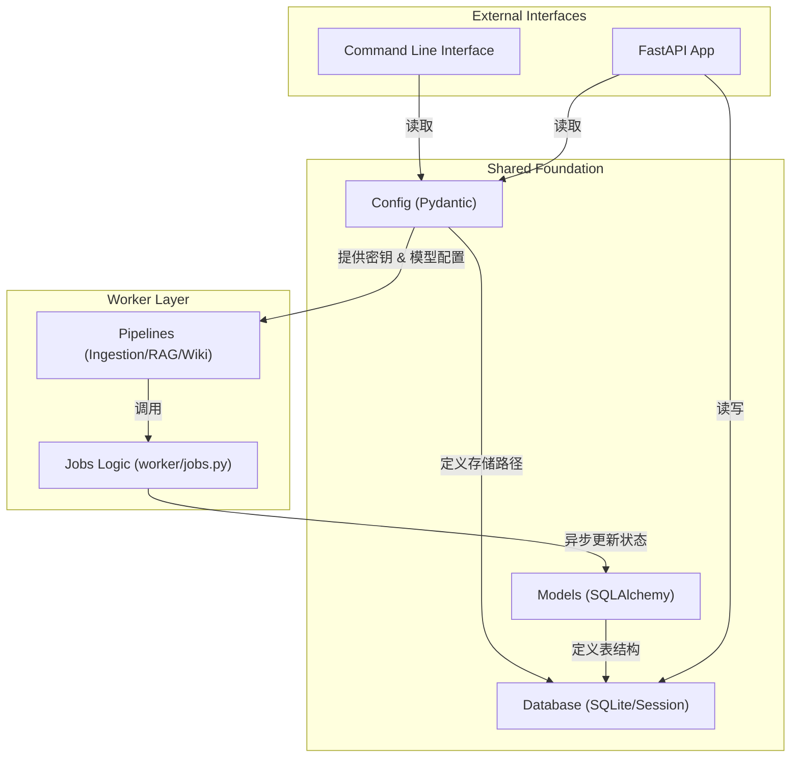
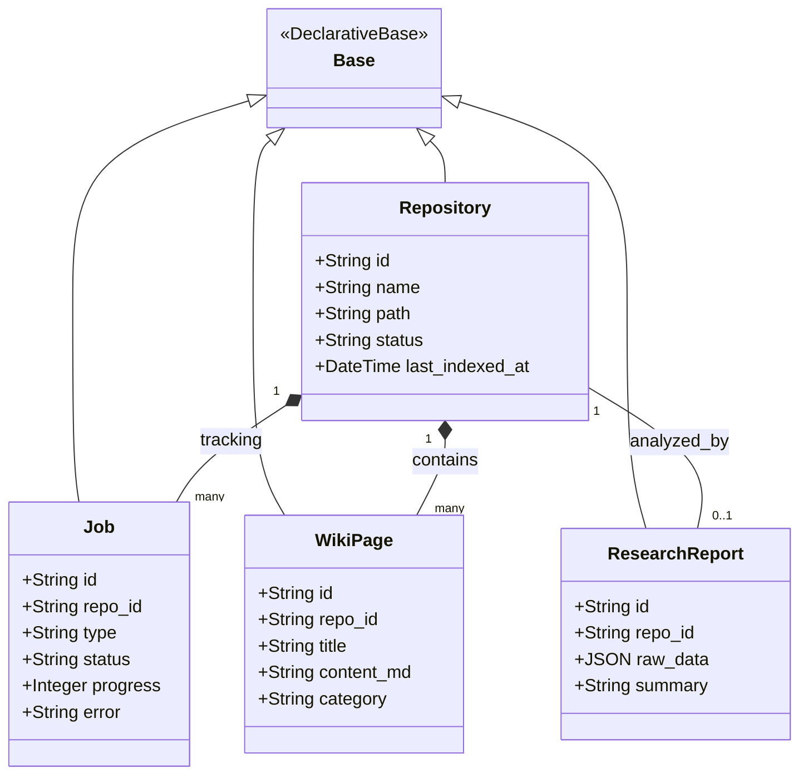

# 系统核心基础

AutoWiki 的系统架构建立在高度解耦且类型安全的底层基础之上。本页面旨在介绍支撑整个应用运行的核心机制，包括全局配置系统、基于 SQLAlchemy 的对象关系映射（ORM）数据模型，以及协调异步任务与数据库状态同步的后台作业机制。这些组件共同构成了 AutoWiki 的基础设施层，为 API 服务、Worker 节点和 CLI 工具提供了统一的运行环境 and 数据视图。

## 架构总览

AutoWiki 采用了典型的分布式架构设计，其核心逻辑被划分为共享基础库（`shared`）、任务执行引擎（`worker`）和交互接口（`api`/`cli`）。系统核心基础主要由 `shared` 目录下的模块定义，确保了在多进程或分布式部署环境下，配置解析、数据库访问和日志记录的一致性。

系统的核心工作流依赖于配置管理系统（`shared/config.py`）提供的环境参数，这些参数决定了 LLM 供应商的调用方式、数据库连接路径以及日志存储位置。在任务执行阶段，`worker/jobs.py` 充当了任务调度与持久化层之间的桥梁，它通过异步操作更新 `shared/models.py` 中定义的实体状态，确保前端界面（通过 API 访问数据库）能够实时反映后台流水线的执行进度。

**Diagram: 架构组件依赖与工作流**

*Source: [shared/config.py:11-103](https://github.com/lazyxiang/AutoWiki/blob/main/shared/config.py#L11-L103), [shared/models.py:13-112](https://github.com/lazyxiang/AutoWiki/blob/main/shared/models.py#L13-L112), [worker/jobs.py:66-177](https://github.com/lazyxiang/AutoWiki/blob/main/worker/jobs.py#L66-L177)*

在这个架构中，`shared/database.py` 负责初始化数据库引擎并管理会话周期。所有的数据库实体（如 `Repository`, `Job`）均统一声明，使得 Worker 在处理深层研究（Deep Research）或页面生成（Page Generation）等耗时任务时，能够通过 `worker/jobs.py` 提供的工具函数，在非阻塞的情况下安全地回写执行状态和错误日志。

## 全局配置管理

AutoWiki 使用 Pydantic 的 `BaseSettings` 构建了一套强类型的配置管理体系。这种设计的核心优势在于它能够自动从环境变量中读取配置、进行严格的类型校验，并为缺失的参数提供智能默认值。系统通过 `get_config()` 函数导出单例 `Config` 对象，确保全局配置的一致性。

### 配置模块定义

配置系统被划分为多个子模块，分别负责 LLM 调用、嵌入模型、服务器设置和聊天参数。这种模块化设计使得 `Config` 类不仅结构清晰，而且易于扩展。

| 配置模块 | 环境变量前缀 | 核心属性 | 说明 |
| :--- | :--- | :--- | :--- |
| `LLMConfig` | `AUTOWIKI_LLM_` | `provider`, `model`, `api_key`, `base_url` | 支持 Anthropic, OpenAI, Ollama 等供应商，默认为 `anthropic`。 |
| `EmbeddingConfig` | `AUTOWIKI_EMBEDDING_` | `provider`, `model`, `api_key` | 负责向量化模型的配置，默认为 OpenAI 的 `text-embedding-3-small`。 |
| `ServerConfig` | `AUTOWIKI_SERVER_` | `host`, `port`, `db_path`, `log_level` | 定义 API 服务监听地址及 SQLite 数据库存储路径。 |
| `ChatConfig` | `AUTOWIKI_CHAT_` | `history_window`, `system_prompt` | 控制聊天界面的上下文窗口大小。 |

### 强制类型转换与防御性编程

在处理环境变量时，`shared/config.py` 为关键配置项实现了一套针对性的防御性校验机制。例如，通过 `field_validator` 装饰器，系统能够识别并处理特定环境变量设置为空字符串的情况，将其强制转换回定义的默认值。这避免了因 `.env` 文件中存在空键而导致的运行时错误。

这种空值回退机制目前主要应用于 `LLMConfig`（针对 `provider` 和 `cache_ttl` 字段）以及 `EmbeddingConfig`（针对 `provider` 字段），确保了核心 LLM 服务的稳定性。在 `LLMConfig` 中，`_coerce_empty_to_default` 方法确保了供应商和缓存策略在环境参数为空时能正确回退。类似地，`EmbeddingConfig` 中的 `_coerce_empty_provider` 确保了嵌入供应商的可靠性。而对于 `ServerConfig` 或 `ChatConfig` 等其他配置模块，系统则遵循标准的环境变量覆盖逻辑。这种机制在 Docker 容器化部署中尤为重要，因为容器环境经常会传递空的占位变量。

*Source: [shared/config.py:27-32](https://github.com/lazyxiang/AutoWiki/blob/main/shared/config.py#L27-L32), [shared/config.py:43-45](https://github.com/lazyxiang/AutoWiki/blob/main/shared/config.py#L43-L45)*

### 路径管理与单例模式

`Config` 类不仅持有配置数据，还封装了日志路径的计算逻辑。通过 `error_log_path`, `task_log_path` 和 `llm_log_path` 方法，系统能够根据配置的数据库路径自动推导出日志文件的存放位置。

    # 示例：Config 类内部的路径推导逻辑
    # error_log_path -> Path(self.server.db_path).parent / "error.log"

为了方便测试，系统还提供了 `reset_config()` 函数，允许在单元测试执行期间强制清除配置缓存并重新加载环境变量。关于配置系统的详细实现及 LLM 抽象层，请参阅子页面：[全局配置管理](全局配置管理.md)。

*Source: [shared/config.py:88-103](https://github.com/lazyxiang/AutoWiki/blob/main/shared/config.py#L88-L103), [shared/config.py:116-119](https://github.com/lazyxiang/AutoWiki/blob/main/shared/config.py#L116-L119)*

## 数据持久化模型

AutoWiki 的持久化层基于 SQLAlchemy 声明式基类（`Base`），在 `shared/models.py` 中定义了整个系统的核心领域模型。这些模型不仅定义了 SQLite 的表结构，还承载了业务逻辑中的状态转换信息。

**Diagram: 核心领域模型类图**

*Source: [shared/models.py:9-112](https://github.com/lazyxiang/AutoWiki/blob/main/shared/models.py#L9-L112)*

### 模型职责说明

1.  **Repository**: 系统的根实体。它存储了被索引代码库的元数据，包括本地路径、克隆 URL 以及当前的索引状态（如 `cloning`, `indexing`, `ready`）。
2.  **Job**: 异步任务的生命周期跟踪器。无论是 `ingestion`（数据摄取）、`indexing`（向量化）还是 `generation`（Wiki 生成），每一个独立的任务都会在 `Job` 表中生成一条记录。其 `status` 字段（`pending`, `running`, `completed`, `failed`）是前端进度条的直接数据源。
3.  **WikiPage**: 存储最终生成的文档内容。它包含 Markdown 格式的正文、标题以及所属的分类，与 `Repository` 形成多对一关系。
4.  **ResearchReport**: 存储深度研究阶段生成的结构化分析结果，通常包含对复杂架构的详细解读。

所有的模型都通过 `shared/database.py` 中提供的 `get_session()` 上下文管理器进行访问。更多关于表间关系、字段约束及事务处理的内容，请参考子页面：[数据库模型与持久化](数据库模型与持久化.md)。

*Source: [shared/models.py:13-32](https://github.com/lazyxiang/AutoWiki/blob/main/shared/models.py#L13-L32), [shared/models.py:35-48](https://github.com/lazyxiang/AutoWiki/blob/main/shared/models.py#L35-L48), [shared/models.py:51-64](https://github.com/lazyxiang/AutoWiki/blob/main/shared/models.py#L51-L64)*

## 异步任务处理机制

在 `worker/jobs.py` 中，AutoWiki 实现了一套专门用于衔接后台流水线与数据库状态的工具函数。由于代码索引和页面生成通常涉及大量磁盘 I/O 和网络调用，系统必须确保这些操作不会阻塞 Python 的异步事件循环（Event Loop）。

### 核心处理逻辑

AutoWiki 的异步任务处理机制具有以下特点：

*   **非阻塞状态更新**: 通过 `_update_job` 和 `_update_repo` 函数，Worker 可以在任务执行的任意阶段更新数据库中的进度或状态。这些函数内部通过获取新的数据库 Session 并提交事务，确保了状态变更的持久性。
*   **异步文件写入**: 系统提供了 `_write_text_async` 工具函数。它利用 `loop.run_in_executor` 将传统的 `Path.write_text` 操作委派给线程池执行，从而避免了大规模 Markdown 文件写入时可能导致的 API 响应延迟。
*   **重试状态同步**: `_make_on_retry` 是一个高阶函数，它返回一个专门用于处理流水线重试逻辑的回调闭包。当某个流水线步骤（如 LLM 调用）因网络问题失败并进入重试序列时，该回调会自动更新数据库中对应 `Job` 的错误信息 and 当前状态，使得用户可以在前端看到“正在重试...”的提示。
*   **解耦的错误记录**: 当任务失败时，`_update_job` 会负责将异常堆栈或错误描述写入 `error` 字段。这与配置系统中的 `error_log_path` 共同构成了系统的双重诊断机制。

*Source: [worker/jobs.py:66-131](https://github.com/lazyxiang/AutoWiki/blob/main/worker/jobs.py#L66-L131), [worker/jobs.py:139-177](https://github.com/lazyxiang/AutoWiki/blob/main/worker/jobs.py#L139-L177)*

### 任务生命周期示例

1.  **启动**: 当一个新任务开始时，调用者通过 `_update_job` 将状态设为 `running`，并将 `progress` 设为 0。
2.  **执行**: 随着流水线的推进，Worker 定期调用更新函数同步进度（例如，摄取完 50% 的文件后更新为 50）。
3.  **重试**: 如果遇到临时故障，由 `_make_on_retry` 生成的闭包被触发，数据库状态实时反馈重试次数。
4.  **结束**: 任务完成后，`Job` 状态变为 `completed`；若发生不可恢复错误，则变为 `failed` 并记录详细错误原因。

这种机制确保了 AutoWiki 的 Worker 进程即便在极高负载下，也能保持对前端的状态透明度。关于系统如何应对调用失败及重试策略的深度解析，请参阅：[错误处理与弹性机制](错误处理与弹性机制.md)。

*Source: [worker/jobs.py:90-110](https://github.com/lazyxiang/AutoWiki/blob/main/worker/jobs.py#L90-L110), [worker/jobs.py:113-131](https://github.com/lazyxiang/AutoWiki/blob/main/worker/jobs.py#L113-L131)*

## Source Files

| File |
|------|
| [`shared/config.py`](https://github.com/lazyxiang/AutoWiki/blob/main/shared/config.py) |
| [`shared/models.py`](https://github.com/lazyxiang/AutoWiki/blob/main/shared/models.py) |
| [`worker/jobs.py`](https://github.com/lazyxiang/AutoWiki/blob/main/worker/jobs.py) |
| [`shared/database.py`](https://github.com/lazyxiang/AutoWiki/blob/main/shared/database.py) |