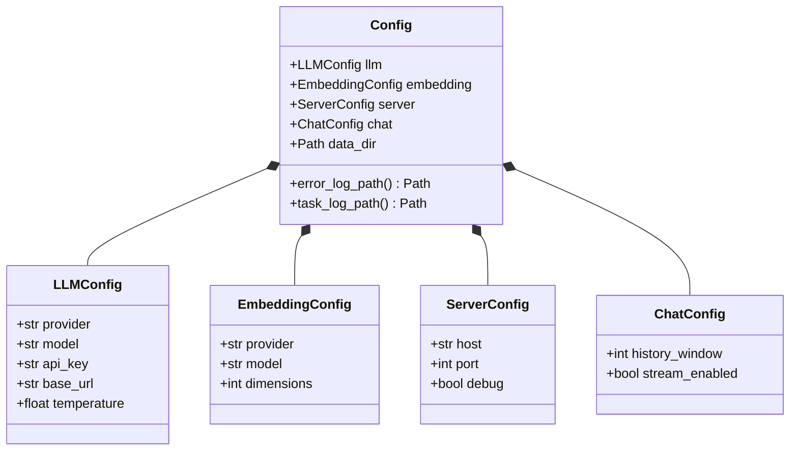
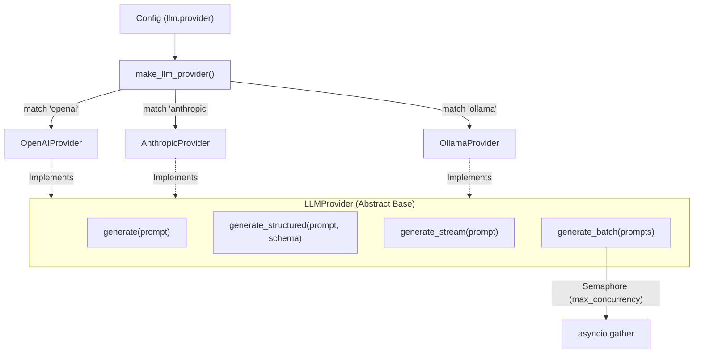

# 全局配置管理

AutoWiki 采用基于 Pydantic 的强类型配置管理体系。系统通过定义结构化的配置模型，实现了环境配置的自动加载、类型校验、默认值回退以及 LLM/嵌入模型的统一抽象。这种架构确保了系统在不同运行环境（开发、生产、容器化）下的稳定性，并为多供应商（OpenAI, Anthropic, Ollama 等）的无缝切换提供了基础。

## 全局配置架构概览

系统的配置核心位于 `shared/config.py`，通过嵌套的 Pydantic 模型组织。`Config` 类作为根节点，聚合了针对 LLM 调用、向量嵌入、服务器运行以及聊天逻辑的专项配置。这种树状结构不仅使得代码逻辑清晰，还允许 Pydantic 自动处理环境变量的层级映射（例如 `LLM_MODEL` 映射到 `llm.model`）。

**Diagram: Config 类模型结构**



*Source: [shared/config.py:11-103](https://github.com/lazyxiang/AutoWiki/blob/main/shared/config.py#L11-L103)*

## 配置加载机制

为了增强系统在不同部署环境下的健壮性，AutoWiki 实现了一套防御性的配置加载机制。主要针对环境变量存在但值为空字符串（常见于 Docker 或 CI/CD 流转）的情况进行了特殊处理。

系统利用 Pydantic 的 `field_validator`（通过 `_coerce` 系列函数实现）来确保配置的一致性：

*   **空值强制转换**：通过 `_coerce_empty_to_default` 等函数，当检测到输入值为 `None` 或空字符串时，强制将其重置为字段定义的默认值。
*   **类型安全**：所有从环境变量读取的字符串会自动转换为模型定义的类型（如 `PORT` 转换为 `int`）。
*   **路径解析**：`data_dir` 等路径字段在加载时会自动转换为 `pathlib.Path` 对象，方便后续的文件系统操作。

具体实现中，各配置子类均包含特定的校验逻辑：
- `LLMConfig` 使用 `_coerce_empty_to_default` 处理 API 密钥及基础 URL。
- `EmbeddingConfig` 使用 `_coerce_empty_provider` 确保嵌入模型供应商不为空。
- `ServerConfig` 使用 `_coerce_empty_port` 确保监听端口始终有效。

*Source: [shared/config.py:27-69](https://github.com/lazyxiang/AutoWiki/blob/main/shared/config.py#L27-L69)*

## LLM 抽象接口与实现

AutoWiki 并不直接依赖特定的 LLM 客户端，而是定义了 `LLMProvider` 抽象基类。所有具体的供应商（如 OpenAI, Anthropic, Ollama）必须实现该接口。这种设计实现了配置驱动的供应商切换：只需在 `LLMConfig` 中更改 `provider` 字段，工厂函数 `make_llm_provider` 即可实例化对应的实现类。

**Diagram: LLM 供应商继承与调用流**



*Source: worker/llm/base.py*

`LLMProvider` 提供了四种核心交互模式：
1.  **文本生成** (`generate`)：基础的 Prompt 到 String 的映射。
2.  **结构化生成** (`generate_structured`)：要求模型返回符合 JSON Schema 的数据，并由基类处理 JSON 解析与格式纠错。
3.  **流式输出** (`generate_stream`)：异步生成器，用于实时显示 AI 响应。
4.  **并发批处理** (`generate_batch`)：内置信号量控制（`max_concurrency` 默认为 5），在处理大规模知识库时防止触发供应商的 Rate Limit。

*Source: [worker/llm/base.py:49-85](https://github.com/lazyxiang/AutoWiki/blob/main/worker/llm/base.py#L49-L85)*

## 核心配置模块对比

下表详细说明了 `Config` 类中各子模块的职责及关键配置项，这些配置直接决定了系统的运行行为。

| 配置模块 | 核心属性 | 职责描述 | 默认行为 |
| :--- | :--- | :--- | :--- |
| `LLMConfig` | `provider`, `model`, `api_key`, `temperature` | 定义主语言模型的接入参数，影响文本生成质量与成本。 | 默认为 OpenAI 兼容接口。 |
| `EmbeddingConfig` | `provider`, `model`, `dimensions`, `api_key` | 配置向量化模型，用于知识库检索与文档相似度计算。 | 决定了向量数据库的维度。 |
| `ServerConfig` | `host`, `port`, `debug`, `workers` | 定义 API 服务器的监听地址与运行模式。 | 默认监听 `0.0.0.0:8000`。 |
| `ChatConfig` | `history_window`, `stream_enabled` | 控制聊天界面的上下文长度及交互体验。 | 窗口大小影响内存占用。 |

此外，`Config` 类还负责管理系统级路径，例如通过 `error_log_path` 动态生成错误日志存放位置，通过 `task_log_path` 隔离不同任务的执行记录。

*Source: [shared/config.py:11-93](https://github.com/lazyxiang/AutoWiki/blob/main/shared/config.py#L11-L93)*

## 防御性编程与日志装饰器

在 LLM 调用过程中，不确定的网络环境和模型输出格式是主要的错误来源。AutoWiki 引入了 `LoggingLLMProvider` 和通用的解析工具来增强系统的鲁棒性。

### 装饰器模式的应用
`LoggingLLMProvider` 采用了装饰器（或称包装器）模式。它接收一个标准的 `LLMProvider` 实例，并拦截所有生成请求。在 `DEBUG` 级别下，它会记录完整的输入 Prompt 和输出结果。为了防止日志文件过大，系统使用 `_truncate` 函数对超长文本（超过 2000 字符）进行截断处理。

### 健壮的响应解析
针对 LLM（特别是 Gemini 或低版本模型）经常将 JSON 包裹在 Markdown 代码块中的问题，`_parse_json_response` 函数提供了容错解析逻辑：
- 识别并剥离 ` ```json ` 或 ` ``` ` 标记。
- 处理首尾的空白字符。
- 确保即使模型输出不规范，`generate_structured` 也能返回合法的 Python 字典。

这种机制保证了上层业务逻辑（如 `PageGenerator` 或 `WikiPlanner`）能够始终获得预期的结构化数据，而不必自行处理正则提取或字符串切片。

*Source: [worker/llm/base.py:15-155](https://github.com/lazyxiang/AutoWiki/blob/main/worker/llm/base.py#L15-L155)*

## Source Files

| File |
|------|
| [`worker/llm/base.py`](https://github.com/lazyxiang/AutoWiki/blob/main/worker/llm/base.py) |
| [`shared/config.py`](https://github.com/lazyxiang/AutoWiki/blob/main/shared/config.py) |
| [`worker/llm/anthropic_provider.py`](https://github.com/lazyxiang/AutoWiki/blob/main/worker/llm/anthropic_provider.py) |
| [`worker/embedding/base.py`](https://github.com/lazyxiang/AutoWiki/blob/main/worker/embedding/base.py) |
| [`worker/llm/openai_provider.py`](https://github.com/lazyxiang/AutoWiki/blob/main/worker/llm/openai_provider.py) |
| [`worker/llm/ollama_provider.py`](https://github.com/lazyxiang/AutoWiki/blob/main/worker/llm/ollama_provider.py) |