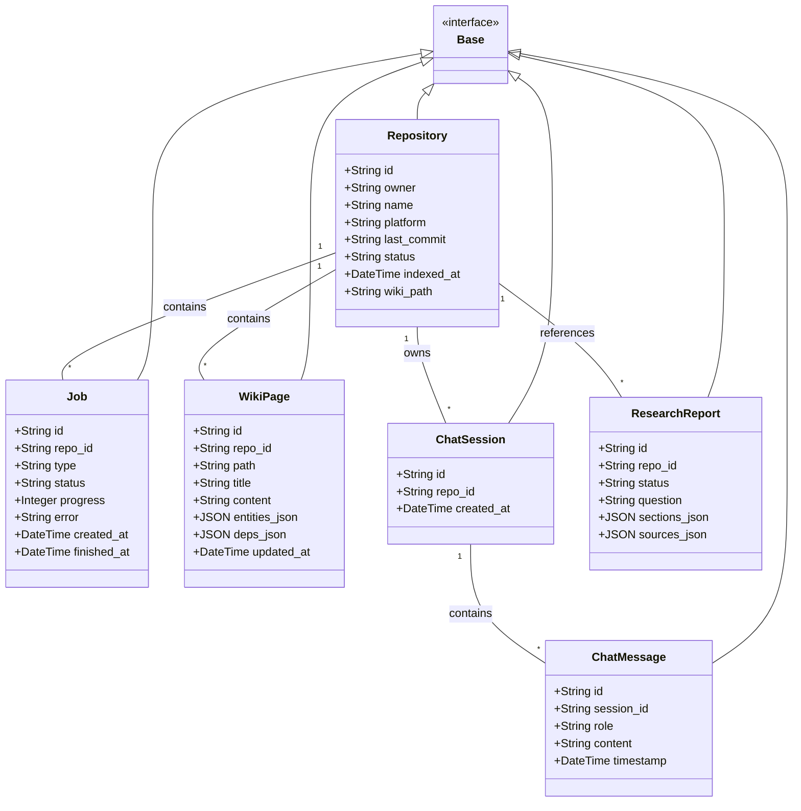
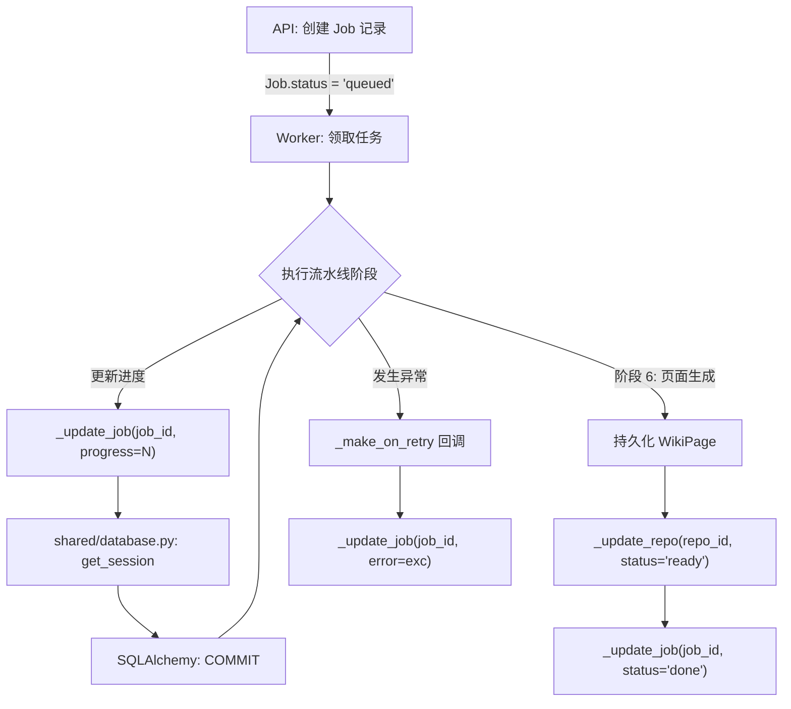

# 数据库模型与持久化

AutoWiki 使用 SQLAlchemy ORM 作为对象关系映射工具，底层存储采用 SQLite。系统的核心逻辑高度依赖于数据库实体来跟踪代码库状态、异步任务进度以及生成的内容。所有的模型均继承自统一的基类，并分布在 `shared/models.py` 中。

## 核心数据模型概览

AutoWiki 的模型设计遵循典型的关系型结构，以 `Repository`（代码仓库）为中心，关联了任务、生成的文档页面以及聊天会话。系统使用 `sqlalchemy.ext.declarative.declarative_base()` 创建的 `Base` 类作为所有实体的共同祖先，确保了元数据的一致性和迁移的便利性。

**Diagram: 核心实体类图**

*Source: [shared/models.py:9-112*](https://github.com/lazyxiang/AutoWiki/blob/main/shared/models.py#L9-L112*)

## 实体关系与表结构

系统中的每个实体都对应 SQLite 中的一张表。`Repository` 是顶级实体，通过 `id`（通常是 `sha256(platform:owner/repo)` 的哈希值）与其他实体建立一对多关系。`Job` 实体用于追踪耗时操作（如 `full_index` 或 `refresh`）的中间状态，而 `WikiPage` 则持久化最终生成的 Markdown 内容及其元数据。

| 实体名称 | 数据库表名 | 核心字段说明 | 作用描述 |
| :--- | :--- | :--- | :--- |
| `Repository` | `repositories` | `last_commit`, `status`, `wiki_path` | 记录代码库的元数据、当前的索引状态及本地 Wiki 存储路径。 |
| `Job` | `jobs` | `type`, `status`, `progress`, `error` | 跟踪异步流水线的执行进度（0-100）和最终执行结果。 |
| `WikiPage` | `wiki_pages` | `path`, `content`, `entities_json`, `deps_json` | 存储生成的 Wiki 页面内容，以及从 AST 中提取的实体和依赖关系。 |
| `ChatSession` | `chat_sessions` | `id`, `repo_id`, `created_at` | 管理用户针对特定仓库的对话上下文。 |
| `ChatMessage` | `chat_messages` | `role`, `content`, `timestamp` | 存储对话历史，区分 `user` 和 `assistant` 角色。 |
| `ResearchReport` | `research_reports` | `question`, `sections_json`, `sources_json` | 持久化 Deep Research 生成的深度研究报告及其引用的源。 |

在 `shared/models.py` 中，复杂的数据结构（如 AST 实体列表或依赖图片段）通过 `JSON` 类型字段存储，并在 Python 层映射为字典或列表。

*Source: [shared/models.py:13-112](https://github.com/lazyxiang/AutoWiki/blob/main/shared/models.py#L13-L112), [docs/superpowers/specs/2026-03-22-autowiki-design.md:141-168*](https://github.com/lazyxiang/AutoWiki/blob/main/docs/superpowers/specs/2026-03-22-autowiki-design.md#L141-L168*)

## 持久化生命周期与异步任务

AutoWiki 的持久化逻辑不仅发生在 API 请求期间，更频繁地发生在由 ARQ 驱动的 Worker 进程中。`worker/jobs.py` 中定义的异步函数（如 `run_full_index`）在执行 6 个阶段的流水线时，会不断调用 `_update_job` 和 `_update_repo` 来同步数据库状态。

当一个 `Job` 被创建并由 Worker 领取后，其生命周期如下：
1. **初始化**：通过 `api/routers/jobs.py` 创建 `Job` 记录，状态设为 `queued`。
2. **状态更新**：Worker 调用 `_update_job` 将状态更新为 `running`，并随着流水线推进（如 `Ingestion` -> `AST Analysis` -> `Wiki Planning`）不断更新 `progress` 字段。
3. **错误处理**：如果流水线发生异常，`_make_on_retry` 生成的回调函数会记录重试次数及异常信息；若最终失败，则通过 `_update_job` 将状态设为 `failed`。
4. **完成与产物持久化**：在 `run_full_index` 的最后阶段，系统会调用 `_collect_page_entities` 和 `_collect_page_deps` 收集生成的元数据，并将其存入 `WikiPage` 表，同时将 `Job` 状态设为 `done`。

**Diagram: 任务执行与持久化流程**

*Source: [worker/jobs.py:66-240](https://github.com/lazyxiang/AutoWiki/blob/main/worker/jobs.py#L66-L240), [worker/jobs.py:285-693](https://github.com/lazyxiang/AutoWiki/blob/main/worker/jobs.py#L285-L693), [shared/database.py:26-33*](https://github.com/lazyxiang/AutoWiki/blob/main/shared/database.py#L26-L33*)

## 数据库访问控制

AutoWiki 通过 `shared/database.py` 封装了所有底层数据库连接逻辑。它不直接暴露 SQLAlchemy 的 Engine 对象，而是通过一组受控的接口管理会话生命周期。尽管 Worker 运行在异步环境中，但数据库操作主要通过 SQLAlchemy 的同步接口执行，并依靠连接池来管理并发访问。

*   **数据库初始化 (`init_db`)**：
    该函数接收 `database_path`，创建同步引擎并调用 `Base.metadata.create_all()` 来确保所有定义的表（`repositories`, `jobs`, `wiki_pages` 等）在程序启动前已存在。
*   **会话管理 (`get_session`)**：
    这是一个上下文管理器，用于在函数内部安全地获取数据库会话。它负责 `session.begin()` 的开启以及在退出时自动处理 `session.commit()` 或 `session.rollback()`。
*   **并发处理**：
    由于使用了 SQLite，AutoWiki 依赖于 SQLAlchemy 的连接池配置来处理并发写入。在 Worker 中，所有的更新操作（如 `_update_job`）都被封装在独立的小型同步事务中，以确保数据一致性并最小化锁争用。
*   **非阻塞文件 I/O**：
    虽然数据库操作是同步执行的，但在 `worker/jobs.py` 中，对于涉及磁盘文件的持久化（如写入生成的 Markdown 页面），使用了 `_write_text_async`。该函数通过 `loop.run_in_executor` 将阻塞的磁盘 I/O 委托给线程池，确保大量文件的写入操作不会阻塞 Worker 的事件循环。

*Source: [shared/database.py:14-33](https://github.com/lazyxiang/AutoWiki/blob/main/shared/database.py#L14-L33), [worker/jobs.py:66-131*](https://github.com/lazyxiang/AutoWiki/blob/main/worker/jobs.py#L66-L131*)

## Source Files

| File |
|------|
| `shared/models.py` |
| `worker/jobs.py` |
| `shared/database.py` |