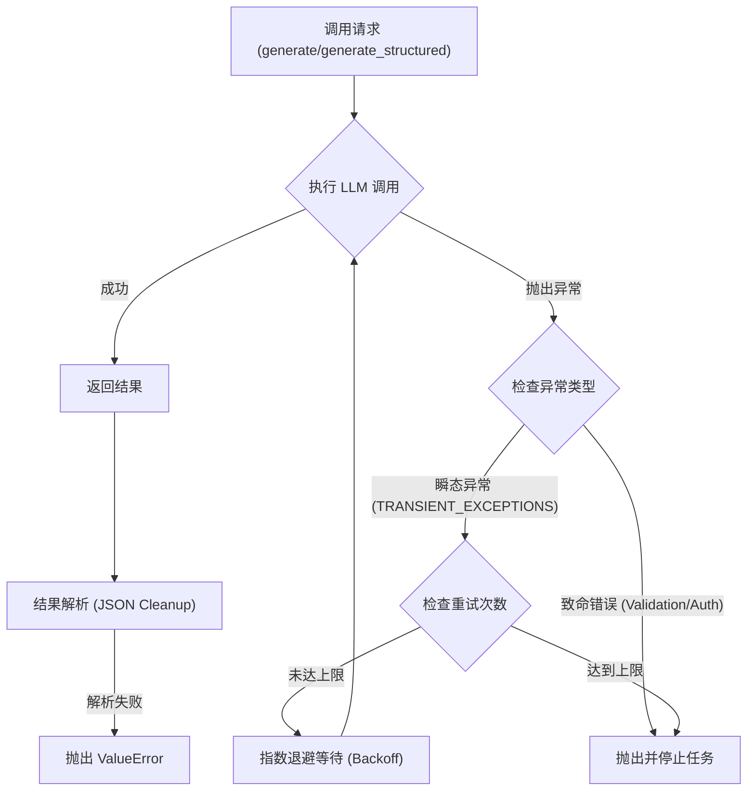
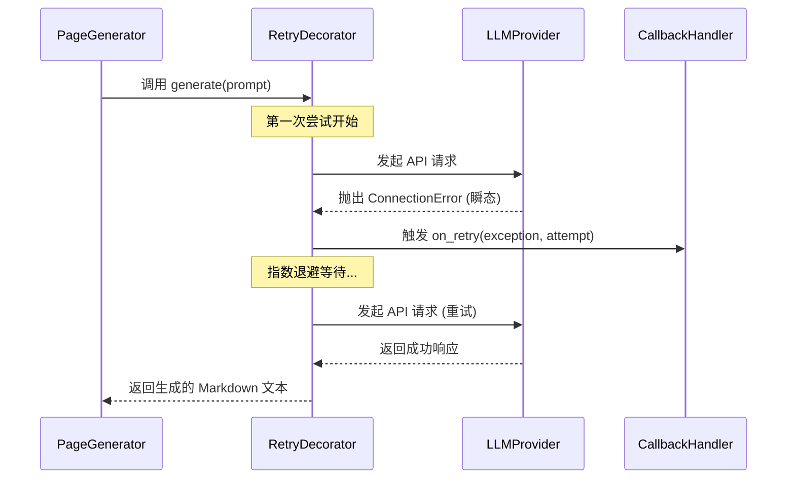

# 错误处理与弹性机制

## 错误处理与重试机制概述

在处理大型语言模型（LLM）的生成任务时，网络波动、API 速率限制（Rate Limiting）以及模型生成的格式错误是系统必须面对的核心挑战。AutoWiki 采用了一种基于异步 IO 的装饰器模式和重试逻辑，确保在不稳定的环境（如远程 API 调用）中保持系统的高可用性。

系统的核心设计理念是将瞬态故障（Transient Failures）与永久故障（Permanent Failures）分离。通过 `worker/utils/retry.py` 提供的 `async_retry` 函数，系统可以针对 `TRANSIENT_EXCEPTIONS`（通常包含超时、连接被对端重置或 429 速率限制错误）进行自动指数退避重试。而在流水线层级，`generate_page` 等核心函数支持 `on_retry` 回调，允许调用者实时监控生成过程中的重试状态。

**Diagram: 从 LLM 调用到重试处理的逻辑流向**



*Source: [worker/llm/base.py:49-85](https://github.com/lazyxiang/AutoWiki/blob/main/worker/llm/base.py#L49-L85), [tests/worker/test_retry.py:1-100](https://github.com/lazyxiang/AutoWiki/blob/main/tests/worker/test_retry.py#L1-L100)*

## LLM 调用接口与鲁棒性增强

`LLMProvider` 是所有模型交互的抽象基类，它不仅定义了生成接口，还内置了处理模型响应不确定性的辅助方法。`LLMProvider` 的具体实现类（如 `OpenAIProvider` 或 `GeminiProvider`）通常会调用 `_parse_json_response` 辅助函数来清理 Markdown 围栏并解析 JSON。这一设计是为了应对模型在 `generate_structured` 任务中可能出现的非标准输出：即使被要求返回纯 JSON，模型也经常会在响应中夹带 ` ```json ` 或 ` ``` ` 围栏。

`_parse_json_response` 函数通过正则表达式和字符串预处理，能够高效识别并提取被包裹的 JSON 字符串，确保 `json.loads` 能够成功执行。具体而言，它支持解析以下三种常见的响应模式：
1. 没有任何装饰的纯 JSON 对象字符串。
2. 被 ` ```json ` 围栏显式标注的 JSON 代码块。
3. 被普通 ` ``` ` 围栏包裹的 JSON 内容。

为了增强大规模生成任务的稳定性，`LLMProvider` 在 `generate_batch` 方法中使用了 `asyncio.Semaphore`（信号量）来严格控制并发执行的协程数量（默认为 5）。这种并发限制能有效防止系统瞬时发起过多请求而触发 API 提供商的 429 速率限制。

此外，为了在保障故障排查透明度的同时防止日志膨胀或系统内存溢出，系统提供了 `_truncate` 辅助函数。该函数会将所有记录到日志中的模型输入和输出内容截断至 2000 字符以内。`LoggingLLMProvider` 则采用了装饰器模式，在不侵入原始提供者逻辑的情况下，实现了对 `generate`、`generate_structured` 和 `generate_stream` 等所有核心方法的 `DEBUG` 级别审计。

| 组件/方法 | 功能描述 | 鲁棒性措施 |
| :--- | :--- | :--- |
| `_parse_json_response` | 将模型生成的原始文本转为 Python 字典 | 自动剥离 Markdown 围栏，支持 `json.loads` 容错 |
| [`LLMProvider.generate_batch`](https://github.com/lazyxiang/AutoWiki/blob/main/LLMProvider.generate_batch) | 并发执行多个生成任务 | 使用 `asyncio.Semaphore` 限制最大并发数，防止触发 Rate Limit |
| `LoggingLLMProvider` | 提供模型交互的透明度 | 记录截断后的内容，确保故障排查时有据可查 |
| `generate_structured` | 强制 schema 验证的生成 | 结合外部重试逻辑处理因格式不正确导致的解析失败 |

*Source: [worker/llm/base.py:15-39](https://github.com/lazyxiang/AutoWiki/blob/main/worker/llm/base.py#L15-L39), [worker/llm/base.py:88-155](https://github.com/lazyxiang/AutoWiki/blob/main/worker/llm/base.py#L88-L155)*

## 流水线作业的容错调度

在 `page_generator.py` 中，生成单个百科页面被拆分为一个四阶段（4-pass）流水线：生成大纲（Outline）、起草内容（Drafting）、事实核查（Fact-checking）以及格式化处理（Formatting）。由于每个阶段都涉及多次异步调用（包括 Embedding 向量搜索和 LLM 生成），系统在 `generate_page` 中集成了深层的容错逻辑。

根据系统的改进计划（docs/2026-03-27-improve-llm-retry-plan.md），`generate_page` 函数将全面集成 `on_retry` 回调接口。这一特性旨在确保当底层的 API 调用触发 `async_retry`（例如遇到网络抖动或 503 错误）时，能够将重试状态实时反馈给上层调度器。目前，该功能已在计划中逐步落地，以支持更精细的任务监控。

在进行批量页面生成时，系统通过 `compute_generation_order` 函数来优化调度。该函数基于 Wiki 计划（WikiPlan）计算页面生成的深度优先级，采用“深度优先”原则对页面进行分层：具有相同深度的页面（通常是同级的子页面）不存在依赖关系，可以通过 `generate_page_batch` 利用并行协程同时生成。这种分层调度确保了父页面在生成时，其依赖的所有子页面内容已作为 `child_contents` 准备就绪，从而保证了知识体系的连贯性。

在 `generate_page_batch` 的执行过程中，每个生成任务都会被包裹在一个受信号量限制的 `_bounded` 闭包中。这种机制结合了 `async_retry` 的指数退避策略，使得系统即使在处理拥有数百个页面的大型仓库时，也能在 API 限制和生成效率之间取得平衡。

**Diagram: generate_page 调用过程中的重试回调触发逻辑**



*Source: [worker/pipeline/page_generator.py:86-119](https://github.com/lazyxiang/AutoWiki/blob/main/worker/pipeline/page_generator.py#L86-L119), [worker/pipeline/page_generator.py:143-307](https://github.com/lazyxiang/AutoWiki/blob/main/worker/pipeline/page_generator.py#L143-L307)*

## 异常处理最佳实践

为了在生产环境中保证系统的稳定性，AutoWiki 在错误处理上遵循以下核心实践：

*   **语义化解析失败处理**：在 `FactCheckIssue` 和 `FactCheckResult` 的处理中，系统不直接抛出原始异常，而是通过结构化的类记录事实核查中发现的问题，允许后续流程根据严重程度决定是进行修复还是保留标注。
*   **并发控制与反压（Backpressure）**：在 `generate_page_batch` 中，通过 `asyncio.Semaphore` 严格控制并发执行的协程数量。这避免了因瞬间发起数百个并发请求而导致的服务端 429 封禁。
*   **清除前导干扰（Preamble Stripping）**：模型有时会在 Markdown 输出前生成一段推理过程（Chain-of-Thought）。`_strip_preamble_and_ensure_header` 函数负责检测并剥离这些非 Markdown 内容，确保输出的 Wiki 页面始终以正确的 `# title` 开头。
*   **确定性生成顺序**：通过 `compute_generation_order` 强制执行从最深层级页面向根页面生成的逻辑。这确保了当父页面生成时，其引用的子页面内容已经作为 `child_contents` 准备就绪，减少了因上下文缺失导致的生成逻辑错误。
*   **透明的重试监测**：所有的重试行为都会记录到日志中，并伴随 `_truncate` 处理过的上下文信息。在 `worker/pipeline/wiki_planner.py` 的重试循环中，只有验证通过的 JSON 结构才会被接受，否则将触发下一轮的生成重试。

*Source: [worker/pipeline/page_generator.py:63-83](https://github.com/lazyxiang/AutoWiki/blob/main/worker/pipeline/page_generator.py#L63-L83), [worker/pipeline/fact_check.py:54-66](https://github.com/lazyxiang/AutoWiki/blob/main/worker/pipeline/fact_check.py#L54-L66), [worker/llm/base.py:42-46](https://github.com/lazyxiang/AutoWiki/blob/main/worker/llm/base.py#L42-L46)*

## Source Files

| File |
|------|
| [`worker/llm/base.py`](https://github.com/lazyxiang/AutoWiki/blob/main/worker/llm/base.py) |
| [`worker/pipeline/page_generator.py`](https://github.com/lazyxiang/AutoWiki/blob/main/worker/pipeline/page_generator.py) |
| [`worker/pipeline/fact_check.py`](https://github.com/lazyxiang/AutoWiki/blob/main/worker/pipeline/fact_check.py) |
| [`tests/worker/test_retry.py`](https://github.com/lazyxiang/AutoWiki/blob/main/tests/worker/test_retry.py) |